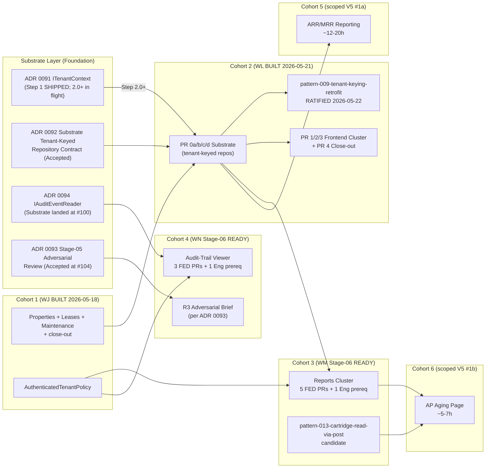
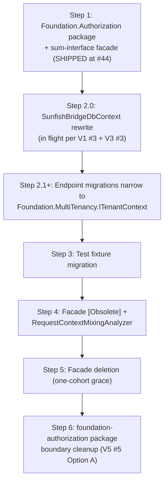
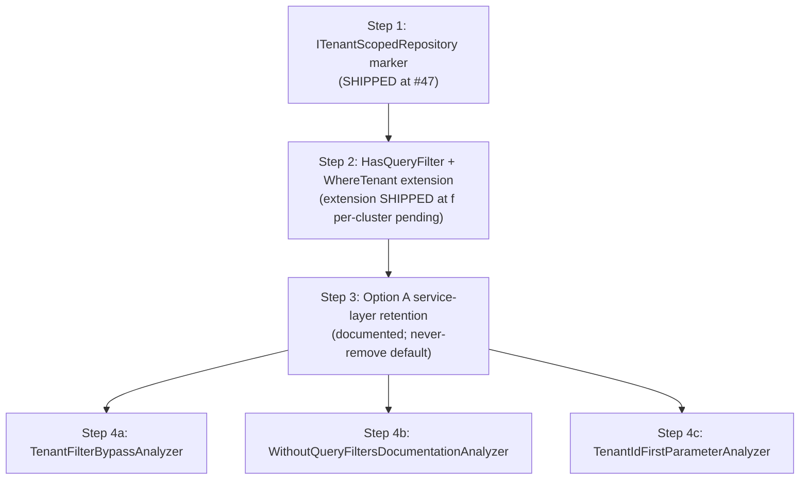
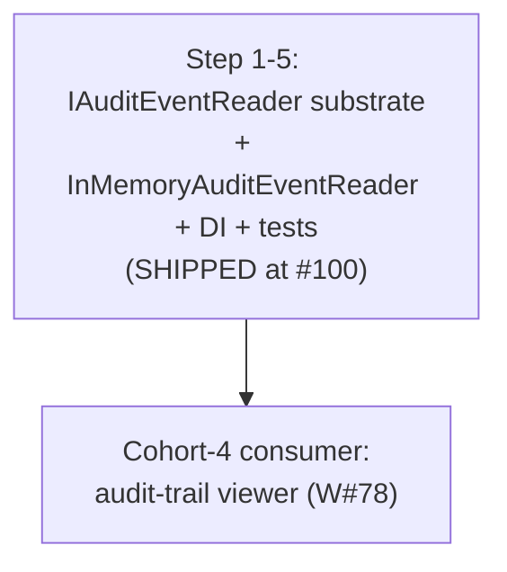
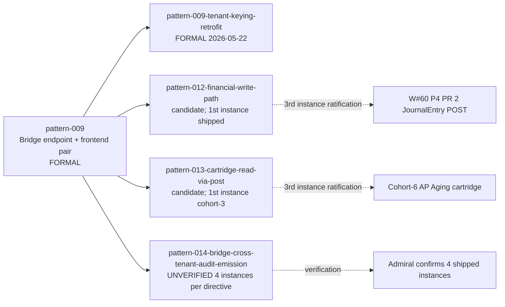

# Cross-cohort dependency graph (2026-05-22)

**Authored by:** ONR (V7 batch item #2)
**Requester:** Admiral (per `admiral-directive-2026-05-22T12-45Z` item #2)
**Authored at:** 2026-05-22T13-05Z

**Path note:** Directive specifies `coordination/hand-offs/cross-cohort-dependency-graph.md` but that directory does not exist. ONR writes to canonical research path `shipyard/icm/01_discovery/research/`.

---

## Scope

Visual + structured diagram of cross-cohort dependencies across cohort-1 → cohort-6. Covers:
- Cohort dependency edges (which cohort needs which prior cohort shipped)
- Substrate ladders (ADR 0091, 0092, 0094)
- Pattern catalog dependencies (pattern-009 + tenant-keying-retrofit; pattern-012; pattern-013; pattern-014)
- Bridge endpoint families
- Critical path to MVP demo

---

## TL;DR

1. **Cohorts 1+2 BUILT** (W#74 + W#76; financial cluster + cohort-1 rebind shipped).
2. **Cohort-3 Stage-06 READY** (W#77; PAO Track C cohort-3 design pending; FED execution gated).
3. **Cohort-4 Stage-06 READY** (W#78; audit-trail viewer; ADR 0094 substrate landed via #100).
4. **Cohort-5 + Cohort-6 SCOPED** (per V5 #1a + V5 #1b; ARR/MRR + AP Aging recommendations).
5. **Critical-path observation:** cohort-3 + cohort-4 are PARALLELIZABLE (cohort-4 has no functional dependency on cohort-3 reports). Cohort-5 + cohort-6 also can parallelize (different surfaces). Bottleneck is PAO Track C design + sec-eng SPOT-CHECK throughput.

---

## 1. Cohort dependency graph (mermaid)



---

## 2. Cohort completion + dependency table

| Cohort | Workstream | Status | Substrate dep | Frontend dep | Gates downstream |
|---|---|---|---|---|---|
| 1 | W#74 | BUILT 2026-05-18 | `AuthenticatedTenantPolicy` (cohort-1 PR 1) | None | Establishes policy precedent for cohort-2+ |
| 2 | W#76 | BUILT 2026-05-21 | ADR 0091 Step 1; ADR 0092 Step 1 substrate | Cohort-1 policy reuse | pattern-009-tenant-keying-retrofit ratified; sets cohort-3+ substrate baseline |
| 3 | W#77 | Stage-06 READY | W#72 blocks-reports cartridges (shipped); ADR 0091/0092 substrate | Cohort-2 frontend rebind pattern | PAO Track C design pending; AP Aging deferred → cohort-6 |
| 4 | W#78 | Stage-06 READY | ADR 0094 IAuditEventReader (shipped at #100); audit-emission retrofit (V2 #3 in flight) | Cohort-1/2 frontend pattern | First R3 Adversarial Brief pilot per ADR 0093 |
| 5 | (TBD W#79?) | Scoped | `blocks-subscriptions` accumulator gap | Cohort-1/2 frontend pattern | None active |
| 6 | (TBD W#80?) | Scoped | `ApAgingSummaryCartridge` (Engineer ~3-4h) | Cohort-3 cartridge consumption pattern | None active |

---

## 3. Substrate ladders (ADR-by-ADR)

### 3.1 ADR 0091 ITenantContext ladder (per V5 #5 + V6 #3)



**Status:** Step 1 SHIPPED; Step 2.0+ in flight; ladder terminates at Step 6 per V6 #3.

### 3.2 ADR 0092 Substrate Tenant-Keyed Repository ladder



**Status:** Step 1 SHIPPED; Step 2 WhereTenant SHIPPED (#102); per-cluster Step 2 + Steps 4a/b/c pending.

### 3.3 ADR 0094 IAuditEventReader ladder



**Status:** SHIPPED at #100 (Admiral implementation per ONR V4 #2 scaffold + V6 #6 Option C HYBRID disposition).

---

## 4. Pattern catalog dependencies



**Status (per V7 #6 audit):**
- pattern-009 + pattern-009-tenant-keying-retrofit: FORMAL on main
- pattern-012 + pattern-013: candidates; NOT on main (ONR V5 #2 #88 still OPEN)
- pattern-014: NOT on main; 4-instance claim unverified

---

## 5. Bridge endpoint families

| Family | Status | Cohort |
|---|---|---|
| `Sunfish.Bridge.Cockpit.*` (existing) | pre-restructure baseline | n/a |
| `Sunfish.Bridge.Properties.*` (cohort-1 PR 1) | SHIPPED | C1 |
| `Sunfish.Bridge.Leases.*` (cohort-1 PR 2) | SHIPPED | C1 |
| `Sunfish.Bridge.Maintenance.*` (cohort-1 PR 3) | SHIPPED | C1 |
| `Sunfish.Bridge.Financial.*` (cohort-2 PR 1/2/3) | SHIPPED | C2 |
| `Sunfish.Bridge.Reports.*` (cohort-3 Engineer prereq) | PENDING | C3 |
| `Sunfish.Bridge.Audit.*` (cohort-4 Engineer prereq; consumes IAuditEventReader) | PENDING | C4 |
| `Sunfish.Bridge.RecurringRevenue.*` (cohort-5 hypothetical) | not yet scoped at Stage-05 | C5 |
| `Sunfish.Bridge.Reports.ApAging.*` (cohort-6 via cartridge runner) | not yet | C6 |

---

## 6. Critical path to MVP demo (see also V7 #3)

Per V7 #3 (separate research), the critical path is:

```
Cohort-1 BUILT → Cohort-2 BUILT → {Cohort-3 OR Cohort-4 parallel} → Cohort-5 ARR/MRR → MVP demo
```

Cohort-3 + Cohort-4 are PARALLELIZABLE; cohort-5 is the first investor-grade story. Cohort-6 (AP Aging) is closure-not-critical for MVP.

---

## 7. Parallelization opportunities

| Cohort N + M | Can parallelize? | Why |
|---|---|---|
| C3 + C4 | YES | Different surfaces (reports vs audit); no shared FED files |
| C5 + C6 | YES (post-C3/C4) | Different surfaces (ARR vs AP Aging) |
| C4 + W#60 P4 PR 2 | YES | pattern-012 ratification at JournalEntry POST is separate from audit viewer |
| Engineer substrate ladder Phase 1-3 vs frontend cohorts | YES | Substrate work doesn't block frontend page work; FED execution gated on substrate at Stage-06 entry, not authoring |

---

## 8. Bottlenecks

1. **PAO Track C cohort-3 design** — gates cohort-3 FED execution (PR 2-5; PR 1 api layer can ship without)
2. **Sec-eng SPOT-CHECK throughput** — per V5 #8 SLA refinement; differentiated by PR type
3. **W#60 P4 PR 1 Stronghold completion** — gates W#60 P4 PR 2-5 + downstream OIDC ADR work
4. **Engineer post-cohort-2 substrate ladder** — 6 phases × ~21 PRs (V3 #3); long-running ladder
5. **pattern-014 verification** — V7 #6 audit found 0 merged instances; either Engineer hasn't tagged OR claim is aspirational

---

## 9. Open questions

For Admiral routing per `feedback_onr_questions_via_inbox`:

1. **pattern-014 verification** — per V7 #6 audit; 4-instance claim returns 0 in shipyard merged PR search. Admiral confirms?
2. **`coordination/hand-offs/` directory creation** — V7 directive specifies this path; doesn't exist. Create new top-level coordination dir OR continue using `shipyard/icm/01_discovery/research/` and `shipyard/icm/_state/handoffs/`?

---

## 10. Sources cited

1. `coordination/inbox/admiral-directive-2026-05-22T12-45Z` item #2
2. V5 #1a + #1b cohort-5/6 scope surveys (shipyard#95 + #96)
3. V3 #1 cohort-4 hand-off (shipyard#81 MERGED)
4. V1 #1 cohort-3 hand-off (shipyard#51 MERGED)
5. V3 #3 Engineer substrate sequencing (shipyard#79)
6. V5 #5 ADR 0091 Steps 5+6 (shipyard#91)
7. V6 #3 ADR 0091 ladder termination (shipyard#98)
8. V7 #6 pattern catalog snapshot (shipyard#108)
9. Cohort-1 hand-off + cohort-2 hand-off (shipyard#42 MERGED)
10. ADR 0091 R2 (Accepted) + ADR 0092 (Accepted) + ADR 0093 (Accepted #104) + ADR 0094 (substrate #100)

---

## 11. What ONR does next

V7 #2 deliverable complete. Files `onr-status-*-v7-item-2-cross-cohort-graph-complete.md`. Proceeds to V7 #5 (Stage-05 retro scaffolding).

— ONR, 2026-05-22T13:05Z
