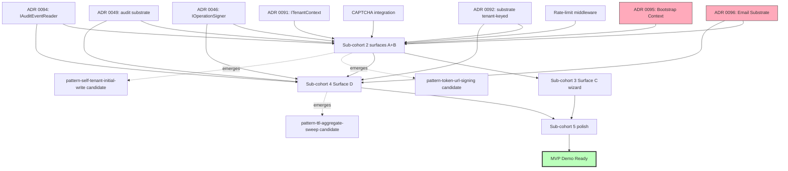

# Onboarding-ladder — Stage-02 architecture scoping

**Authored by:** ONR (V8 batch item #3)
**Requester:** Admiral (per `admiral-directive-2026-05-22T14-00Z` item V8 #3; per V7 #7 question #1 ruling APPROVED)
**Authored at:** 2026-05-22T14-40Z

---

## Purpose

V7 #3 MVP demo critical-path analysis identified **onboarding-ladder as the
highest-leverage MVP-blocking gap**. This Stage-02 scoping:

1. Enumerates the consumer surfaces of the onboarding flow
2. Maps dependencies onto existing substrate ladders (ADR 0091/0092/0046/0049/0094)
3. Identifies which ADRs need step-additions vs new ADRs vs new pattern entries
4. Decomposes the onboarding-ladder into shippable cohorts
5. Surfaces decisions that require Admiral / CIC ratification before Stage-05

**Not in scope here:** Stage-05 hand-off (downstream); Stage-06 build (downstream);
PR-by-PR decomposition (later).

---

## 1. Consumer surfaces

The onboarding flow has FOUR distinct consumer surfaces (each potentially
shippable as separate PRs):

### 1.1 Surface A — Public signup (anonymous user → new tenant)

**User action:** anonymous user lands on signup page, fills out form, submits.
**System action:** validates form, creates Tenant + admin User + first ITenantContext,
sends welcome email, redirects to dashboard.

**Endpoint:** `POST /api/signup` (anonymous; antiforgery-token required; rate-limited)

**Substrate operations:**
1. Validate signup payload (email + password + tenant-name format guards)
2. Check email uniqueness (anti-duplicate-tenant)
3. Create `Tenant` aggregate (tenant-keyed by the new tenant's own ID)
4. Create initial `User` aggregate (admin role, tenant-keyed)
5. Provision initial `ITenantContext` (via `AddSunfishTenantContext<DemoTenantContext>` or production equivalent — per ADR 0091 R2)
6. Emit `AuditEventType.TenantCreated` + `AuditEventType.UserRegistered` events
7. Sign welcome-email link (`IOperationSigner.SignAsync` per ADR 0046)
8. Dispatch welcome email (NEW SUBSTRATE — see §3.1)
9. Issue authentication session (local auth per V7 #3 ruling LOCAL-ONLY)

**Bridge endpoint family:** new — `/api/signup`, `/api/signup/verify-email/{token}`,
`/api/signup/check-email-available`

**Frontend surfaces:** new — `/signup`, `/signup/verify-email`, `/signup/welcome`

### 1.2 Surface B — Email verification (anonymous; one-time link)

**User action:** clicks email-verification link from welcome email.
**System action:** validates signed token, marks user email as verified, redirects
to dashboard.

**Endpoint:** `GET /api/signup/verify-email/{signed-token}` (anonymous;
token-authenticated; rate-limited per token)

**Substrate operations:**
1. Verify token signature via `IOperationSigner.VerifyAsync`
2. Validate token TTL (24h)
3. Mark `User.EmailVerified = true` (tenant-keyed update)
4. Emit `AuditEventType.UserEmailVerified` event
5. Issue authenticated session

**Bridge endpoint:** part of family from §1.1
**Frontend surfaces:** part from §1.1

### 1.3 Surface C — First property creation wizard (admin user → first Property)

**User action:** post-signup, admin lands on empty dashboard; wizard guides through
"add your first property" form.
**System action:** validates property form, creates Property aggregate, creates first
Unit (optional), persists, navigates to property detail page.

**Endpoint:** `POST /api/properties` (existing per cohort-1; reuses substrate)

**Substrate operations:** ALREADY EXISTS per cohort-1 W#74. New work is purely
frontend (wizard UX flow + empty-state copy + welcome banner).

**Bridge endpoint:** existing (cohort-1)
**Frontend surfaces:** new wizard UX in `sunfish/apps/web/src/onboarding/`

### 1.4 Surface D — Invite first additional user (admin → property manager)

**User action:** admin clicks "invite team member" → enters email + role → sends.
**System action:** creates pending invitation (signed link), sends invitation email,
recipient clicks link → registration flow → joins tenant.

**Endpoints:**
- `POST /api/invitations` (admin only; antiforgery-required; idempotency-key required)
- `GET /api/invitations/accept/{signed-token}` (anonymous; token-auth)
- `POST /api/invitations/accept/{signed-token}` (anonymous; password setup)

**Substrate operations:**
1. Create `Invitation` aggregate (NEW substrate primitive — see §3.2) with TTL 7d
2. Sign invitation link via `IOperationSigner.SignAsync`
3. Emit `AuditEventType.InvitationSent` event
4. Dispatch invitation email (uses §3.1 substrate)
5. On accept: verify signature + TTL; create `User` (role per invitation); emit
   `AuditEventType.InvitationAccepted` + `AuditEventType.UserRegistered`
6. Mark invitation as `Used` (prevent token replay)

**Bridge endpoint family:** new — `/api/invitations/*`
**Frontend surfaces:** new — `/invitations/accept`, plus admin UX for sending

---

## 2. Substrate ladder dependencies

### 2.1 ADR 0091 (ITenantContext divergence resolution) — touched

Onboarding creates the FIRST `ITenantContext` per tenant. This is novel:

**Current state of ADR 0091:** Step 7+ (facade deletion) is the active forward
boundary; Steps 1-6 cover the divergence resolution and analyzer ship.

**Onboarding gap:** Step 1-6 assume ITenantContext already exists in the request
pipeline. The pre-tenant signup window has NO ITenantContext until the Tenant
aggregate is created. We need:

- A "**bootstrap context**" — between signup form POST and Tenant creation
- Decision: does the signup endpoint inject `IBrowserTenantContext` only (since
  no control-plane tenant context exists yet)? Or a NEW interface
  `IBootstrapContext` for the pre-tenant window?

**ADR-additions OR new ADR:** ONR recommends **NEW ADR 0095 "Onboarding Bootstrap
Context"** — the bootstrap window is structurally distinct from ADR 0091's
domain (post-tenant request pipeline). Tagging it as ADR 0091 Step 8 would
overload the divergence-resolution ADR.

### 2.2 ADR 0092 (substrate tenant-keyed repository) — touched

Onboarding creates the FIRST tenant-keyed aggregate (Tenant itself).

**Existing pattern (pattern-009-tenant-keying-retrofit, formal):** assumes tenant
exists at the time of repo write. Onboarding violates this assumption.

**Resolution:** the Tenant aggregate is **its own tenant** — `Tenant.TenantId =
Tenant.Id` at creation time. The repository's `.WhereTenant()` global query
filter must allow this self-tenant initial-write case.

**Pattern addition:** NEW candidate pattern — "Self-tenant initial-write
permission" — applies to: Tenant entity, and any future top-level "tenant-owns-
itself" aggregate.

**ADR-additions:** ADR 0092 needs Step addition: "Self-tenant initial-write
permission" (or a new ADR 0096 if Admiral prefers separation).

### 2.3 ADR 0046 (IOperationSigner) — touched (consumer)

Onboarding signs welcome-email links + invitation links. Both are existing
IOperationSigner consumers conceptually (cohort-2 used signing for journal-entry
voids; onboarding uses it for token-bearing URLs).

**No ADR amendments needed.** Onboarding-ladder consumes existing substrate.

**Forward-watch:** signing scope — onboarding tokens sign `{user_id, expires_at,
tenant_id?}`; document the scope payload pattern (potential pattern candidate
"Token-bearing URL signing").

### 2.4 ADR 0049 (audit substrate) + ADR 0094 (IAuditEventReader) — touched

Onboarding introduces NEW audit event types:
- `TenantCreated` (per §1.1)
- `UserRegistered` (per §1.1 + §1.4)
- `UserEmailVerified` (per §1.2)
- `InvitationSent` (per §1.4)
- `InvitationAccepted` (per §1.4)
- `InvitationExpired` (background sweep; per §3.3)
- `InvitationRevoked` (admin action; not first-pass)

**ADR-additions:** ADR 0049 documents AuditEventType enum + emission conventions;
adding 5-7 new types requires:
- ADR 0049 Step addition: "Onboarding event types" (or simple enum-extension PR)
- ADR 0094 (IAuditEventReader) update: visibility for these new types in the
  audit-trail viewer

**Forward-watch:** Idempotency for `AuditEventType.UserRegistered` — same user can
register twice if email-verification flow is interrupted? Need de-duplication
strategy.

---

## 3. NEW substrate primitives (Stage-02 reveals)

### 3.1 Email dispatch substrate (NEW; high-leverage)

**Why new:** Sunfish today has NO outbound email infrastructure. Onboarding
fundamentally needs it (welcome email, invitation email, email verification, etc.).

**Decision required:** email provider choice — SendGrid / Postmark / SES /
Mailgun / etc. Each has its own quirks (deliverability, pricing, SDK quality).

**Substrate shape:** new interface `IEmailDispatcher.SendAsync(EmailEnvelope)` with
provider-neutral envelope (subject, recipient, html-body, text-body, headers).

**Cluster:** likely lives in `packages/foundation-email/` or
`packages/blocks-notifications/` (TBD; ADR ratification).

**Pattern emergence:** if email follows the wayfinder-analyzer pattern (a Roslyn-
analyzed contract), it could be the second "provider-neutral substrate" instance,
hardening pattern-007 (provider-neutrality, currently candidate).

**Effort:** ~1 cohort-cycle (~3-4 weeks) just for email substrate; CANNOT
parallelize with onboarding-ladder build until email substrate ships.

### 3.2 Invitation aggregate (NEW substrate primitive)

**Why new:** Invitations are a distinct aggregate (not a flag on User) because:
- Lifecycle independent of User (created before User exists)
- TTL-bounded
- Single-use (token-authenticated, not session-authenticated)
- Tenant-keyed (admin who sent it is tenant-bound)

**Substrate shape:** `IInvitationRepository` per ADR 0092 substrate pattern.
Aggregate fields: Id, TenantId, InvitedEmail, Role, ExpiresAt, UsedAt?,
RevokedAt?, IssuedByUserId.

**Cluster:** likely `packages/blocks-onboarding/` (new package) or
`packages/blocks-users/` (might emerge alongside).

**Pattern dependency:** consumes pattern-009-tenant-keying-retrofit (formal).

### 3.3 Background sweep — invitation expiration

**Why new:** Invitations have 7d TTL but the system needs to actively mark
expired invitations (for audit emission + UI consistency).

**Substrate shape:** `IHostedService` sweeping expired invitations daily; emits
`AuditEventType.InvitationExpired` per swept invitation.

**Pattern emergence:** likely a candidate pattern "TTL-bounded aggregate background
sweep" — if 2nd-instance (e.g., session expiration in future) emerges, formalize.

### 3.4 Rate-limit middleware (NEW; CRITICAL for public surfaces)

**Why new:** Public `/api/signup` + `/api/signup/verify-email` + `/api/invitations/accept`
are anonymous endpoints. WITHOUT rate-limiting, an attacker can:
- Spam-create tenants (resource exhaustion)
- Brute-force email-verification tokens (token-guessing attack)
- Brute-force invitation tokens

**Substrate shape:** AspNetCore RateLimiter middleware OR custom (per cluster
decision).

**Decision required:** built-in (AspNetCore 9+ RateLimiter) vs custom.

**Forward-watch:** sec-eng-council MUST review rate-limit configuration before
Surface A ships. SPOT-CHECK pattern applies (per pattern-009 + sec-eng 8-item §5
input-validation).

### 3.5 Anti-bot / CAPTCHA (NEW; needed for public signup)

**Why new:** signup form needs bot-mitigation (CAPTCHA or equivalent — Cloudflare
Turnstile / hCaptcha / reCAPTCHA). Without it, automated tenant-creation is
trivial.

**Decision required:** CAPTCHA provider. Cloudflare Turnstile recommended (free,
privacy-respecting, lightweight).

**Forward-watch:** sec-eng-council review on Surface A.

---

## 4. ADR additions vs new ADRs vs pattern entries

Consolidated decision-grid:

| Item | Type | Rationale |
|---|---|---|
| Onboarding bootstrap context | NEW ADR 0095 | Distinct substrate domain from ADR 0091 |
| Self-tenant initial-write permission | ADR 0092 Step addition OR pattern-candidate | Lighter weight; lean toward pattern-candidate first |
| Email dispatch substrate | NEW ADR 0096 | Net-new substrate cluster; cross-tenant relevance |
| Email provider selection | ONR research → CIC ratification | Decision-doc, not ADR; commercial concern |
| Invitation aggregate | NEW ADR 0097 OR ADR-less pattern formalization | If cluster `blocks-onboarding/` is greenfield, ADR captures aggregate boundary |
| Background sweep (invitation expiration) | candidate pattern | 2nd-instance emergence triggers formalization |
| Rate-limit middleware | candidate pattern (or ADR if substrate-wide) | Cluster-cross-cutting |
| CAPTCHA / anti-bot | decision-doc → vendor selection | Not ADR; commercial |
| 5-7 new audit event types | ADR 0049 + 0094 enum extension PRs | Minor; not new ADR |
| Token-bearing URL signing scope | candidate pattern (under ADR 0046) | Documents signing-scope convention |
| Onboarding-ladder Stage-05 hand-off | ONR (Stage-05 deliverable) | After Stage-02 ratifies |

---

## 5. Cohort decomposition

Onboarding-ladder is too large for a single cohort. Stage-02 proposes:

### 5.1 Sub-cohort 1 (foundational substrate; ~1 cohort)

- Email dispatch substrate (new ADR 0096)
- Rate-limit middleware
- CAPTCHA / anti-bot integration
- Bootstrap context (new ADR 0095)

**Gates:** ADR 0095 + 0096 ratified; email provider chosen + integrated; rate-limit
middleware operational.

### 5.2 Sub-cohort 2 (Surface A + B; public signup + email verification; ~1 cohort)

- Tenant aggregate (self-tenant initial-write)
- User aggregate (admin role)
- `/api/signup` endpoint family (3 routes)
- Welcome email (uses §5.1 substrate)
- Email verification flow
- 2 audit event types (`TenantCreated`, `UserEmailVerified`)
- Frontend: `/signup`, `/signup/verify-email`, `/signup/welcome`

**Gates:** sec-eng-council Stage-05 + Stage-06 SPOT-CHECK GREEN; CIC ratification of
auth-provider choice (local-only confirmed per V7 #3 ruling).

### 5.3 Sub-cohort 3 (Surface C; first-property wizard; ~½ cohort)

- Frontend wizard UX (no backend changes; cohort-1 substrate)
- Empty-state UX
- Welcome banner

**Gates:** UX review by PAO; user-testing dry-run.

### 5.4 Sub-cohort 4 (Surface D; invitations; ~1 cohort)

- Invitation aggregate (new ADR 0097 OR pattern)
- `/api/invitations` endpoint family (3 routes)
- Invitation email
- Background expiration sweep
- 5 audit event types (`InvitationSent`, `InvitationAccepted`, `InvitationExpired`,
  `InvitationRevoked`, `UserRegistered` (when accepting))
- Frontend: `/invitations/accept` + admin UX

**Gates:** sec-eng-council Stage-05 + Stage-06 (write-path + token-auth);
.NET-architect for aggregate boundary.

### 5.5 Sub-cohort 5 (polish + integration; ~½ cohort)

- End-to-end dry-run
- Demo seed data
- Error-page polish
- Accessibility audit

**Gates:** end-to-end demo dry-run; PAO design QA.

---

## 6. Risk-weighted timeline

| Sub-cohort | Calendar (parallelizable) | Risk |
|---|---|---|
| 1 (substrate) | ~3-4 weeks | HIGH (new ADRs; vendor selection) |
| 2 (Surface A+B) | ~3 weeks | MEDIUM (depends on §5.1 substrate) |
| 3 (Surface C) | ~1.5 weeks | LOW (purely frontend) |
| 4 (Surface D) | ~3 weeks | MEDIUM (depends on §5.1 + new aggregate) |
| 5 (polish) | ~1.5 weeks | LOW (mechanical) |
| **Cumulative** | ~5-6 weeks (parallel) / ~12-13 weeks (serial) | |

Per V7 #3 MVP critical-path: 4-5 week MVP demo target is feasible IF §5.1 substrate
ships within 3 weeks AND sub-cohorts 2/3/4 run in parallel.

---

## 7. Decisions requiring Admiral / CIC ratification

For routing to Admiral / CIC per `feedback_onr_questions_via_inbox`:

1. **New ADR 0095 (Onboarding Bootstrap Context) approval** — ONR drafts scaffold;
   Admiral authors final.
2. **New ADR 0096 (Email Dispatch Substrate) approval** — same pattern.
3. **Self-tenant initial-write — ADR 0092 Step addition vs pattern-candidate first?**
   ONR recommends pattern-candidate first; promote to ADR step if 2nd-instance
   emerges (e.g., future "Organization" entity).
4. **Email provider selection** — SendGrid vs Postmark vs SES vs Mailgun? CIC
   decision (commercial + deliverability).
5. **CAPTCHA / anti-bot provider** — Cloudflare Turnstile (ONR recommended) vs
   hCaptcha vs reCAPTCHA? CIC decision.
6. **Rate-limit substrate** — AspNetCore 9+ built-in RateLimiter vs custom?
   ONR recommends built-in.
7. **Invitation aggregate cluster** — new `blocks-onboarding/` package, OR fold
   into existing `blocks-users/` (if emerging)? .NET-architect decision via
   council.
8. **Tenant aggregate cluster** — likely `blocks-tenants/` (new), OR fold into
   `blocks-onboarding/`? .NET-architect decision via council.
9. **Cohort numbering** — sub-cohorts 1-5 become W#NN through W#MM? Admiral
   workstream allocation.
10. **Stage-05 hand-off authoring sequence** — ONR authors Stage-05 for §5.1
    substrate first (gating dependency), or parallel-author all 4 hand-offs?

---

## 8. Substrate ladder visualization

---

## 9. Sources cited

1. `coordination/inbox/admiral-directive-2026-05-22T14-00Z` item V8 #3
2. V7 #3 MVP demo critical-path analysis (shipyard#111) — identified onboarding as
   highest-leverage gap
3. V7 #2 cross-cohort dependency graph (shipyard#109) — substrate-ladder topology
4. ADR 0091 R2 (ITenantContext divergence resolution)
5. ADR 0092 R2 (substrate tenant-keyed repository)
6. ADR 0046 (IOperationSigner)
7. ADR 0049 (audit substrate) + ADR 0094 (IAuditEventReader)
8. pattern-009-tenant-keying-retrofit (formal; shipyard#103)
9. pattern-009 (Bridge endpoint + frontend rebind pair; formal)
10. fleet-conventions §SPOT-CHECK dispatch SLA
11. V7 #3 ruling: local-only auth for MVP demo; 50-unit demo seed

---

## 10. What ONR does next

V8 #3 deliverable complete. Proceeds to V8 #4 (ADR 0093 Rev 2 scaffolding for
Admiral; ~2-3h).

— ONR, 2026-05-22T14:40Z
