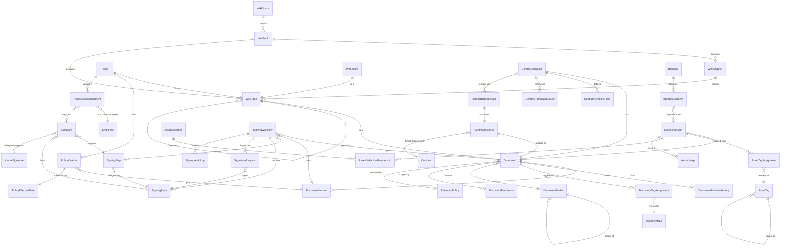

# `blocks-docs-*` Cluster — Stage 02 Schema Design (Clean-Room)

**ADR reference:** [ADR 0088 — Anchor as All-In-One Local-First Runtime](../../docs/adrs/0088-anchor-all-in-one-local-first-runtime.md)
**Pipeline variant:** sunfish-feature-change
**Phase:** Phase 2 (active per CO directive 2026-05-16)
**Authored:** 2026-05-16 (parallel schema-mining sprint)
**Status:** Draft (Stage 02 architecture)

---

## 1. Header & License Posture Summary

This document is the clean-room Stage 02 schema design for the `blocks-docs-*` cluster of the Sunfish Anchor application. It covers structured document management: policies, procedures, contract templates, marketing collateral (DAM), wiki, and the signing workflow.

Per ADR 0088 §2, **all Sunfish output is MIT-licensed.** Per ADR 0088 §3, the team applies clean-room implementation discipline: license-classification gate before code work; reading isolation for copyleft sources; cleansing rule (never paste copyleft code); attribution for permissive borrowed code; per-cluster Stage 02 doc as the clean-room artifact suitable for any implementer.

This document is that artifact for `blocks-docs-*`. It is written entirely from clean-room schemas + textbook fundamentals; no copyleft source code is incorporated by reference or paraphrase. Where copyleft sources are cited (Wiki.js, HedgeDoc, Documenso, OpenSign, Razuna), the citation is to publicly-documented behavior or surface design, not to source.

The cluster spans six functional sub-domains, each materialized as one or more `blocks-docs-*` packages:

| Sub-domain | Package candidate | Scope |
|---|---|---|
| Document core | `blocks-docs-core` | Document base entity; versions; revisions; tags; folders; permissions |
| Wiki / policies / procedures | `blocks-docs-wiki` | WikiSpace / WikiBook / WikiPage; Policy + Procedure overlays; acknowledgment |
| Contract templates | `blocks-docs-templates` | ContractTemplate + fields + clauses; render jobs; instances |
| Marketing DAM | `blocks-docs-dam` | MarketingAsset, AssetTag, AssetCollection, AssetUsage, BrandKit |
| Signing workflow | `blocks-docs-signing` | SigningWorkflow, SigningStep, SigningParty, SignatureRequest, Signature, audit |
| Cross-cluster contracts | (defined in §7) | Touchpoints to `blocks-people-*`, `blocks-work-*`, kernel-security |

---

## 2. License Posture Table (this cluster)

Applies ADR 0088 §2 + §3 to the FOSS sources surveyed for `blocks-docs-*`. Classifications are authoritative for this cluster's design work.

| Source | License | Posture | Used for (in this design) |
|---|---|---|---|
| Bookstack | MIT | **BORROW — direct-candidate** | WikiBook → WikiChapter → WikiPage shape; per-page version + revision history; tag taxonomy; soft-delete |
| Outline | BSD-3-Clause | **BORROW** | Modern team-wiki UX surface; backlink/forward-link conventions; per-page revision pointer |
| Mayan EDMS | Apache 2.0 | **BORROW** | DocumentVersion + revision + retention-policy + tag patterns; per-document permission scoping |
| Apache OFBiz `content` module | Apache 2.0 | **BORROW** | Content + DataResource + ContentAssoc relational shape; ContentRole for permissions |
| DocAssemble | MIT | **BORROW** | Template + variable interview model for ContractTemplateField; render-job semantics |
| ResourceSpace | BSD-3 | **BORROW** | DAM asset metadata + collection + usage-tracking shape; brand-kit grouping |
| Mailtrain | MIT | **BORROW** (cross-cluster) | Marketing-asset reuse patterns from campaign perspective |
| Wiki.js | AGPLv3 | **STUDY ONLY** | Behavior observation only; never source-paste |
| HedgeDoc | AGPLv3 | **STUDY ONLY** | Collaborative-markdown UX observation only |
| Documenso | GPLv3 + Enterprise | **CLEAN-ROOM** | Modern e-signing surface; clean-room implement workflow + signer-state machine |
| OpenSign | AGPLv3 | **STUDY ONLY** | DocuSign-alternative signing surface observation; clean-room re-derive |
| Razuna | GPLv3 | **CLEAN-ROOM** | DAM workflow observation; clean-room re-derive |
| RFC 3161 / RFC 5652 (CMS) / RFC 7515 (JWS) | IETF (public) | **NORMATIVE** | Cryptographic signing references (delegated to kernel-security) |

**Discipline reminder:** for AGPL / GPL sources above, no code paste, no comment paste, no in-editor co-presence with Sunfish files. Reading happens in a separate worktree per ADR 0088 §3.2.

---

## 3. Entity Catalog

Field types use TypeScript shorthand. `ID` = ULID string (foundation-wayfinder canonical). `Instant` = ISO-8601 UTC. All entities carry `tenantId: ID` and the standard `createdAt: Instant`, `updatedAt: Instant`, `createdBy: ID`, `updatedBy: ID` per `foundation-multitenancy` + audit conventions; those are omitted from per-entity field lists for brevity.

### 3.1 Document core (`blocks-docs-core`)

#### 3.1.1 `Document` — base entity

```ts
interface Document {
  id: ID;
  name: string;                       // display name; 1..200
  slug: string;                       // url-safe, unique per tenant + folder
  documentType: DocumentType;         // discriminator
  ownerId: ID;                        // Employee or Tenant principal
  folderId: ID | null;                // FK DocumentFolder; null = root
  currentVersionId: ID | null;        // FK DocumentVersion (most-recent published)
  draftVersionId: ID | null;          // FK DocumentVersion (in-flight)
  status: DocumentStatus;
  retentionPolicyId: ID | null;       // FK RetentionPolicy (see 3.1.7)
  retainUntil: Instant | null;        // computed at publish; null = indefinite
  sensitivity: DocumentSensitivity;   // public | internal | confidential | restricted
  contentHash: string | null;         // sha256 of currentVersion.body (denormalized for fast change detect)
  sizeBytes: number;                  // total of current version body + attachments
  mimeType: string | null;            // for binary blobs; null for structured docs
  storageRef: StorageRef | null;      // see §6 storage model; null when body is inline text
  metadata: Record<string, unknown>;  // free-form, tenant-scoped
  archivedAt: Instant | null;         // soft-delete
}

type DocumentType =
  | 'wiki-page' | 'policy' | 'procedure'
  | 'contract-template' | 'contract-instance'
  | 'marketing-asset' | 'brand-kit-entry'
  | 'signed-pdf' | 'generic';

type DocumentStatus = 'draft' | 'in-review' | 'approved' | 'published' | 'archived' | 'superseded';
type DocumentSensitivity = 'public' | 'internal' | 'confidential' | 'restricted';
```

**Validation:**
- `slug` unique within `(tenantId, folderId)`; case-insensitive; matches `/^[a-z0-9][a-z0-9-]{0,99}$/`.
- `currentVersionId` and `draftVersionId` may not both be null when `status != 'archived'`.
- `retentionPolicyId` is mandatory for `documentType ∈ {policy, procedure, signed-pdf, contract-instance}` (regulatory hold lineage).
- `sensitivity ∈ {confidential, restricted}` requires at least one `DocumentPermission` row with non-public scope.

**Workflow states:** `draft → in-review → approved → published → (superseded | archived)`. The `in-review` and `approved` states are skipped for `documentType = 'wiki-page'` when the publishing workflow is opted out (per `WikiSpace.requiresApproval`).

**Source:** Document base shape derives from OFBiz `Content` entity (Apache 2.0 — direct borrow); version-pointer pattern (current + draft) from Mayan EDMS (Apache 2.0). No copyleft sources used.

---

#### 3.1.2 `DocumentVersion`

```ts
interface DocumentVersion {
  id: ID;
  documentId: ID;                     // FK Document
  versionNumber: number;              // monotonic; 1, 2, 3...
  versionLabel: string | null;        // optional semver-like "v2.1" or "2026-Q2"
  body: string | null;                // inline text/markdown/HTML; null when storageRef set
  storageRef: StorageRef | null;      // when body is a binary or large blob (§6)
  contentHash: string;                // sha256(body) or storageRef.contentHash
  sizeBytes: number;
  authorId: ID;
  changeSummary: string | null;       // human-authored note
  publishedAt: Instant | null;        // null while draft/in-review
  supersededAt: Instant | null;       // when a newer version was published
}
```

**Validation:**
- Exactly one of `body` or `storageRef` is non-null.
- `versionNumber` strictly monotonic within `documentId`.
- A new version cannot be `publishedAt`-set before the prior version is `supersededAt`-set in the same transaction.

**Relationships:** `Document.currentVersionId` / `Document.draftVersionId` point here; `DocumentRevisionHistory` rows reference `DocumentVersion.id`.

---

#### 3.1.3 `DocumentRevisionHistory`

Append-only journal of fine-grained edits between versions. Snapshots are coarse (`DocumentVersion`); revisions are fine (every save).

```ts
interface DocumentRevisionHistory {
  id: ID;
  documentId: ID;
  versionId: ID;                      // version this revision applied to
  revisionNumber: number;             // monotonic within version
  diffKind: 'full-snapshot' | 'json-patch' | 'crdt-op';
  diffBody: string;                   // serialized patch payload
  authorId: ID;
  occurredAt: Instant;
}
```

**Notes:** `crdt-op` allows Loro op-log inclusion (per ADR 0088 + kernel-crdt). Replay yields the version body. Bookstack inspires `full-snapshot + json-patch`; CRDT branch is Sunfish-native.

---

#### 3.1.4 `DocumentTag`

```ts
interface DocumentTag {
  id: ID;
  name: string;                       // 1..50
  slug: string;                       // unique per tenant
  color: string | null;               // hex; UI hint
  description: string | null;
}

interface DocumentTagAssignment {
  id: ID;
  documentId: ID;
  tagId: ID;
  assignedBy: ID;
  assignedAt: Instant;
}
```

**Constraints:** `(documentId, tagId)` unique. Bookstack + Mayan EDMS tag shape.

---

#### 3.1.5 `DocumentFolder`

Hierarchical taxonomy. Nested-set or materialized-path; we use materialized-path for cheap subtree queries on SQLite (no recursive CTE round-trips for the hot UI path).

```ts
interface DocumentFolder {
  id: ID;
  name: string;                       // 1..100
  slug: string;                       // unique among siblings
  parentId: ID | null;
  path: string;                       // materialized: e.g. "/policies/hr/"
  depth: number;                      // 0 at root
  ownerId: ID | null;                 // optional folder-level owner
  description: string | null;
  archivedAt: Instant | null;
}
```

**Validation:** `path` is regenerated on parent change (rare); `depth ≤ 8` to keep UI breadcrumbs sane.

---

#### 3.1.6 `DocumentPermission`

Per-document access scoping. Coexists with cluster-level RBAC; this is the override surface.

```ts
interface DocumentPermission {
  id: ID;
  documentId: ID;
  principalKind: 'employee' | 'role' | 'group' | 'tenant';
  principalId: ID;
  scope: 'read' | 'comment' | 'edit' | 'approve' | 'manage';
  grantedBy: ID;
  grantedAt: Instant;
  revokedAt: Instant | null;
  reason: string | null;              // audit
}
```

**Semantics:** Permissions accumulate (highest applicable scope wins). `manage` includes signing-workflow administration. OFBiz `ContentRole` shape; not GPL-derived.

---

#### 3.1.7 `RetentionPolicy`

```ts
interface RetentionPolicy {
  id: ID;
  name: string;
  description: string | null;
  retentionPeriodDays: number | null; // null = indefinite hold
  legalHold: boolean;                 // overrides retentionPeriodDays
  disposalAction: 'archive' | 'soft-delete' | 'crypto-shred';
  appliesToTypes: DocumentType[];     // ['policy', 'signed-pdf']
}
```

**Notes:** Crypto-shred relies on kernel-security envelope keys; deletion is logical (key destruction) per Inverted Stack paper §11 (CP-class records).

---

### 3.2 Wiki / policies / procedures (`blocks-docs-wiki`)

Bookstack inspires the `Book → Chapter → Page` shape; we map it to `WikiSpace → WikiBook → WikiPage`. Sunfish adds policy/procedure overlays.

#### 3.2.1 `WikiSpace`

```ts
interface WikiSpace {
  id: ID;
  name: string;
  slug: string;                       // unique per tenant
  description: string | null;
  visibility: 'tenant' | 'restricted';
  requiresApproval: boolean;          // pages must go through review before publish
  defaultRetentionPolicyId: ID | null;
  archivedAt: Instant | null;
}
```

#### 3.2.2 `WikiBook`

```ts
interface WikiBook {
  id: ID;
  spaceId: ID;
  name: string;
  slug: string;                       // unique per space
  description: string | null;
  coverImageRef: StorageRef | null;
  sortOrder: number;
  archivedAt: Instant | null;
}
```

#### 3.2.3 `WikiPage`

A WikiPage IS a Document (via `documentId`) — Document holds versioning, permission, retention; WikiPage holds the wiki-specific surface (chapter, parent-page, ordering).

```ts
interface WikiPage {
  id: ID;
  documentId: ID;                     // FK Document; Document.documentType = 'wiki-page' | 'policy' | 'procedure'
  bookId: ID;
  chapterId: ID | null;               // null = directly under book
  parentPageId: ID | null;            // nested-page support; depth ≤ 4
  sortOrder: number;
  markdownBody: string;               // canonical authoring format
  renderedHtml: string | null;        // cached render
  backlinks: ID[];                    // computed; pages linking TO this page
  forwardLinks: ID[];                 // computed; pages this page links TO
}

interface WikiChapter {
  id: ID;
  bookId: ID;
  name: string;
  slug: string;
  description: string | null;
  sortOrder: number;
}
```

**Validation:**
- Slug uniqueness: `(spaceId, bookId, chapterId, slug)`.
- `parentPageId` chain must terminate (no cycles); depth ≤ 4.
- `backlinks` / `forwardLinks` are maintained by a link-integrity service (see §5.5).

#### 3.2.4 `Policy` and `Procedure`

A Policy/Procedure IS a WikiPage with formal publishing/approval workflow. Discriminated via `Document.documentType ∈ {policy, procedure}`. The overlay adds:

```ts
interface Policy {
  id: ID;
  wikiPageId: ID;                     // FK WikiPage
  policyNumber: string;               // human-assigned, unique per tenant
  category: string;                   // 'HR' | 'Safety' | 'Compliance' | 'IT' | ...
  appliesToRoles: string[];           // employee-role tags requiring acknowledgment
  appliesToDepartments: ID[];
  reviewCadence: 'monthly' | 'quarterly' | 'annually' | 'biennially' | 'ad-hoc';
  nextReviewDue: Instant | null;
  approverIds: ID[];                  // required approvers (Employee.id)
}

interface Procedure {
  id: ID;
  wikiPageId: ID;
  procedureNumber: string;
  category: string;
  parentPolicyId: ID | null;          // procedures often implement policies
  estimatedDurationMinutes: number | null;
  toolingRequirements: string[];
}
```

#### 3.2.5 `PolicyVersion`

```ts
interface PolicyVersion {
  id: ID;
  policyId: ID;
  documentVersionId: ID;              // FK DocumentVersion (the actual content)
  versionLabel: string;               // e.g. "2026.Q2"
  effectiveDateId: ID;                // FK PolicyEffectiveDate
  approvedBy: ID[];                   // who signed off (Employee.id)
  approvedAt: Instant;
  acknowledgmentRequired: boolean;
  acknowledgmentDeadline: Instant | null;
}
```

#### 3.2.6 `PolicyEffectiveDate`

```ts
interface PolicyEffectiveDate {
  id: ID;
  policyId: ID;
  effectiveFrom: Instant;
  effectiveUntil: Instant | null;     // null = open-ended
  supersededByVersionId: ID | null;
}
```

#### 3.2.7 `PolicyAcknowledgment` (cross-cluster touch)

A Policy version requires acknowledgment from one or more Employees (defined in `blocks-people-*`).

```ts
interface PolicyAcknowledgment {
  id: ID;
  policyId: ID;
  policyVersionId: ID;
  employeeId: ID;                     // FK blocks-people Employee
  status: 'pending' | 'acknowledged' | 'declined' | 'expired';
  requestedAt: Instant;
  acknowledgedAt: Instant | null;
  acknowledgmentChannel: 'web-ui' | 'email-link' | 'onboarding-flow' | 'mobile';
  ipAddress: string | null;
  userAgent: string | null;
  signatureId: ID | null;             // optional FK Signature (when wet/digital signature required)
  declineReason: string | null;
}
```

**Validation:** `(policyVersionId, employeeId)` unique. Decline transitions: `declined → pending` requires manager override. Expired status set by background job at `acknowledgmentDeadline`.

---

### 3.3 Contract templates (`blocks-docs-templates`)

DocAssemble (MIT) inspires the template + variable interview model.

#### 3.3.1 `ContractTemplate`

```ts
interface ContractTemplate {
  id: ID;
  documentId: ID;                     // FK Document; documentType = 'contract-template'
  name: string;
  category: 'lease' | 'employment' | 'vendor' | 'nda' | 'service' | 'custom';
  bodyFormat: 'markdown' | 'docx' | 'html' | 'pdf-form';
  body: string;                       // template source with {{variable}} placeholders
  storageRef: StorageRef | null;      // when body is a binary form
  defaultVariables: Record<string, unknown>;
  requiredSignerRoles: string[];      // ['landlord', 'tenant', 'witness']
  defaultSigningWorkflowId: ID | null;
  isActive: boolean;
}
```

#### 3.3.2 `ContractTemplateField`

```ts
interface ContractTemplateField {
  id: ID;
  templateId: ID;
  name: string;                       // matches {{variable}} key in body
  label: string;                      // UI label
  fieldKind: 'text' | 'number' | 'date' | 'currency' | 'enum' | 'boolean' | 'multi-line' | 'reference';
  required: boolean;
  defaultValue: unknown | null;
  enumOptions: string[] | null;       // when fieldKind = 'enum'
  referenceEntity: string | null;     // when fieldKind = 'reference', e.g. 'Property', 'Employee'
  validationRegex: string | null;
  helpText: string | null;
  sortOrder: number;
}
```

#### 3.3.3 `ContractTemplateClause`

Reusable clauses that can be conditionally included.

```ts
interface ContractTemplateClause {
  id: ID;
  templateId: ID;
  name: string;
  body: string;                       // markdown
  conditionExpression: string | null; // simple expression over fields (e.g. "leaseKind === 'commercial'")
  sortOrder: number;
  isOptional: boolean;
}
```

#### 3.3.4 `TemplateRenderJob`

```ts
interface TemplateRenderJob {
  id: ID;
  templateId: ID;
  templateVersionId: ID;              // pinned at job submission
  variables: Record<string, unknown>; // resolved values
  resolvedClauseIds: ID[];            // which optional clauses applied
  outputFormat: 'pdf' | 'docx' | 'html' | 'markdown';
  status: 'queued' | 'rendering' | 'complete' | 'failed';
  outputDocumentId: ID | null;        // FK Document of the rendered output
  errorMessage: string | null;
  submittedBy: ID;
  submittedAt: Instant;
  completedAt: Instant | null;
}
```

#### 3.3.5 `ContractInstance`

```ts
interface ContractInstance {
  id: ID;
  templateId: ID;
  templateVersionId: ID;              // which template version was rendered
  renderJobId: ID;
  outputDocumentId: ID;               // FK Document
  workContractId: ID | null;          // FK blocks-work Contract (when associated)
  party1Id: ID | null;                // e.g. landlord (Employee or Tenant)
  party2Id: ID | null;                // e.g. tenant
  signingWorkflowId: ID | null;
  status: 'rendered' | 'sent' | 'partially-signed' | 'fully-signed' | 'voided';
  effectiveDate: Instant | null;
  expirationDate: Instant | null;
}
```

**Validation:** `status` advances monotonically except `voided` which is terminal from any state.

---

### 3.4 Marketing DAM (`blocks-docs-dam`)

ResourceSpace (BSD-3) inspires DAM shape; Razuna observed at surface level only (GPL — clean-room).

#### 3.4.1 `MarketingAsset`

```ts
interface MarketingAsset {
  id: ID;
  documentId: ID;                     // FK Document; documentType = 'marketing-asset'
  assetKind: 'image' | 'video' | 'audio' | 'pdf' | 'document' | 'copy-snippet' | 'animation';
  title: string;
  description: string | null;
  storageRef: StorageRef;             // binary; required (DAM is binary-first)
  thumbnailRef: StorageRef | null;
  altText: string | null;             // a11y
  durationSeconds: number | null;     // for video/audio
  widthPx: number | null;
  heightPx: number | null;
  rights: AssetRights;
  licenseExpiresAt: Instant | null;
  attribution: string | null;
}

interface AssetRights {
  ownership: 'owned' | 'licensed' | 'public-domain' | 'creative-commons';
  licenseName: string | null;         // 'CC-BY-4.0' | 'stock-photo-vendor-XYZ' | ...
  usageRestrictions: string[];        // ['no-derivative', 'attribution-required', ...]
}
```

#### 3.4.2 `AssetTag` + `AssetTagAssignment`

```ts
interface AssetTag {
  id: ID;
  name: string;
  slug: string;
  taxonomyKind: 'subject' | 'campaign' | 'season' | 'channel' | 'product' | 'free-form';
  parentTagId: ID | null;             // hierarchical tags
}

interface AssetTagAssignment {
  id: ID;
  assetId: ID;
  tagId: ID;
  confidence: number | null;          // 0..1; null when human-assigned
  assignedBy: ID | null;              // null when ML-assigned
}
```

#### 3.4.3 `AssetCollection`

```ts
interface AssetCollection {
  id: ID;
  name: string;
  description: string | null;
  collectionKind: 'campaign' | 'brand-kit-member' | 'gallery' | 'mood-board' | 'ad-hoc';
  coverAssetId: ID | null;
  ownerId: ID;
  archivedAt: Instant | null;
}

interface AssetCollectionMembership {
  id: ID;
  collectionId: ID;
  assetId: ID;
  sortOrder: number;
  addedAt: Instant;
}
```

#### 3.4.4 `AssetUsage`

Tracks where assets are used (for licensing compliance + impact-of-change queries).

```ts
interface AssetUsage {
  id: ID;
  assetId: ID;
  consumerKind: 'campaign' | 'wiki-page' | 'contract' | 'website' | 'listing' | 'email-template' | 'external';
  consumerId: ID | null;              // null when external
  consumerLabel: string;              // human-readable e.g. "Spring 2026 newsletter"
  firstUsedAt: Instant;
  lastUsedAt: Instant;
  isActive: boolean;
}
```

#### 3.4.5 `BrandKit`

```ts
interface BrandKit {
  id: ID;
  name: string;                       // e.g. "Sunfish Properties 2026"
  description: string | null;
  isActive: boolean;
  effectiveFrom: Instant;
  effectiveUntil: Instant | null;
}

interface BrandKitElement {
  id: ID;
  brandKitId: ID;
  elementKind: 'logo' | 'color' | 'font' | 'voice-note' | 'tagline' | 'icon-set';
  name: string;                       // 'Primary Logo' | 'Brand Blue' | 'Heading Font'
  assetId: ID | null;                 // for logo/font/icon-set
  colorHex: string | null;            // for color
  colorName: string | null;
  fontFamily: string | null;
  fontWeights: number[] | null;
  textContent: string | null;         // for tagline/voice-note
  sortOrder: number;
  isPrimary: boolean;
}
```

---

### 3.5 Signing workflow (`blocks-docs-signing`)

Clean-room from Documenso + OpenSign surface observation. Cryptographic primitives delegated to `kernel-security` + `kernel-signatures`.

#### 3.5.1 `SigningWorkflow`

```ts
interface SigningWorkflow {
  id: ID;
  documentId: ID;                     // the document being signed
  documentVersionId: ID;              // pinned at workflow creation (anti-tamper)
  workflowKind: 'sequential' | 'parallel' | 'hybrid';
  status: SigningWorkflowStatus;
  initiatedBy: ID;
  initiatedAt: Instant;
  expiresAt: Instant | null;
  completedAt: Instant | null;
  voidedAt: Instant | null;
  voidReason: string | null;
  finalSignedDocumentId: ID | null;   // FK Document of the merged signed output
  templateId: ID | null;              // FK ContractTemplate (when applicable)
}

type SigningWorkflowStatus =
  | 'draft'           // being prepared
  | 'sent'            // dispatched to first signer(s)
  | 'in-progress'     // some signers complete
  | 'completed'       // all signers complete
  | 'declined'        // a signer declined
  | 'expired'
  | 'voided';
```

#### 3.5.2 `SigningStep`

```ts
interface SigningStep {
  id: ID;
  workflowId: ID;
  stepOrder: number;
  stepKind: 'signature' | 'initial' | 'date' | 'text-fill' | 'checkbox' | 'approval-only';
  pageNumber: number | null;          // for PDF positioning
  positionX: number | null;           // 0..1 normalized
  positionY: number | null;
  widthFraction: number | null;
  heightFraction: number | null;
  required: boolean;
  assignedPartyId: ID;                // FK SigningParty
  completedAt: Instant | null;
  completedValue: string | null;      // captured value for text/initial; ref for signature
}
```

#### 3.5.3 `SigningParty`

```ts
interface SigningParty {
  id: ID;
  workflowId: ID;
  partyOrder: number;                 // for sequential workflows
  roleLabel: string;                  // 'Landlord' | 'Tenant' | 'Witness'
  partyKind: 'employee' | 'tenant' | 'external';
  principalId: ID | null;             // FK when employee/tenant
  externalName: string | null;
  externalEmail: string | null;
  status: 'pending' | 'invited' | 'viewed' | 'signed' | 'declined';
  invitedAt: Instant | null;
  viewedAt: Instant | null;
  signedAt: Instant | null;
  declinedAt: Instant | null;
  declineReason: string | null;
  authMethod: 'magic-link' | 'sso' | 'sms-otp' | 'in-person' | 'kba';
}
```

#### 3.5.4 `SignatureRequest`

Bridges workflow + outbound delivery (email, SMS, in-app).

```ts
interface SignatureRequest {
  id: ID;
  workflowId: ID;
  partyId: ID;
  channel: 'email' | 'sms' | 'in-app' | 'printed';
  recipient: string;                  // email or phone
  sentAt: Instant | null;
  deliveryStatus: 'queued' | 'sent' | 'delivered' | 'failed' | 'bounced';
  magicLinkTokenHash: string | null;  // hashed token (never raw)
  magicLinkExpiresAt: Instant | null;
  reminderCount: number;
  lastReminderAt: Instant | null;
}
```

#### 3.5.5 `Signature`

The persisted signature artifact. Cryptographic material is in `kernel-signatures`; this entity references it.

```ts
interface Signature {
  id: ID;
  workflowId: ID;
  stepId: ID;
  partyId: ID;
  signatureKind: 'drawn' | 'typed' | 'cryptographic' | 'wet-imported';
  imageRef: StorageRef | null;        // drawn/typed signature rendering
  kernelSignatureId: ID | null;       // FK kernel-signatures.Signature (for cryptographic)
  signedAt: Instant;
  signedFromIp: string | null;
  signedUserAgent: string | null;
  signedGeolocation: string | null;   // when consented
  documentVersionAtSign: ID;          // documentVersionId pinned at signing
  contentHashAtSign: string;          // sha256 of the document at sign time
  // CMS/PKCS#7 + RFC 3161 timestamp payloads live in kernel-signatures, NOT here
}
```

**Discipline rule:** This package never implements cryptographic primitives. All key handling, certificate validation, RFC 3161 timestamping, and CMS envelope construction live in `kernel-security` + `kernel-signatures`. `blocks-docs-signing` only stores foreign keys + display-grade metadata.

#### 3.5.6 `SigningAuditLog`

Append-only; one row per workflow event.

```ts
interface SigningAuditLog {
  id: ID;
  workflowId: ID;
  partyId: ID | null;
  eventKind: SigningAuditEvent;
  occurredAt: Instant;
  actorId: ID | null;                 // employee acting on behalf
  ipAddress: string | null;
  userAgent: string | null;
  payload: Record<string, unknown>;   // event-specific
  contentHashAtEvent: string;         // tamper-detection
  prevEntryHashChain: string;         // hash(prev row) for chain integrity
}

type SigningAuditEvent =
  | 'workflow.created' | 'workflow.sent' | 'workflow.completed' | 'workflow.voided' | 'workflow.expired'
  | 'party.invited' | 'party.viewed' | 'party.signed' | 'party.declined' | 'party.reminded'
  | 'document.downloaded' | 'document.tampered-detected'
  | 'auth.magic-link-used' | 'auth.failed';
```

**Validation:** `prevEntryHashChain` builds a tamper-evident chain per workflow. Verification routine in §5.3.

---

## 4. Cross-Entity Relationships Diagram



---

## 5. Key Workflows (Pseudocode)

### 5.1 Policy publishing workflow

```
publishPolicy(policyId, draftVersionId, approvers, effectiveFrom):
  policy = repo.findPolicy(policyId)
  draft = repo.findDocumentVersion(draftVersionId)
  assert draft.documentId == policy.wikiPage.documentId
  assert draft.publishedAt == null

  // 1. Transition document into review
  withTransaction:
    repo.updateDocument(draft.documentId, { status: 'in-review' })

    // 2. Solicit approvals
    for approverId in approvers:
      approvalRequests.enqueue({
        policyId, versionId: draft.id, approverId,
        status: 'pending',
      })

  emit PolicyReviewRequested(policyId, draft.id, approvers)
  return

onApprovalGranted(policyId, versionId, approverId):
  // 3. When all required approvers signed off
  if allApprovalsComplete(policyId, versionId):
    withTransaction:
      // Mark prior policyVersion superseded
      prior = repo.findCurrentPolicyVersion(policyId)
      if prior: repo.update(prior, { effectiveDate.effectiveUntil: effectiveFrom })

      // Create PolicyVersion + PolicyEffectiveDate
      effectiveDate = repo.create(PolicyEffectiveDate, {
        policyId, effectiveFrom, effectiveUntil: null,
        supersededByVersionId: null,
      })
      newVersion = repo.create(PolicyVersion, {
        policyId, documentVersionId: versionId,
        versionLabel: nextLabel(prior),
        effectiveDateId: effectiveDate.id,
        approvedBy: approvers, approvedAt: now(),
        acknowledgmentRequired: policy.acknowledgmentRequired,
        acknowledgmentDeadline: now() + policy.acknowledgmentWindow,
      })

      // Promote DocumentVersion to current
      repo.updateDocument(draft.documentId, {
        currentVersionId: versionId,
        draftVersionId: null,
        status: 'published',
      })
      repo.updateDocumentVersion(versionId, { publishedAt: now() })
      if prior: repo.updateDocumentVersion(prior.documentVersionId, { supersededAt: now() })

    // 4. Schedule acknowledgment requests if needed
    if newVersion.acknowledgmentRequired:
      employees = blocksPeople.findEmployeesMatching(
        policy.appliesToRoles, policy.appliesToDepartments,
      )
      for emp in employees:
        repo.create(PolicyAcknowledgment, {
          policyId, policyVersionId: newVersion.id,
          employeeId: emp.id, status: 'pending',
          requestedAt: now(),
          acknowledgmentChannel: emp.preferredChannel,
        })
        notifications.enqueue(AcknowledgmentRequest, emp.id, policyId)

    emit PolicyPublished(policyId, newVersion.id, effectiveFrom)
```

### 5.2 Contract template instantiation

```
renderContractFromTemplate(templateId, variables, optionalClauseIds, submittedBy):
  template = repo.findContractTemplate(templateId)
  assert template.isActive

  // 1. Validate variables against fields
  fields = repo.findContractTemplateFields(templateId)
  errors = []
  for field in fields:
    value = variables[field.name]
    if field.required && value == null: errors.append(`missing ${field.name}`)
    if value != null:
      if !typeMatches(field.fieldKind, value): errors.append(`type ${field.name}`)
      if field.validationRegex && !regexMatch(field.validationRegex, value):
        errors.append(`regex ${field.name}`)
      if field.fieldKind == 'reference':
        assert refExists(field.referenceEntity, value)
  if errors: throw ValidationError(errors)

  // 2. Resolve clauses
  clauses = repo.findClauses(templateId)
  resolvedClauseIds = []
  for clause in clauses:
    if clause.isOptional:
      if !optionalClauseIds.includes(clause.id): continue
    if clause.conditionExpression && !evaluateExpr(clause.conditionExpression, variables):
      continue
    resolvedClauseIds.append(clause.id)

  // 3. Render
  body = interpolate(template.body, variables)
  for clauseId in resolvedClauseIds:
    body = appendClause(body, repo.findClause(clauseId))

  // 4. Job + output Document
  job = repo.create(TemplateRenderJob, {
    templateId, templateVersionId: template.currentVersionId,
    variables, resolvedClauseIds,
    outputFormat: 'pdf', status: 'rendering',
    submittedBy, submittedAt: now(),
  })
  output = renderer.toFormat(body, 'pdf')   // delegate to blocks-reports renderer
  outputDoc = repo.create(Document, {
    documentType: 'contract-instance',
    name: `${template.name} — ${variables.party2Name ?? ''}`,
    sensitivity: 'confidential',
    storageRef: storage.put(output),
    mimeType: 'application/pdf',
    contentHash: sha256(output),
  })
  repo.update(job, { status: 'complete', outputDocumentId: outputDoc.id, completedAt: now() })

  instance = repo.create(ContractInstance, {
    templateId, templateVersionId: template.currentVersionId,
    renderJobId: job.id, outputDocumentId: outputDoc.id,
    party1Id: variables._party1Id ?? null,
    party2Id: variables._party2Id ?? null,
    status: 'rendered',
  })
  return instance
```

### 5.3 Signing workflow (prepare → finalize → audit)

```
startSigningWorkflow(documentId, parties, steps, kind):
  doc = repo.findDocument(documentId)
  assert doc.currentVersionId != null

  workflow = repo.create(SigningWorkflow, {
    documentId, documentVersionId: doc.currentVersionId,
    workflowKind: kind, status: 'draft',
    initiatedBy: currentUser.id, initiatedAt: now(),
  })
  for p in parties:
    repo.create(SigningParty, { workflowId: workflow.id, ...p, status: 'pending' })
  for s in steps:
    repo.create(SigningStep, { workflowId: workflow.id, ...s })

  audit(workflow.id, 'workflow.created', payload: { steps: steps.length, parties: parties.length })
  return workflow.id

dispatchWorkflow(workflowId):
  workflow = repo.findWorkflow(workflowId)
  assert workflow.status == 'draft'

  partiesToNotify = workflow.workflowKind == 'sequential'
    ? [firstByOrder(workflow.parties)]
    : workflow.parties

  for party in partiesToNotify:
    token = secureRandomToken()
    req = repo.create(SignatureRequest, {
      workflowId, partyId: party.id,
      channel: party.preferredChannel,
      recipient: party.externalEmail ?? lookupEmail(party.principalId),
      magicLinkTokenHash: sha256(token),
      magicLinkExpiresAt: now() + 7d,
      reminderCount: 0,
    })
    notifications.enqueueSignerInvite(req.id, rawToken: token)  // token leaves system only once
    repo.update(party, { status: 'invited', invitedAt: now() })
    audit(workflowId, 'party.invited', partyId: party.id)

  repo.update(workflow, { status: 'sent' })
  audit(workflowId, 'workflow.sent')

signByParty(workflowId, partyId, stepCompletions, authProof):
  workflow = repo.findWorkflow(workflowId)
  party = repo.findParty(partyId)
  assert workflow.status in ['sent', 'in-progress']
  assert party.status in ['invited', 'viewed']

  // 1. Pin document content hash and verify tamper-free
  currentHash = sha256(loadDocumentBody(workflow.documentVersionId))
  pinnedHash = workflow.documentVersionAtSignHash
  if pinnedHash && currentHash != pinnedHash:
    audit(workflowId, 'document.tampered-detected', partyId)
    throw TamperError()

  // 2. For each step assigned to this party, persist completion + Signature
  for completion in stepCompletions:
    step = repo.findStep(completion.stepId)
    assert step.assignedPartyId == partyId
    repo.update(step, { completedAt: now(), completedValue: completion.value })

    if step.stepKind in ['signature', 'initial']:
      kernelSigId = step.stepKind == 'signature' && party.authMethod in ['sso', 'kba']
        ? kernelSignatures.createCryptographicSignature(
            documentVersionId: workflow.documentVersionId,
            principalId: party.principalId,
            timestampAuthority: 'rfc3161-trusted-tsa',
          )
        : null
      repo.create(Signature, {
        workflowId, stepId: step.id, partyId,
        signatureKind: kernelSigId ? 'cryptographic' : completion.signatureKind,
        imageRef: completion.imageRef,
        kernelSignatureId: kernelSigId,
        signedAt: now(),
        signedFromIp: authProof.ipAddress,
        signedUserAgent: authProof.userAgent,
        documentVersionAtSign: workflow.documentVersionId,
        contentHashAtSign: currentHash,
      })

  // 3. Update party + audit
  repo.update(party, { status: 'signed', signedAt: now() })
  audit(workflowId, 'party.signed', partyId, payload: { authMethod: party.authMethod })

  // 4. Sequential: invite next; Parallel: wait
  if workflow.workflowKind == 'sequential':
    next = nextPartyAfter(party, workflow)
    if next: dispatchToParty(workflowId, next.id)

  // 5. Check completion
  if allPartiesSigned(workflow):
    finalDoc = mergeSignedDocument(workflow)
    repo.update(workflow, {
      status: 'completed',
      completedAt: now(),
      finalSignedDocumentId: finalDoc.id,
    })
    audit(workflowId, 'workflow.completed')
    emit SigningWorkflowCompleted(workflowId, finalDoc.id)
  else:
    repo.update(workflow, { status: 'in-progress' })

audit(workflowId, eventKind, ...): // append-only hash-chained
  prev = repo.findLastAuditEntry(workflowId)
  prevHash = prev ? sha256(serialize(prev)) : '0' * 64
  contentHashNow = sha256(loadDocumentBody(workflow.documentVersionId))
  repo.create(SigningAuditLog, {
    workflowId, partyId: ..., eventKind,
    occurredAt: now(), actorId: currentUser?.id,
    ipAddress: ctx.ip, userAgent: ctx.userAgent,
    payload, contentHashAtEvent: contentHashNow,
    prevEntryHashChain: prevHash,
  })

verifyAuditChain(workflowId):
  entries = repo.findAuditEntries(workflowId, orderBy: 'occurredAt asc')
  prev = '0' * 64
  for e in entries:
    if e.prevEntryHashChain != prev: throw ChainBrokenAt(e.id)
    prev = sha256(serialize(e))
  return 'ok'
```

### 5.4 DAM asset lookup

```
findAssets(query, tagSlugs, collectionId, kind, usedInLast):
  q = repo.queryMarketingAsset()
  if query: q.where(fts(['title', 'description', 'altText'], query))
  if tagSlugs:
    tagIds = repo.tagIdsForSlugs(tagSlugs)
    q.whereIn('id', repo.assetIdsWithAllTags(tagIds))   // intersection
  if collectionId:
    q.whereIn('id', repo.assetIdsInCollection(collectionId))
  if kind: q.where('assetKind', kind)
  if usedInLast:
    cutoff = now() - usedInLast
    q.whereIn('id', repo.assetIdsUsedAfter(cutoff))
  return q.orderBy('updatedAt desc').limit(100)

assetImpactOfChange(assetId):
  // who's using this asset and where?
  usages = repo.findActiveUsages(assetId)
  return usages.map(u => ({
    consumer: u.consumerKind,
    consumerLabel: u.consumerLabel,
    lastUsedAt: u.lastUsedAt,
  }))
```

### 5.5 Wiki page versioning + cross-link integrity

```
saveWikiPage(pageId, markdownBody, authorId, changeSummary):
  page = repo.findWikiPage(pageId)
  doc = repo.findDocument(page.documentId)

  // 1. Open or extend a draft version
  draft = doc.draftVersionId
    ? repo.findDocumentVersion(doc.draftVersionId)
    : null

  if !draft:
    nextVN = (doc.currentVersionId
      ? repo.findDocumentVersion(doc.currentVersionId).versionNumber
      : 0) + 1
    draft = repo.create(DocumentVersion, {
      documentId: doc.id, versionNumber: nextVN,
      body: markdownBody, contentHash: sha256(markdownBody),
      sizeBytes: byteLen(markdownBody), authorId,
    })
    repo.update(doc, { draftVersionId: draft.id })
  else:
    repo.update(draft, { body: markdownBody, contentHash: sha256(markdownBody) })

  // 2. Append revision entry (fine-grained)
  prevBody = draft.body
  repo.create(DocumentRevisionHistory, {
    documentId: doc.id, versionId: draft.id,
    revisionNumber: nextRevisionNumber(draft.id),
    diffKind: 'json-patch',
    diffBody: serialize(jsonPatch(prevBody, markdownBody)),
    authorId, occurredAt: now(),
  })

  // 3. Re-index links
  links = parseWikiLinks(markdownBody)   // [[Page Name]] or [[book/page]] syntax
  resolved = resolveLinkTargets(links, page.spaceId)
  repo.replaceForwardLinks(pageId, resolved.targetIds)
  for targetId in resolved.targetIds:
    repo.upsertBacklink(targetId, pageId)

  // 4. Emit
  emit WikiPageDrafted(pageId, draft.id)

linkIntegrityScan(spaceId):
  for page in repo.findWikiPagesBySpace(spaceId):
    broken = page.forwardLinks.filter(id => !repo.exists(WikiPage, id))
    if broken: emit BrokenLinksFound(page.id, broken)
```

---

## 6. Storage Model — Binary Blobs + Loro Sync

Per ADR 0088, SQLite is the primary store and Loro CRDT handles peer-to-peer sync. Binary content (PDFs, images, video, large templates) needs careful handling so Loro doesn't replicate multi-megabyte blob bodies through the CRDT op-log.

### 6.1 `StorageRef` discriminated union

```ts
type StorageRef =
  | { kind: 'inline-sqlite-blob'; contentHash: string; sizeBytes: number }
  | { kind: 'fs-content-addressed'; contentHash: string; sizeBytes: number; relPath: string }
  | { kind: 'external-uri'; uri: string; sizeBytes: number | null; mimeType: string };
```

### 6.2 Storage tier rules

| Body size | Storage tier | Rationale |
|---|---|---|
| ≤ 1 MB | `inline-sqlite-blob` — SQLite BLOB column in a dedicated `DocumentBlobs` table (separate from hot rows) | SQLite handles small blobs well; backups simple; cross-device sync via DB replication |
| 1 MB < size ≤ 100 MB | `fs-content-addressed` — file at `${anchorDataDir}/blobs/${hash[0:2]}/${hash[2:4]}/${hash}` | Filesystem-backed CAS; SQLite stores only the StorageRef; backup tooling handles blobs separately |
| > 100 MB | `external-uri` — explicit external storage (S3-compatible, NAS, etc.); not auto-synced | Out-of-band; user opts in per asset |

The 1 MB threshold is a tunable default (`anchor.docs.inlineBlobMaxBytes`). The hash addressing scheme uses sha256; the two-level directory prefix keeps each directory under ~4k files on disks with practical inode density.

### 6.3 Loro CRDT sync semantics

Per kernel-crdt + foundation-localfirst:

- **Structured rows (Document, DocumentVersion, WikiPage, Policy, Signature, …)** sync through Loro op-log. CRDT semantics resolve concurrent edits on text-shaped fields (e.g. `WikiPage.markdownBody`) and last-write-wins on scalar fields. Conflict resolution is per-field; see `SyncConflict.cs` in foundation-localfirst.
- **`StorageRef` values sync through Loro**, but the blob bodies they reference do NOT. Loro carries the reference + content hash; the body transfer is a separate channel.
- **Blob bodies sync via a content-addressed pull protocol.** When a peer receives a Loro op referencing a previously-unseen `contentHash`, it issues a blob-fetch RPC (per kernel-sync). Multiple peers can serve the blob; first responder wins. Fetched blobs are written to the local CAS and the StorageRef is satisfied.
- **`inline-sqlite-blob` is the exception:** inline blobs ride along with the structured-row sync (Loro carries them as opaque byte fields). This is why the 1 MB ceiling is conservative; inline blobs over ~1 MB make CRDT ops bloated and slow.
- **`external-uri` is never synced** — peers must independently provision access.

### 6.4 Crypto-shred + retention

When `RetentionPolicy.disposalAction = 'crypto-shred'`:
- Inline-blob: column-set to NULL + entry written to a deletion ledger.
- FS-CAS: per-blob symmetric key (managed by kernel-security) destroyed; blob bytes become inert ciphertext; eventual GC removes the file.
- External-URI: out-of-scope; the integration plug-in handles its own deletion.

Logical deletion (Document.archivedAt) does NOT crypto-shred unless the RetentionPolicy says so. This matters for legal-hold (`RetentionPolicy.legalHold = true`) which BLOCKS any disposal regardless of expiry.

### 6.5 Tamper-evidence at signing time

When a SigningWorkflow is dispatched, the DocumentVersion is pinned (its content hash is recorded in `SigningWorkflow.documentVersionAtSignHash` — implicitly via SigningAuditLog row #1). Any subsequent edit to the underlying StorageRef (which should be impossible in normal flow since DocumentVersion is immutable post-publish) would surface in `signByParty()` step 1 via content-hash check; if mismatch, `document.tampered-detected` is audited and the sign attempt fails.

---

## 7. Cross-Cluster Contracts

`blocks-docs-*` does NOT own these foreign entities. Contracts here define the integration seam.

### 7.1 → `blocks-people-*`

- **`Employee.id` referenced by:**
  - `PolicyAcknowledgment.employeeId` (acknowledgment subject)
  - `SigningParty.principalId` when `partyKind = 'employee'`
  - `DocumentPermission.principalId` when `principalKind = 'employee'`
  - `ContractTemplate` rendering for employment contracts
- **Cluster contract:**
  - `blocks-people-*` exposes `findEmployeesMatching({ roles, departments })` returning `Employee[]` (used in policy-acknowledgment-fanout).
  - `blocks-people-*` exposes a domain event `EmployeeOnboardingStarted({ employeeId, role })` which `blocks-docs-wiki` subscribes to in order to enqueue acknowledgments for `Policy.appliesToRoles` matches.
  - On `EmployeeRoleChanged`, re-evaluate acknowledgment requirements for currently-published policies.

### 7.2 → `blocks-work-*`

- **`Contract.id` referenced by `ContractInstance.workContractId`.**
- **Cluster contract:**
  - `blocks-work-*` owns the operational contract entity (its lifecycle, financial terms, work-order links).
  - `blocks-docs-templates` produces a rendered PDF + ContractInstance row; `blocks-work-*` creates a Contract row pointing at the ContractInstance.
  - Signing completion in `blocks-docs-signing` emits `ContractFullySigned(contractInstanceId, finalSignedDocumentId)` consumed by `blocks-work-*` to flip the Contract from `pending-signature` to `active`.

### 7.3 → `kernel-security` + `kernel-signatures`

- **No crypto in `blocks-docs-*`.** All cryptographic concerns delegate to the kernel packages.
- **Surface:**
  - `kernel-signatures.createCryptographicSignature({ documentVersionId, principalId, timestampAuthority })` → returns kernel-signature ID. The blocks-docs-signing `Signature.kernelSignatureId` FK points there.
  - `kernel-signatures.verify(signatureId, contentHash)` → boolean for verification flows.
  - `kernel-security` handles envelope keys for crypto-shred; `blocks-docs-core` only calls `kernel-security.shred({ keyId })` indirectly via the RetentionPolicy disposal worker.
  - `kernel-security.computeContentHash(bytes)` is the canonical hasher; blocks-docs-* uses it everywhere it stores a `contentHash`.

### 7.4 → `foundation-localfirst` + `kernel-crdt` + `kernel-sync`

- StorageRef sync semantics live there; blocks-docs-* only declares the union type.
- `kernel-sync.requestBlob(contentHash)` is the blob-fetch RPC referenced in §6.3.

### 7.5 → `foundation-multitenancy`

- All entities carry `tenantId`; cluster code never queries without a tenant filter (analyzer-enforced per existing project convention).

### 7.6 → `blocks-reports-*`

- Template rendering (markdown → PDF) delegates to the blocks-reports renderer (`react-pdf` based per ADR 0088 Appendix A). blocks-docs-templates does not own PDF generation.

---

## 8. FOSS-Source Citations

All sources reviewed during this design, with classification and what was taken.

| Source | License | Used? | What was taken / studied |
|---|---|---|---|
| Bookstack | MIT | YES, BORROW | Book → chapter → page taxonomy; per-page revision; tag model; soft-delete pattern. Direct shape mapping in §3.2. Attribution required at implementation. |
| Outline | BSD-3 | YES, BORROW (light) | Backlink / forward-link maintenance pattern; revision pointer-per-page (we extended with revision history journal). |
| Mayan EDMS | Apache 2.0 | YES, BORROW | DocumentVersion + retention + tag patterns; per-document permission scoping in §3.1.6. |
| Apache OFBiz `content` module | Apache 2.0 | YES, BORROW | Content + ContentRole shape inspires Document + DocumentPermission. Borrow-and-rename pattern. |
| DocAssemble | MIT | YES, BORROW | Template + field interview model; render-job semantics in §3.3. |
| ResourceSpace | BSD-3 | YES, BORROW | DAM asset + collection + usage-tracking shapes; brand-kit grouping concept. |
| Mailtrain | MIT | Referenced for cross-cluster (campaign side); no DAM shape borrowed here. |
| Wiki.js | AGPLv3 | STUDY ONLY | Observed page tree + tag UX from public docs only; no source consulted; no shape copied directly. |
| HedgeDoc | AGPLv3 | STUDY ONLY | Collaborative-markdown UX observed at the surface; influenced our decision to make WikiPage.markdownBody a CRDT-eligible field but no code or schema borrowed. |
| Documenso | GPLv3 + Enterprise | CLEAN-ROOM | Modern e-signing UX observed at the surface (public demo + docs); clean-room re-derivation of SigningWorkflow / SigningStep / SigningParty / Signature shapes from first principles. |
| OpenSign | AGPLv3 | STUDY ONLY | DocuSign-alternative signing surface observation; clean-room re-derivation. |
| Razuna | GPLv3 | CLEAN-ROOM | DAM workflow observation only; ResourceSpace (BSD-3) drove the actual shape. |
| RFC 3161 (Timestamping Protocol) | IETF (public standard) | Reference for kernel-signatures (not implemented in this cluster). |
| RFC 5652 (Cryptographic Message Syntax / PKCS#7) | IETF (public standard) | Reference for kernel-signatures. |
| RFC 7515 (JSON Web Signature) | IETF (public standard) | Reference for kernel-signatures. |

**Discipline note:** Bookstack, Outline, Mayan EDMS, OFBiz, DocAssemble, ResourceSpace will get source-header attribution comments + entries in `LICENSES/` or `NOTICE` at implementation time per ADR 0088 §3.4. Wiki.js / HedgeDoc / Documenso / OpenSign / Razuna are NOT cited in source comments since no code is borrowed from them.

---

## 9. Open Questions for CO / cob

1. **Wiki collaborative editing (CRDT) scope.** WikiPage.markdownBody is a natural fit for Loro text-CRDT semantics (multi-user concurrent editing). Do we ship that for Phase 2, or simpler last-writer-wins per draft version? Collaborative editing has tail risk (Loro text-CRDT ops can balloon for very long docs) — recommend deferring to Phase 3 absent CO direction.

2. **Crypto-shred granularity.** RetentionPolicy.disposalAction = 'crypto-shred' wants per-blob keys. Kernel-security currently has envelope keys at tenant scope. Either (a) refine kernel-security to support per-row keys (effort), or (b) crypto-shred at tenant or RetentionPolicy granularity (coarser). Recommend (b) for Phase 2; (a) as a follow-on intake.

3. **External signing identity (KBA / IDV).** SigningParty.authMethod includes `kba` (knowledge-based-authentication) which typically requires a third-party IDV vendor. For Phase 2, recommend `kba` lands as a stub (validation-only schema field; routes to a no-op verifier with a TODO). Real KBA integration is a separate workstream — likely Phase 3 or post-MVP.

4. **Marketing DAM thumbnail generation.** MarketingAsset.thumbnailRef expects thumbnails. Generating them inside Anchor (ImageSharp / ffmpeg-net) keeps the all-in-one promise but adds binary dependencies. Alternative: defer thumbnail generation to first display + cache. Recommend the latter for Phase 2 — lazy thumbnails, no native binaries.

5. **PolicyAcknowledgment after offboarding.** When an employee leaves mid-acknowledgment, do their pending requests transition to `expired` automatically or remain `pending` for audit? Recommend transition to a new `voided-by-offboarding` status; current schema would need that status added.

6. **ContractTemplate versioning model.** ContractTemplate currently has no explicit version table — its body is the latest. ContractInstance pins `templateVersionId` but that FK would need a `ContractTemplateVersion` entity. Options: (a) reuse DocumentVersion since ContractTemplate IS a Document; or (b) add a dedicated ContractTemplateVersion overlay. Recommend (a) for simplicity; this design assumes (a) and uses `Document.currentVersionId` as `templateVersionId`.

7. **Sequential vs. parallel signing UX.** SigningWorkflow.workflowKind = 'hybrid' is in the type union but the workflow pseudocode in §5.3 doesn't address it. Recommend dropping `'hybrid'` from Phase 2 (sequential + parallel cover ~95% of cases) and revisiting if real need emerges.

8. **Backlink storage on WikiPage.** WikiPage.backlinks and .forwardLinks are stored as arrays of IDs on the row. At very large wiki sizes (10k+ pages with dense linking), this denormalization could thrash. Alternative: dedicated `WikiPageLink` join table. Recommend the join table; the in-row array is acceptable as the V1 surface, but flag for revisit if Phase 2 ships with > 1k pages observed.

9. **Brand-kit-as-policy.** BrandKit elements (logo, colors, fonts) are arguably governance artifacts that should require acknowledgment from marketing staff (analogous to Policy). Current design keeps them separate. Confirm: do we want a Brand-Compliance acknowledgment workflow now or later? Recommend later.

10. **Cross-tenant document sharing.** Document.sensitivity = 'public' is per-tenant. Cross-tenant sharing (e.g., a vendor seeing their contract on a multi-tenant Anchor install) isn't addressed in this schema. Recommend Phase 2 punt; cross-tenant access flows through Bridge per ADR 0031.

---

**End of Stage 02 schema design for `blocks-docs-*`.** Ready for CO review and downstream Stage 03 package-design decomposition into the five candidate packages identified in §1.
