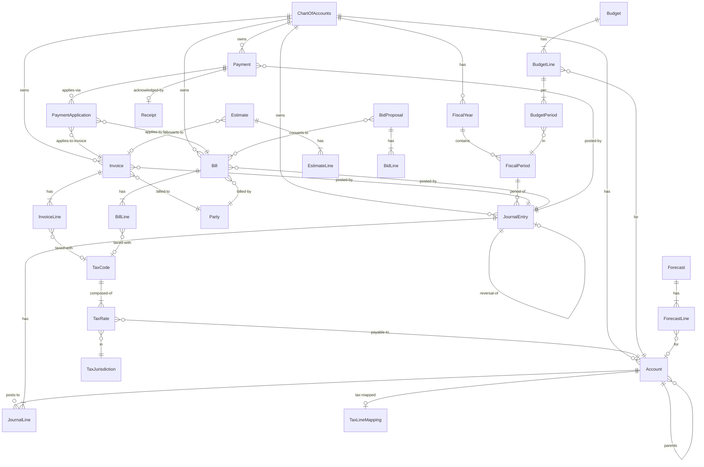

# `blocks-financial-*` — Stage 02 Schema Design (Clean-Room)

**Document type:** ICM Stage 02 architecture artifact (clean-room schema-mining output)
**Cluster:** `blocks-financial-*`
**Author:** XO (research session)
**Date:** 2026-05-16
**Status:** Draft for CO + COB review
**Anchors to:** [ADR 0088 — Anchor as All-In-One Local-First Runtime](../../docs/adrs/0088-anchor-all-in-one-local-first-runtime.md)

---

## 0. Header & Posture

### 0.1 What this document is

A **clean-room** schema-design document for the `blocks-financial-*` cluster of
the Sunfish Anchor application. It defines entity shapes, validation rules,
workflow states, cross-entity relationships, and the algorithms that need
care (double-entry posting, AR aging, bank reconciliation, tax-line mapping,
period close).

This document is **the** clean-room artifact for the cluster — sufficient for
an implementer with no copyleft FOSS access to build the cluster correctly.
Implementation may be in TypeScript (Anchor Tauri-React surface) or Rust
(Tauri side / future native domain shards) or C# (existing `blocks-financial-ledger`
package, the canonical .NET implementation). Type notation in this document
leans TypeScript for readability; equivalents in Rust (`enum` + `struct`) and
C# (`record` + `enum`) follow obvious conventions.

### 0.2 License posture (binding)

All schema, validation logic, and algorithm pseudocode in this document is
**original** clean-room work, derived from:

1. Textbook double-entry accounting fundamentals (500+ year old patterns; no
   IP holder).
2. Public-domain IRS publications (Schedule E / Form 1040 / Pub 527 / Pub 946
   for depreciation) — cited directly.
3. **Permissive-licensed** entity patterns (Apache OFBiz `accounting` module,
   Apache 2.0) — borrowed with attribution per ADR 0088 §3, classified below.
4. **Copyleft-licensed** sources (GPL/AGPL) — read for conceptual
   understanding **only**, in reading-isolation. No code, comments, schema
   text, or identifier strings copied. Cited as inspiration in §11.

**Reading isolation log:** All copyleft references in §11 were studied in a
non-Sunfish working directory, in editor sessions not connected to this
document. No copyleft code was opened in the same editor instance that
produced this schema.

### 0.3 Anchor runtime context (recap from ADR 0088)

- **SQLite is the primary store**, not a cache. All schemas in this document
  are SQLite-friendly: integer / text / real / blob primitives, no
  PostgreSQL-isms.
- **Loro CRDT** is the sync overlay between Anchor instances. Schema choices
  must avoid unbounded write-amplification in the CRDT (e.g., entity-versioned
  records, not row-versioned audit logs that grow unbounded).
- **Monetary precision:** all money values are stored as integer minor units
  (e.g., USD cents) in the persistence layer to avoid floating-point error.
  The TypeScript surface exposes them as `Money` (a tagged type wrapping
  bigint-minor-units + ISO 4217 currency code). The C# surface uses
  `decimal` with two-decimal rounding enforcement (matches the existing
  `blocks-financial-ledger` `JournalEntryLine.Debit` pattern). The two
  representations interop via the integer-minor-units canonical form.
- **MIT license output**: every line of cluster code remains MIT.

---

## 1. License Posture for This Cluster

Every FOSS source consulted is classified once, before any schema design
work. Designations follow the ADR 0088 §2 license matrix.

| Source | License | Classification | Used for in this doc | Citation form |
|---|---|---|---|---|
| Apache OFBiz `accounting` package | Apache 2.0 | **Permissive — BORROW with attribution** | Chart-of-accounts hierarchy, invoice/bill entity skeletons, payment-application pattern, tax-authority/tax-category split | OFBiz/v18+ accounting entity model (§11.1) |
| Beancount + ledger-cli ecosystem (data model concepts only) | GPLv2 | **Copyleft — clean-room only** | Read for understanding of the textbook double-entry data model (transaction-with-postings, balance assertions, account-type semantics) | Inspired-by citation, §11.2 |
| GnuCash | GPLv2 | **Copyleft — clean-room only** | Read for understanding of AR aging buckets, bank reconciliation flow, scheduled-transaction patterns, Schedule E tax-line mapping | Inspired-by citation, §11.3 |
| Akaunting | GPLv3 | **Copyleft — clean-room only** | Read for understanding of small-business AR/AP UX expectations (status enums, due-date logic, payment-application UX) | Inspired-by citation, §11.4 |
| ERPNext `accounts`, `tax_template`, `budget`, `accounting_dimension` doctypes | GPLv3 | **Copyleft — clean-room only** | Read for understanding of property-business-specific patterns (cost-center, dimension tagging, budget vs actual). Also: the doctype-tree for migration-importer source-side. | Inspired-by citation, §11.5; importer source-shape §10 |
| IRS Publication 527 (Residential Rental Property) | Public domain | **Public-domain — direct reference** | Schedule E line definitions, expense category taxonomy | Direct citation, §11.6 |
| IRS Schedule E + Form 1040 instructions, IRS Pub 946 (Depreciation), Pub 535 (Business Expenses) | Public domain | **Public-domain — direct reference** | Line-item structure for Schedule E, depreciation methods (MACRS), deductible expense categories | Direct citation, §11.6 |
| Frappe Framework `core` doctypes (DocType, child-table, link-field patterns) | GPLv3 | **Copyleft — clean-room only** | Read for understanding of the source schema shape for the migration importer (§10). | Inspired-by citation, §11.5 |

**Discipline statement:** Of the eight sources, only Apache OFBiz and the
public-domain IRS publications are permitted as **source material** for this
document. The five copyleft sources are studied for **understanding** of the
problem space; their solutions are not transcribed. The schema and algorithms
in §3–§7 are original work that happens to solve the same problems the
copyleft projects solve — because the problems (double-entry, AR aging,
period close, tax-line mapping) have textbook-fundamental solutions older
than any of those projects.

---

## 2. Cluster Decomposition

The cluster is decomposed into block packages along entity-cohesion lines.
This mirrors existing Sunfish conventions (one package per cohesive entity
family) and the existing `blocks-financial-ledger` thin shell, which is rolled
into this design as the GL package.

| Package | Purpose | Phase |
|---|---|---|
| `blocks-financial-chart` | Chart of accounts (Account hierarchy + AccountType). | 1 |
| `blocks-financial-ledger` | Journal entries + lines (double-entry posting engine). Rolls in the existing thin `blocks-financial-ledger`. | 1 |
| `blocks-financial-ar` | Customer-facing: Invoices + InvoiceLines + InvoiceStatus + Receipts. | 1 |
| `blocks-financial-ap` | Vendor-facing: Bills + BillLines + BillStatus. | 1 |
| `blocks-financial-payments` | Payment + PaymentApplication (apply to invoices / bills / mixed). | 1 |
| `blocks-financial-tax` | TaxCode + TaxRate + TaxJurisdiction + TaxLineMapping. | 1 |
| `blocks-financial-periods` | FiscalYear + FiscalPeriod + period-close machinery. | 1 |
| `blocks-financial-budget` | Budget + BudgetLine + BudgetPeriod (budget vs actual). | 3 |
| `blocks-financial-forecast` | Forecast + ForecastLine. | 3 |
| `blocks-financial-estimate` | Estimate + EstimateLine (client-facing pre-invoice). | 3 |
| `blocks-financial-bid` | BidProposal + BidLine (vendor-side cost proposal). | 3 |

**Naming compliance (cluster-naming-rules):**

- Cluster prefix `financial` applied per Rule 1.
- Existing `blocks-financial-ledger` (GL primitives) is a pre-cluster name. Rule 1
  exception applies: the existing thin shell is the cluster's GL spine and
  will be renamed to `blocks-financial-ledger` during Stage 04 (scaffolding),
  with type aliases retained for one release cycle.
- Rule 3 reservation respected: no `Asset` / `Tenant` / `User` / `Account`
  overload at the block-tier. The accounting entity is `Account` qualified by
  the package namespace (`Sunfish.Blocks.Financial.Chart.Account`), which is
  acceptable because the foundation reservation on `Account` is for a future
  *identity-tier* concept; the financial-tier `Account` is the textbook GL
  account and lives behind a `Chart.` qualifier. CO ratification required
  before scaffolding — open question in §12.

---

## 3. Entity Catalog (Phase 1 Core)

Notation: TypeScript-leaning; `Money = { amount: bigint /* minor units */, currency: ISO4217 }`; ISO4217 is a 3-letter string (`"USD"`, `"CAD"` etc); `DateOnly = string /* YYYY-MM-DD */`; `Instant = string /* RFC3339 UTC */`; all IDs are `ULID` strings unless stated otherwise.

Validation rules listed are **non-obvious** ones; obvious rules (`Id` is
non-empty, strings are non-null, `Money.amount >= 0` for fields named
`Amount*`) are assumed throughout and not repeated.

---

### 3.1 `Account` (Chart of Accounts node)

**Purpose:** A single node in the general ledger chart of accounts. Forms a
hierarchical tree under one ChartOfAccounts root.

```ts
type AccountType =
  | "Asset"
  | "Liability"
  | "Equity"
  | "Income"      // textbook "Revenue"
  | "Expense";

type AccountSubtype =
  // Assets
  | "CurrentAsset" | "FixedAsset" | "BankAccount" | "AccountsReceivable"
  | "InventoryAsset" | "AccumulatedDepreciation" | "OtherAsset"
  // Liabilities
  | "CurrentLiability" | "AccountsPayable" | "LongTermLiability"
  | "TaxesPayable" | "OtherLiability"
  // Equity
  | "OwnersEquity" | "RetainedEarnings" | "Drawings"
  // Income
  | "OperatingIncome" | "OtherIncome"
  // Expense
  | "OperatingExpense" | "CostOfGoodsSold" | "InterestExpense"
  | "DepreciationExpense" | "OtherExpense";

type NormalBalance = "Debit" | "Credit";

interface Account {
  id: AccountId;                              // ULID
  chartId: ChartOfAccountsId;                 // FK -> ChartOfAccounts
  parentAccountId: AccountId | null;          // null for root-of-type
  code: string;                               // e.g. "4000" — unique within chartId
  name: string;                               // e.g. "Rental Revenue"
  type: AccountType;
  subtype: AccountSubtype;
  normalBalance: NormalBalance;               // derived from type but stored for query speed
  description: string | null;
  currency: ISO4217;                          // an account is single-currency in v1
  isActive: boolean;                          // soft-delete; default true
  isPostable: boolean;                        // false for parent/rollup nodes
  taxLineMappingId: TaxLineMappingId | null;  // optional FK; see §3.16
  externalRef: string | null;                 // for ERPNext migration trace; opaque
  createdAtUtc: Instant;
  updatedAtUtc: Instant;
}
```

**Relationships:**
- `chartId` → `ChartOfAccounts.id` (many accounts per chart).
- `parentAccountId` → `Account.id` (self-FK; tree).
- `taxLineMappingId` → `TaxLineMapping.id` (optional; nullable for non-tax-relevant accounts).
- Inverse: `JournalLine.accountId` → `Account.id`.

**Validation rules:**
1. `normalBalance` MUST match `type`: Asset/Expense → Debit; Liability/Equity/Income → Credit. (Enforced at construction.)
2. `code` is unique within a `chartId`. Suggested but not enforced: numeric ranges by type (1xxx Assets, 2xxx Liabilities, 3xxx Equity, 4xxx Income, 5xxx Expense, 6xxx Other).
3. If `parentAccountId` is non-null, the parent MUST have the same `type` and the same `chartId`. Subtype may differ within the type.
4. If `isPostable = false`, no `JournalLine` may reference this account (validation at posting time).
5. An account can be deactivated (`isActive = false`) only when it has zero balance and no open child accounts. Deactivation is reversible.
6. `currency` MUST equal the `ChartOfAccounts.baseCurrency` for v1 (multi-currency deferred to a later phase).

**Workflow:** stateless; lifecycle is `isActive` true/false only.

---

### 3.2 `ChartOfAccounts`

**Purpose:** Container for a set of `Account` records. Typically one per
legal entity (LLC / sole proprietor); CO's portfolio has 4 LLCs → 4 charts.

```ts
interface ChartOfAccounts {
  id: ChartOfAccountsId;
  legalEntityId: LegalEntityId;       // FK -> blocks-property/foundation legal entity registry
  name: string;                       // "Wood Properties LLC — Operating"
  baseCurrency: ISO4217;
  fiscalYearStart: { month: 1..12, day: 1..31 };  // e.g. {1,1} for calendar year
  retainedEarningsAccountId: AccountId | null;    // designated; required before first close
  isActive: boolean;
  createdAtUtc: Instant;
  updatedAtUtc: Instant;
}
```

**Validation:**
1. Exactly one `ChartOfAccounts` per `legalEntityId` in v1.
2. `retainedEarningsAccountId`, if set, MUST be an Equity-type account in this chart.
3. `fiscalYearStart` cannot be changed after the first `JournalEntry` has been
   posted to the chart (would invalidate period boundaries).

---

### 3.3 `JournalEntry`

**Purpose:** An atomic accounting transaction — a balanced set of debit and
credit lines posted on a single date. **The fundamental unit of the ledger.**
Existing implementation: `Sunfish.Blocks.FinancialLedger.Models.JournalEntry`.

```ts
type JournalEntryStatus =
  | "Draft"        // editable; not posted; does not affect balances
  | "Posted"       // committed to the ledger; affects balances; immutable
  | "Reversed";    // a reversal entry has been posted; this entry is logically nullified
                   // (both this and the reversing entry remain in the ledger)

interface JournalEntry {
  id: JournalEntryId;
  chartId: ChartOfAccountsId;
  entryDate: DateOnly;                   // accounting date (affects which period)
  postedAtUtc: Instant | null;           // wall-clock; null when Draft
  status: JournalEntryStatus;
  memo: string;                          // human-readable; required
  lines: ReadonlyArray<JournalLine>;     // 2..n lines; balanced
  sourceKind: JournalEntrySource;        // see below — provenance tag
  sourceRef: string | null;              // e.g. "invoice:INV-00123"
  reversalOf: JournalEntryId | null;     // non-null iff this entry reverses another
  reversedBy: JournalEntryId | null;     // non-null iff this entry was reversed
  periodId: FiscalPeriodId;              // derived from entryDate at post time; pinned
  createdByUserId: UserId;
  createdAtUtc: Instant;
}

type JournalEntrySource =
  | "Manual"           // hand-entered
  | "Invoice"          // generated from an AR invoice
  | "Bill"             // generated from an AP bill
  | "Payment"          // generated from a payment
  | "Receipt"          // generated from a receipt without an invoice
  | "Depreciation"     // generated by depreciation schedule
  | "Adjusting"        // period-end adjusting entry
  | "Closing"          // period-close entry (revenue/expense → retained earnings)
  | "Reversal"         // reversal of another entry
  | "Migration";       // imported from ERPNext / Wave / etc.
```

**Relationships:**
- `chartId` → `ChartOfAccounts.id`.
- `periodId` → `FiscalPeriod.id`.
- `reversalOf` and `reversedBy` → `JournalEntry.id` (paired, anti-symmetric).
- `lines` → `JournalLine[]` (composition; lines do not exist without an entry).

**Validation (enforced at post-time, not at draft-time):**
1. `lines.length >= 2`.
2. `sum(lines.debit) == sum(lines.credit)` exactly, in minor units. **No tolerance.**
3. All `lines[].accountId` MUST resolve to `Account` records in the same `chartId` and with `isPostable = true`.
4. `entryDate` MUST fall within an open `FiscalPeriod`. (Period must not be `Closed` or `Locked`.)
5. `entryDate <= today` (no future-dating in v1 except for `sourceKind = "Adjusting"` which permits same-period-end-date).
6. Once `status = "Posted"`, the entry is immutable — fields, `lines`, anything. Corrections happen via reversal + new entry.
7. `reversalOf` chain depth = 1: a reversal cannot itself be reversed. The next correction is a new entry, not a reversal-of-a-reversal.

**Workflow states:**

```
   ┌──────────┐  post()    ┌─────────┐  reverse()  ┌──────────┐
   │  Draft   │ ─────────▶ │ Posted  │ ──────────▶ │ Reversed │
   └──────────┘            └─────────┘             └──────────┘
       │                       │
       │ discard()             │ (immutable; no edits)
       ▼                       │
    [deleted]                  │
```

Draft → Posted is the only state transition that runs balance validation.
Discarding a Draft is a hard delete (no audit retention required for
never-posted drafts in v1).

---

### 3.4 `JournalLine`

**Purpose:** One debit or one credit posting to a single account within a
`JournalEntry`. Existing implementation:
`Sunfish.Blocks.FinancialLedger.Models.JournalEntryLine`.

```ts
interface JournalLine {
  id: JournalLineId;
  entryId: JournalEntryId;          // FK -> JournalEntry
  lineNumber: number;               // 1..n; ordering within entry
  accountId: AccountId;
  debit: Money;                     // exactly one of debit/credit is zero
  credit: Money;
  memo: string | null;              // line-level annotation; overrides entry.memo for reporting
  // Optional dimensional tags for reporting (see §3.18):
  propertyId: PropertyId | null;    // cost-center: which rental property
  classId: ClassificationId | null; // user-defined classification
  taxCodeId: TaxCodeId | null;      // if this line represents tax
}
```

**Validation:**
1. Exactly one of `debit.amount` / `credit.amount` is non-zero. Both
   non-negative. (Already enforced by existing `JournalEntryLine`.)
2. `debit.currency == credit.currency == Account[accountId].currency == ChartOfAccounts.baseCurrency`.
3. `propertyId`, if non-null, MUST exist in the property registry.
4. `taxCodeId` may only be non-null on lines posted to tax-payable or
   tax-receivable accounts (subtype `TaxesPayable` or — rare — a tax-asset
   variant).

---

### 3.5 `Invoice` (AR)

**Purpose:** A customer-facing demand for payment for goods or services
rendered. Distinct from the existing `Sunfish.Blocks.RentCollection.Invoice`
(which is rent-schedule-driven and narrower); the financial-AR Invoice
covers the general case (rent, service fees, sales of supplies, etc.).
The rent-collection Invoice will remain a specialization that emits a
financial-AR Invoice on issue (open question §12).

```ts
type InvoiceStatus =
  | "Draft"           // editable; not posted; no GL effect
  | "Issued"          // sent to customer; posted to GL (AR debit, Income credit)
  | "PartiallyPaid"   // some payment applied; balance > 0
  | "Paid"            // balance == 0
  | "Overdue"         // (computed) issued + past due date + balance > 0
  | "Voided"          // reversed in GL; ledger trail retained
  | "WrittenOff";     // moved to bad-debt expense; ledger trail retained

interface Invoice {
  id: InvoiceId;
  chartId: ChartOfAccountsId;
  invoiceNumber: string;            // human-readable; unique within chartId
  customerId: PartyId;              // FK -> party/customer registry
  propertyId: PropertyId | null;    // for property-business cost-center tagging
  issueDate: DateOnly;
  dueDate: DateOnly;
  currency: ISO4217;
  lines: ReadonlyArray<InvoiceLine>;
  subtotal: Money;                  // sum of line amounts before tax
  taxTotal: Money;                  // sum of line tax amounts
  total: Money;                     // subtotal + taxTotal
  amountPaid: Money;                // running total from applied payments
  balance: Money;                   // total - amountPaid; cached for query
  status: InvoiceStatus;
  arAccountId: AccountId;           // which AR account this posts to
  notes: string | null;
  termsId: PaymentTermsId | null;   // see §3.17
  journalEntryId: JournalEntryId | null;  // null until issued; the JE that posted it
  voidedByEntryId: JournalEntryId | null; // non-null when voided
  externalRef: string | null;       // ERPNext source ref
  createdAtUtc: Instant;
  updatedAtUtc: Instant;
}
```

**Relationships:**
- `chartId`, `customerId`, `propertyId`, `arAccountId`, `journalEntryId`, `voidedByEntryId`, `termsId` — all FKs.
- `lines` → `InvoiceLine[]` (composition).
- Inverse: `PaymentApplication.invoiceId` → `Invoice.id`.

**Validation:**
1. `subtotal == sum(lines[].amount)` and `taxTotal == sum(lines[].taxAmount)` and `total == subtotal + taxTotal`. (Computed; persisted for query speed; re-computed on every line change.)
2. `balance == total - amountPaid`. Persisted; recomputed on every payment application.
3. `dueDate >= issueDate`.
4. `invoiceNumber` unique within `chartId`. Format suggested as `INV-NNNNNNN` but not enforced.
5. State transitions are gated (see workflow below).
6. `arAccountId` MUST be an Asset-type, AccountsReceivable-subtype account in this chart.

**Workflow:**

```
                        issue()
   ┌─────────┐        (posts JE)        ┌────────┐  apply-payment()  ┌──────────────┐
   │  Draft  │ ─────────────────────────▶│ Issued │ ─────────────────▶│ PartiallyPaid│
   └─────────┘                           └────────┘                   └──────────────┘
        │                                    │  │                            │
        │ discard()                          │  │   apply-payment(full)      │
        ▼                                    │  └────────────────────────────┼──▶ Paid
     [deleted]                               │                               │
                                             │  void() (posts reversing JE)  │
                                             ▼                               │
                                          Voided ◀─────────────────────────┐ │
                                                                           │ │
                                                          write-off()      │ │
                                                       (posts bad-debt JE) │ │
                                                                           ▼ ▼
                                                                      WrittenOff
```

`Overdue` is a **derived** status: `Issued || PartiallyPaid` and `today > dueDate` and `balance > 0`. It is not a persisted state; computed at read time. (Some UIs may want a flag; can be added without breaking the schema.)

---

### 3.6 `InvoiceLine`

```ts
interface InvoiceLine {
  id: InvoiceLineId;
  invoiceId: InvoiceId;
  lineNumber: number;
  description: string;
  quantity: number;                  // permits decimal quantities (e.g. 1.5 hours)
  unitPrice: Money;
  amount: Money;                     // quantity * unitPrice (rounded to minor units)
  incomeAccountId: AccountId;        // which income account this credits at post-time
  taxCodeId: TaxCodeId | null;
  taxAmount: Money;                  // computed from taxCodeId resolution at post-time
  propertyId: PropertyId | null;     // optional cost-center
  classId: ClassificationId | null;
  notes: string | null;
}
```

**Validation:**
1. `amount = round(quantity * unitPrice.amount, 0 /* minor units */)` using banker's rounding. (Rounding strategy is a project-wide convention — see §6.)
2. `incomeAccountId` MUST be Income-type and `isPostable=true`.
3. `taxAmount` is recomputed when `taxCodeId` or `amount` changes; never user-editable.

---

### 3.7 `Bill` (AP)

**Purpose:** A vendor-facing obligation — what we owe a supplier.
Mirror-image of `Invoice` on the credit side.

```ts
type BillStatus =
  | "Draft"
  | "Received"        // entered, posted to GL (Expense/Asset debit, AP credit)
  | "Approved"        // approved for payment (optional gate)
  | "PartiallyPaid"
  | "Paid"
  | "Overdue"         // (computed) Received|Approved + past due date + balance > 0
  | "Voided"
  | "Disputed";       // hold; do not pay; ledger trail retained

interface Bill {
  id: BillId;
  chartId: ChartOfAccountsId;
  billNumber: string;               // typically the vendor's invoice number
  vendorId: PartyId;
  propertyId: PropertyId | null;    // cost-center: which property the bill is for
  billDate: DateOnly;
  dueDate: DateOnly;
  receivedDate: DateOnly;           // when we got it (may differ from billDate)
  currency: ISO4217;
  lines: ReadonlyArray<BillLine>;
  subtotal: Money;
  taxTotal: Money;
  total: Money;
  amountPaid: Money;
  balance: Money;
  status: BillStatus;
  apAccountId: AccountId;           // AP account this posts to
  notes: string | null;
  termsId: PaymentTermsId | null;
  journalEntryId: JournalEntryId | null;
  voidedByEntryId: JournalEntryId | null;
  approvedByUserId: UserId | null;
  approvedAtUtc: Instant | null;
  externalRef: string | null;
  createdAtUtc: Instant;
  updatedAtUtc: Instant;
}
```

**Validation:** parallel to Invoice (totals computed; FKs validated; AP account type-checked). Additionally:
1. Approval is optional — controlled by a per-chart policy flag (`require_approval_threshold: Money | null`). Below threshold, `Received → PartiallyPaid/Paid` is allowed without `Approved` step.
2. `Disputed` may be set from `Received` or `Approved`; clears back to the prior state when resolved.

---

### 3.8 `BillLine`

Mirror of `InvoiceLine`, with:
- `expenseAccountId` instead of `incomeAccountId`.
- May also debit an Asset account (e.g., when a bill represents purchase of fixed asset or inventory); the field is renamed `debitAccountId` and validated as Expense-or-Asset.

```ts
interface BillLine {
  id: BillLineId;
  billId: BillId;
  lineNumber: number;
  description: string;
  quantity: number;
  unitPrice: Money;
  amount: Money;
  debitAccountId: AccountId;        // Expense or Asset; subtype-validated
  taxCodeId: TaxCodeId | null;
  taxAmount: Money;
  propertyId: PropertyId | null;
  classId: ClassificationId | null;
  notes: string | null;
}
```

---

### 3.9 `Payment`

**Purpose:** A cash movement — money out (to vendor) or money in (from
customer). Distinct from the existing `Sunfish.Blocks.RentCollection.Payment`
which is invoice-specific; financial-Payment is the general case. Existing
rent-collection Payment becomes a thin wrapper that creates a
financial-Payment + immediately applies it to its invoice (open question §12).

```ts
type PaymentDirection = "Inbound" | "Outbound";

type PaymentMethod =
  | "Cash" | "Check" | "ACH" | "Wire"
  | "Card" | "DigitalWallet" | "Other";

type PaymentStatus =
  | "Draft"
  | "Cleared"          // funds have moved; posted to GL
  | "Unapplied"        // posted, but not yet applied to any invoice/bill (suspense)
  | "Applied"          // fully applied
  | "PartiallyApplied" // some applied, some still floating
  | "Bounced"          // returned (NSF, etc.); reversal entry posted
  | "Voided";

interface Payment {
  id: PaymentId;
  chartId: ChartOfAccountsId;
  direction: PaymentDirection;
  paymentNumber: string;            // sequential within chart+direction
  partyId: PartyId;                 // customer (Inbound) or vendor (Outbound)
  bankAccountId: AccountId;         // the cash/bank account moved
  paymentDate: DateOnly;
  amount: Money;
  currency: ISO4217;
  method: PaymentMethod;
  reference: string | null;         // check #, ACH trace, card last-4, etc.
  status: PaymentStatus;
  unappliedAmount: Money;           // amount - sum(applications); >= 0
  applications: ReadonlyArray<PaymentApplication>;
  journalEntryId: JournalEntryId | null;
  bouncedByEntryId: JournalEntryId | null;
  notes: string | null;
  externalRef: string | null;
  createdAtUtc: Instant;
  updatedAtUtc: Instant;
}
```

**Validation:**
1. `bankAccountId` MUST be Asset-type, BankAccount-subtype (or `Cash` subtype for cash drawer).
2. `amount > 0`.
3. `unappliedAmount = amount - sum(applications[].amountApplied)`, always `>= 0`.
4. State transitions are gated:
   - `Draft → Cleared` requires the GL entry to post.
   - `Cleared → Bounced` posts a reversal JE; reduces invoice/bill `amountPaid` for each prior application.
   - `Cleared → Unapplied/PartiallyApplied/Applied` depends on application coverage.

**Workflow:**

```
   ┌───────┐  clear()/post()   ┌──────────┐   apply()   ┌──────────────────┐
   │ Draft │ ─────────────────▶│Unapplied │ ───────────▶│ PartiallyApplied │
   └───────┘                   └──────────┘             └──────────────────┘
                                    │  ▲                       │   ▲
                                    │  │ unapply()             │   │
                                    │  │                       │ apply()
                                    │  │                       ▼
                                    │  │                    ┌────────┐
                                    │  └────────────────────│Applied │
                                    │       unapply-all()   └────────┘
                                    ▼
                              ┌──────────┐
                              │ Bounced  │  (terminal until manual void/re-create)
                              └──────────┘
```

---

### 3.10 `PaymentApplication`

**Purpose:** Apply (part of) a `Payment` to (part of) an `Invoice` or `Bill`.
Many-to-many: one payment can apply to multiple invoices; one invoice can
receive multiple payments.

```ts
type AppliedTo = "Invoice" | "Bill";

interface PaymentApplication {
  id: PaymentApplicationId;
  paymentId: PaymentId;
  appliedTo: AppliedTo;
  targetId: InvoiceId | BillId;     // tagged union with appliedTo
  amountApplied: Money;
  appliedDate: DateOnly;            // usually == payment.paymentDate
  discountAmount: Money;            // early-payment discount, if any
  writeoffAmount: Money;            // short-pay write-off, if any
  createdAtUtc: Instant;
}
```

**Validation:**
1. `paymentId` direction MUST match: Inbound payment ↔ Invoice; Outbound payment ↔ Bill.
2. `targetId` MUST belong to the same `chartId` as the payment.
3. `amountApplied + discountAmount + writeoffAmount <= target.balance` at time of application.
4. `sum_over_applications(amountApplied) <= payment.amount` (enforced via `unappliedAmount` invariant).
5. Application is immutable once created; corrections happen via unapply (delete) + re-apply.
6. Currency MUST match across payment, target, and application.

**Note:** discounts and writeoffs each post their own GL line, see algorithm in §6.

---

### 3.11 `Receipt`

**Purpose:** Customer-facing acknowledgment of a payment. Often emitted
after a Payment is applied to an Invoice (or after an Inbound payment is
posted without an invoice — e.g. a deposit). Distinct from a `Bill` (which
goes inbound from a vendor) and from a `Payment` (which is the cash event).

```ts
interface Receipt {
  id: ReceiptId;
  chartId: ChartOfAccountsId;
  receiptNumber: string;            // sequential within chartId
  paymentId: PaymentId;             // FK; one receipt per payment in v1
  customerId: PartyId;
  receiptDate: DateOnly;
  amount: Money;
  // Snapshot of the invoice numbers covered (for receipt text):
  coveredInvoiceNumbers: ReadonlyArray<string>;
  pdfDocumentId: DocumentId | null; // FK -> blocks-reports rendered PDF
  emailedToAddresses: ReadonlyArray<string>;
  emailedAtUtc: Instant | null;
  notes: string | null;
  createdAtUtc: Instant;
}
```

**Validation:**
1. `amount == Payment[paymentId].amount` (a receipt represents the full payment).
2. One `Receipt` per `paymentId` (1:1 in v1; relax later if needed).

---

### 3.12 `TaxCode`

**Purpose:** A user-facing identifier for a sales-tax or VAT rule. Resolves
to (potentially compound) `TaxRate` records under a `TaxJurisdiction`. The
3-level split (Code → Rate → Jurisdiction) mirrors the Apache OFBiz pattern
(permissive; borrowed-with-attribution).

```ts
type TaxKind =
  | "Sales"            // US-style sales tax
  | "VAT"              // Value-Added Tax (Europe etc.)
  | "GST"              // Goods & Services Tax (Canada, AU)
  | "WithholdingTax"   // tax withheld at source
  | "Use"              // self-assessed use tax
  | "Exempt"           // explicit zero (preserves audit trail vs. just omitting)
  | "Other";

type TaxApplication =
  | "OnSubtotal"        // tax = subtotal * rate
  | "Compound"          // tax = (subtotal + prior_tax) * rate
  | "Inclusive";        // line price already includes tax; back out

interface TaxCode {
  id: TaxCodeId;
  chartId: ChartOfAccountsId;
  code: string;                   // "CA-LA-CITY", "EU-DE-VAT19", "EXEMPT", etc.
  name: string;
  kind: TaxKind;
  application: TaxApplication;
  rates: ReadonlyArray<TaxRate>;  // 1..n; compound codes have multiple
  isActive: boolean;
  notes: string | null;
  createdAtUtc: Instant;
  updatedAtUtc: Instant;
}
```

---

### 3.13 `TaxRate`

```ts
interface TaxRate {
  id: TaxRateId;
  taxCodeId: TaxCodeId;
  jurisdictionId: TaxJurisdictionId;
  ratePercent: number;            // 0..100; decimal precision to 5 places (e.g. 8.25)
  effectiveDate: DateOnly;        // when this rate begins
  expiryDate: DateOnly | null;    // when this rate ends; null = open-ended
  payableAccountId: AccountId;    // Liability account that this rate's tax accrues to
  description: string | null;
}
```

**Validation:**
1. `ratePercent` is in `[0, 100]`.
2. For a given (`taxCodeId`, `jurisdictionId`), effective-date ranges MUST NOT overlap. Exactly one rate is active per (`code`, `jurisdiction`, `date`).
3. `payableAccountId` MUST be Liability-type, TaxesPayable-subtype.
4. Historical rates are retained (not deleted); rate changes are modeled as expiring the old rate and inserting a new one.

---

### 3.14 `TaxJurisdiction`

```ts
type JurisdictionLevel =
  | "Federal" | "State" | "County" | "City" | "District" | "Special" | "Country";

interface TaxJurisdiction {
  id: TaxJurisdictionId;
  level: JurisdictionLevel;
  isoCountry: ISO3166_1;          // "US", "CA", "DE"
  region: string | null;          // ISO 3166-2 subdivision: "US-CA", "DE-BY"
  locality: string | null;        // "Los Angeles", "Munich"
  name: string;                   // display
  parentJurisdictionId: TaxJurisdictionId | null;
  notes: string | null;
}
```

**Use:** Multiple jurisdictions can apply to one transaction (federal + state + city). Tax code resolution walks the jurisdiction tree at the customer's billing address (`propertyId` location for property-business).

---

### 3.15 `FiscalYear`

```ts
type FiscalYearStatus = "Open" | "Closed";

interface FiscalYear {
  id: FiscalYearId;
  chartId: ChartOfAccountsId;
  label: string;                  // "2026", "FY26", "FY26 (Apr2026-Mar2027)"
  startDate: DateOnly;
  endDate: DateOnly;              // inclusive
  status: FiscalYearStatus;
  closedAtUtc: Instant | null;
  closingJournalEntryId: JournalEntryId | null;
  createdAtUtc: Instant;
}
```

---

### 3.16 `FiscalPeriod`

```ts
type FiscalPeriodKind = "Monthly" | "Quarterly" | "Annual" | "Custom";
type FiscalPeriodStatus =
  | "Open"           // postings allowed
  | "SoftClosed"     // postings blocked for regular users; admin can reopen
  | "Locked";        // immutable; reopening requires explicit unlock-with-audit

interface FiscalPeriod {
  id: FiscalPeriodId;
  chartId: ChartOfAccountsId;
  fiscalYearId: FiscalYearId;
  kind: FiscalPeriodKind;
  label: string;                  // "2026-01", "Q1-2026", "FY2026"
  startDate: DateOnly;
  endDate: DateOnly;
  status: FiscalPeriodStatus;
  softClosedAtUtc: Instant | null;
  lockedAtUtc: Instant | null;
  closingJournalEntryId: JournalEntryId | null;
  createdAtUtc: Instant;
}
```

**Validation:**
1. Periods within a `fiscalYearId` MUST be contiguous and non-overlapping.
2. The union of all periods in a year exactly covers `[FiscalYear.startDate, FiscalYear.endDate]`.
3. A period cannot be `Locked` if its `fiscalYearId` is not `Closed`.

---

### 3.17 `TaxLineMapping`

**Purpose:** Maps an `Account` to a target tax-form line. Drives the Schedule
E generation (and 1099 reporting, etc.). Borrowed-with-attribution shape from
OFBiz's `TaxAuthorityGlAccount` pattern, simplified for single-jurisdiction
US use.

```ts
type TaxForm =
  | "ScheduleE"        // Form 1040 — Supplemental Income and Loss (rental real estate)
  | "ScheduleC"        // Form 1040 — Profit or Loss from Business
  | "Form1120"         // C-Corp
  | "Form1120S"        // S-Corp
  | "Form1065"         // Partnership
  | "Form1099Nec"
  | "Form1099Misc"
  | "Other";

interface TaxLineMapping {
  id: TaxLineMappingId;
  chartId: ChartOfAccountsId;
  accountId: AccountId;
  taxForm: TaxForm;
  formLine: string;               // form-specific line ref, e.g. "5" for Schedule E line 5 (Advertising)
  description: string;            // human-readable: "Schedule E, Line 5: Advertising"
  taxYear: number | null;         // null = applies to all years; else year-specific
  isActive: boolean;
}
```

---

### 3.18 `PaymentTerms`

**Purpose:** Reusable "Net-30", "2/10 Net 30", "Due on receipt" definitions
applied to Invoices/Bills.

```ts
interface PaymentTerms {
  id: PaymentTermsId;
  chartId: ChartOfAccountsId;
  code: string;                  // "NET30", "2-10-NET-30", "DOR"
  name: string;
  netDays: number;               // due-date offset from invoice/bill date
  discountPercent: number;       // 0 if no discount
  discountDays: number;          // days within which discount applies; 0 if no discount
  isActive: boolean;
}
```

---

### 3.19 `Classification` (a.k.a. "Class")

**Purpose:** User-defined cross-cutting tag for GL lines (e.g., "Renovation",
"Insurance Claim 2026-Q1"). Equivalent to QuickBooks-style "Class" or
ERPNext's "Cost Center" / "Accounting Dimension" but simpler.

```ts
interface Classification {
  id: ClassificationId;
  chartId: ChartOfAccountsId;
  parentId: ClassificationId | null;
  name: string;
  isActive: boolean;
}
```

---

## 4. Entity Catalog (Phase 3 Advanced)

### 4.1 `Budget`

**Purpose:** Planned amount per account per period. Compared against actuals
in budget-vs-actual reports.

```ts
type BudgetStatus = "Draft" | "Approved" | "Active" | "Archived";

interface Budget {
  id: BudgetId;
  chartId: ChartOfAccountsId;
  name: string;                   // "FY2026 Operating Budget"
  fiscalYearId: FiscalYearId;
  status: BudgetStatus;
  approvedByUserId: UserId | null;
  approvedAtUtc: Instant | null;
  notes: string | null;
  createdAtUtc: Instant;
  updatedAtUtc: Instant;
}
```

### 4.2 `BudgetLine`

```ts
interface BudgetLine {
  id: BudgetLineId;
  budgetId: BudgetId;
  accountId: AccountId;
  propertyId: PropertyId | null;  // per-property budgets supported
  classId: ClassificationId | null;
  periods: ReadonlyArray<BudgetPeriod>;
  totalAmount: Money;             // sum across periods (denormalized)
}
```

### 4.3 `BudgetPeriod`

```ts
interface BudgetPeriod {
  id: BudgetPeriodId;
  budgetLineId: BudgetLineId;
  fiscalPeriodId: FiscalPeriodId;
  amount: Money;
  notes: string | null;
}
```

**Validation:** `Budget.totalAmount` = sum across `BudgetLine.periods.amount`. Periods MUST exist in the budget's `fiscalYearId`.

### 4.4 `Forecast` + `ForecastLine`

**Purpose:** Predicted amounts. Similar shape to Budget but typically updated
rolling rather than fixed. Distinguished from Budget by intent: budget is
**target**, forecast is **prediction**.

```ts
type ForecastKind = "Cashflow" | "Revenue" | "Expense" | "FullPL";
type ForecastHorizon = "ThirteenWeek" | "Quarterly" | "Annual" | "Custom";

interface Forecast {
  id: ForecastId;
  chartId: ChartOfAccountsId;
  name: string;
  kind: ForecastKind;
  horizon: ForecastHorizon;
  asOfDate: DateOnly;              // forecast "vintage"
  startDate: DateOnly;
  endDate: DateOnly;
  modelNotes: string | null;       // how the forecast was derived
  createdAtUtc: Instant;
  updatedAtUtc: Instant;
}

interface ForecastLine {
  id: ForecastLineId;
  forecastId: ForecastId;
  accountId: AccountId | null;     // null permitted for aggregate cashflow lines
  bucketDate: DateOnly;            // start of bucket
  bucketKind: "Week" | "Month" | "Quarter";
  amount: Money;
  confidence: "Low" | "Medium" | "High" | null;
  notes: string | null;
}
```

### 4.5 `Estimate` + `EstimateLine`

**Purpose:** A non-binding price quote to a customer. May convert to an
Invoice on acceptance. Lifecycle is separate from Invoice's.

```ts
type EstimateStatus =
  | "Draft" | "Sent" | "Accepted" | "Declined" | "Expired"
  | "Converted";                   // an Invoice was generated from this Estimate

interface Estimate {
  id: EstimateId;
  chartId: ChartOfAccountsId;
  estimateNumber: string;
  customerId: PartyId;
  propertyId: PropertyId | null;
  issueDate: DateOnly;
  validUntil: DateOnly;
  currency: ISO4217;
  lines: ReadonlyArray<EstimateLine>;
  subtotal: Money;
  taxTotal: Money;
  total: Money;
  status: EstimateStatus;
  convertedInvoiceId: InvoiceId | null;
  acceptedAtUtc: Instant | null;
  acceptedByName: string | null;   // free text — counterparty's representative
  acceptanceSignatureDocumentId: DocumentId | null;
  notes: string | null;
  createdAtUtc: Instant;
  updatedAtUtc: Instant;
}

interface EstimateLine {
  id: EstimateLineId;
  estimateId: EstimateId;
  lineNumber: number;
  description: string;
  quantity: number;
  unitPrice: Money;
  amount: Money;
  optionGroupId: string | null;    // "Tile package A" — grouping for client-pickable options
  isOptional: boolean;             // shown but not in total unless selected
  taxCodeId: TaxCodeId | null;
  taxAmount: Money;
  notes: string | null;
}
```

### 4.6 `BidProposal` + `BidLine`

**Purpose:** Vendor-side cost proposal — what a contractor proposes to charge
us for a scope of work. Inbound mirror of Estimate. Often the input to
creating a Bill once work is done; can also be evaluated against competing
bids before selection.

```ts
type BidStatus =
  | "Requested"        // we sent an RFP
  | "Submitted"        // vendor submitted bid
  | "UnderReview"
  | "Accepted"
  | "Declined"
  | "Expired"
  | "Withdrawn";       // vendor withdrew

interface BidProposal {
  id: BidProposalId;
  chartId: ChartOfAccountsId;
  bidNumber: string;
  vendorId: PartyId;
  propertyId: PropertyId | null;
  workOrderId: WorkOrderId | null; // FK -> blocks-maintenance / blocks-work-*
  rfpDate: DateOnly | null;
  submittedDate: DateOnly | null;
  validUntil: DateOnly | null;
  currency: ISO4217;
  lines: ReadonlyArray<BidLine>;
  subtotal: Money;
  taxTotal: Money;
  total: Money;
  status: BidStatus;
  acceptedAtUtc: Instant | null;
  convertedBillIds: ReadonlyArray<BillId>;   // 0..n — progress billing
  notes: string | null;
  attachmentDocumentIds: ReadonlyArray<DocumentId>;
  createdAtUtc: Instant;
  updatedAtUtc: Instant;
}

interface BidLine {
  id: BidLineId;
  bidProposalId: BidProposalId;
  lineNumber: number;
  description: string;
  category: "Labor" | "Material" | "Equipment" | "Subcontract" | "Other";
  quantity: number;
  unitPrice: Money;
  amount: Money;
  isAlternate: boolean;            // alternate scope: not in base total unless selected
  notes: string | null;
}
```

---

## 5. Cross-Entity Relationships

### 5.1 Mermaid ER diagram



### 5.2 AR aging — relationship logic

AR aging is **derived** state computed from `Invoice` records, not stored.
For each open invoice (`status IN (Issued, PartiallyPaid)` and `balance > 0`):

- `daysOverdue = today - dueDate` (negative if not yet due).
- Bucket:
  - `current` if `daysOverdue <= 0`
  - `0-30` if `1 <= daysOverdue <= 30`
  - `31-60` if `31 <= daysOverdue <= 60`
  - `61-90` if `61 <= daysOverdue <= 90`
  - `90+` if `daysOverdue > 90`

Aggregated by customer (and optionally by property). See algorithm in §6.2.

### 5.3 Payment application logic

A `Payment` can apply to:
- Zero invoices (suspense / customer deposit / overpayment held against future) — `status = Unapplied`.
- One invoice (the common case) — `status = Applied` if covers fully; else `PartiallyApplied`.
- N invoices (e.g., one ACH covering 3 monthly rents) — `status = Applied` when sum of applications == payment.amount.

Application is order-significant only for FIFO/LIFO posting policy on
**implicit** auto-application (when the user pays "the customer", not "this
specific invoice"). Default v1 policy is **oldest-first FIFO** on the
customer's open invoices.

### 5.4 Period-close relationships

`FiscalPeriod.status` transitions gate journal posting:

| From → To | Posting allowed | Trigger | Reversibility |
|---|---|---|---|
| `Open → Open` | Yes | n/a | n/a |
| `Open → SoftClosed` | Blocked for non-admin users | "soft close" action | Reversible (admin reopen) |
| `SoftClosed → Locked` | Blocked for everyone | "lock" action; requires fiscal year close for the final period of the year | Reversible only via explicit unlock-with-audit |
| `Locked → SoftClosed` | After unlock | "unlock period" action with audit memo | Requires audit-event entry |

Year-end close is a guarded sequence; see algorithm §6.5.

---

## 6. Key Algorithms

### 6.1 Double-entry posting (atomic)

```text
postJournalEntry(entry: JournalEntry) -> Result<JournalEntry, PostError>:

  // Phase 1 — preconditions
  if entry.status != "Draft":
      return Err(NotADraft)
  if entry.lines.length < 2:
      return Err(TooFewLines)

  // Phase 2 — balance check (no tolerance; integer minor units)
  totalDebit  = sum(line.debit.amount  for line in entry.lines)  // bigint
  totalCredit = sum(line.credit.amount for line in entry.lines)
  if totalDebit != totalCredit:
      return Err(Imbalanced { totalDebit, totalCredit })

  // Phase 3 — account validity
  for line in entry.lines:
      account = lookupAccount(line.accountId)
      if account is None:
          return Err(UnknownAccount { line.accountId })
      if account.chartId != entry.chartId:
          return Err(WrongChart)
      if !account.isPostable:
          return Err(AccountNotPostable { line.accountId })
      if line.debit.currency != account.currency or
         line.credit.currency != account.currency:
          return Err(CurrencyMismatch)

  // Phase 4 — period gating
  period = resolvePeriod(entry.chartId, entry.entryDate)
  if period is None:
      return Err(NoPeriodForDate)
  if period.status == "Locked":
      return Err(PeriodLocked)
  if period.status == "SoftClosed" and !user.hasRole("FinancialAdmin"):
      return Err(PeriodSoftClosed)

  // Phase 5 — atomic commit inside a single SQLite transaction
  withTransaction(db):
      entry.periodId = period.id
      entry.status   = "Posted"
      entry.postedAtUtc = now()
      db.insert(entry)
      for line in entry.lines:
          db.insert(line)
      // Balance cache (optional optimization):
      for accountId in distinct(line.accountId for line in entry.lines):
          db.upsertAccountBalance(accountId, period.id, /* delta */ ...)

  return Ok(entry)
```

**Notes:**
- All arithmetic uses **bigint minor units** (no decimals, no floats). Money
  with a fractional cent is impossible by construction.
- The balance cache is an optional read-side optimization. Authority remains
  `sum(JournalLine.debit - JournalLine.credit)`. The cache is rebuildable
  from primary data.
- Reversal posting is the same algorithm, with `sourceKind = "Reversal"` and
  `reversalOf` set. The reversal entry has flipped debits/credits relative to
  the original; this is the textbook double-entry reversal pattern.

### 6.2 AR aging buckets

```text
agingReport(chartId, asOf: DateOnly, optGroupBy: ("Customer" | "Property")?)
  -> AgingReport:

  buckets = [ "current", "0-30", "31-60", "61-90", "90+" ]
  result  = Map<GroupKey, Map<BucketName, Money>>()

  openInvoices = db.query Invoice
                 where chartId = chartId
                 and status in ("Issued", "PartiallyPaid")
                 and balance > 0

  for inv in openInvoices:
      daysOverdue = (asOf - inv.dueDate).days
      bucket = match daysOverdue:
          ..=0    => "current"
          1..=30  => "0-30"
          31..=60 => "31-60"
          61..=90 => "61-90"
          _       => "90+"

      key = match optGroupBy:
          Some("Customer") => inv.customerId
          Some("Property") => inv.propertyId or "Unassigned"
          None             => "All"

      result[key][bucket] += inv.balance

  // Optionally compute a totals row.
  totalsRow = sumAcrossKeys(result)
  return AgingReport { asOf, rows: result, totals: totalsRow }
```

**Subtleties:**
- `asOf` is parameterizable (not always `today`) — supports historical aging
  ("aging as of 2025-12-31").
- Partial payments reduce `balance` but don't change `dueDate`; aging is
  based on the original invoice due date. (User-facing toggle for "use last
  payment date" is a config option; not v1.)
- Negative `daysOverdue` (not yet due) is consolidated into `current`.

### 6.3 Bank reconciliation

```text
reconcileBankAccount(bankAccountId, statementEndDate, statementEndBalance,
                     externalTransactions: BankFeedTxn[]):

  // 1. Find candidate ledger lines.
  candidates = db.query JournalLine join JournalEntry
               where line.accountId = bankAccountId
               and entry.entryDate <= statementEndDate
               and !line.isReconciled

  // 2. Match externalTransactions against candidates.
  matches    = []
  unmatched_external = []
  for ext in externalTransactions:
      m = findMatch(ext, candidates)
        where match means:
          - amount matches exactly (sign-corrected by debit/credit)
          - dateWithin(±3 days)
          - reference/memo similarity > threshold (heuristic)
      if m is Some:
          matches.append((ext, m))
          candidates.remove(m)
      else:
          unmatched_external.append(ext)

  unmatched_ledger = candidates  // remaining

  // 3. Sum check
  bookBalance = priorReconciledBalance(bankAccountId)
              + sum(line.debit.amount - line.credit.amount
                    for line in db.lines(bankAccountId)
                    where line.isReconciled)
              + sum(match.delta for match in matches)
  difference = statementEndBalance - bookBalance

  // 4. Reconciliation record
  rec = BankReconciliation {
      id, bankAccountId,
      statementEndDate,
      statementEndBalance,
      bookBalanceAtEnd: bookBalance,
      difference,
      status: difference == 0 ? "Balanced" : "OutOfBalance",
      matches,
      unmatched_external,
      unmatched_ledger,
  }

  // 5. On commit: mark matched lines as isReconciled, store recId
  if user commits:
      withTransaction(db):
          for (ext, line) in matches:
              line.isReconciled = true
              line.reconciliationId = rec.id
              db.update(line)
          db.insert(rec)

  return rec
```

`BankReconciliation` is itself an entity, added in v1 alongside the AR/AP core
because property businesses reconcile monthly and rely on this end-to-end.

```ts
interface BankReconciliation {
  id: BankReconciliationId;
  chartId: ChartOfAccountsId;
  bankAccountId: AccountId;
  statementEndDate: DateOnly;
  statementEndBalance: Money;
  bookBalanceAtEnd: Money;
  difference: Money;
  status: "InProgress" | "Balanced" | "OutOfBalance" | "Finalized";
  matchedLineIds: ReadonlyArray<JournalLineId>;
  unmatchedExternal: ReadonlyArray<BankFeedTxn>;  // stored as JSON blob
  notes: string | null;
  finalizedByUserId: UserId | null;
  finalizedAtUtc: Instant | null;
  createdAtUtc: Instant;
}
```

### 6.4 Tax calculation per jurisdiction

```text
computeLineTax(line: InvoiceLine | BillLine, txnContext) -> { taxAmount, breakdown }:

  if line.taxCodeId is None:
      return { taxAmount: 0, breakdown: [] }

  code = lookupTaxCode(line.taxCodeId)

  // Resolve applicable rates for this date + jurisdiction.
  // Jurisdiction is determined from txnContext (customer billing address or property location).
  jurisdictions = resolveJurisdictionTree(txnContext.address)
  applicableRates = []
  for rate in code.rates:
      if rate.effectiveDate <= txnContext.date
         and (rate.expiryDate is None or rate.expiryDate >= txnContext.date)
         and rate.jurisdictionId in jurisdictions:
          applicableRates.append(rate)

  // Apply per TaxApplication semantics.
  switch code.application:
    case "OnSubtotal":
        // simple: tax = subtotal * (sum of rates)
        totalRate = sum(r.ratePercent for r in applicableRates) / 100
        taxAmount = roundMinor(line.amount.amount * totalRate)
        breakdown = [ { rate: r, amount: roundMinor(line.amount.amount * r.ratePercent / 100) }
                      for r in applicableRates ]

    case "Compound":
        // sequential: each rate applies to (subtotal + prior taxes)
        // Order rates by jurisdiction level (federal -> state -> county -> city -> district)
        sortedRates = sortByLevel(applicableRates)
        running = line.amount.amount
        breakdown = []
        accumulatedTax = 0
        for r in sortedRates:
            t = roundMinor(running * r.ratePercent / 100)
            breakdown.append({ rate: r, amount: t })
            accumulatedTax += t
            running += t      // compound on top
        taxAmount = accumulatedTax

    case "Inclusive":
        // tax is already in line.amount; back it out
        totalRate = sum(r.ratePercent for r in applicableRates) / 100
        taxAmount = roundMinor(line.amount.amount * totalRate / (1 + totalRate))
        breakdown = ...      // proportional

  return { taxAmount, breakdown }
```

**Notes:**
- `roundMinor` is banker's rounding (half-to-even) at the minor-unit boundary
  to prevent systematic over- or under-collection.
- The per-rate breakdown is stored on the line (in addition to the
  `taxAmount` total) so that GL posting can split tax-payable into one line
  per jurisdiction.

### 6.5 Period close + reversal

Period close has two flavors:

**(a) Month-end soft close** — non-admin users can no longer post to the
period. Admins can. The process:

```text
softClosePeriod(periodId):
    period = lookup(periodId)
    require period.status == "Open"
    period.status = "SoftClosed"
    period.softClosedAtUtc = now()
    db.update(period)
```

**(b) Year-end close + retained-earnings rollover** — at the end of a fiscal
year, all Income and Expense account balances are zeroed out by posting a
closing journal entry that transfers their net to Retained Earnings.

```text
closeFiscalYear(fiscalYearId):
    fy = lookup(fiscalYearId)
    require fy.status == "Open"
    chart = lookup(fy.chartId)
    require chart.retainedEarningsAccountId is not None

    // 1. Ensure all periods in the FY are at least SoftClosed.
    for p in periodsIn(fy):
        if p.status == "Open":
            softClosePeriod(p.id)

    // 2. Build the closing entry.
    incomeBalance = computeBalance(type="Income",   chartId=fy.chartId,
                                   asOf=fy.endDate)
    expenseBalance = computeBalance(type="Expense", chartId=fy.chartId,
                                    asOf=fy.endDate)
    // Income accounts normally have credit balance — close by debiting them.
    // Expense accounts normally have debit balance — close by crediting them.
    // The net flows to Retained Earnings.

    closingLines = []
    for incomeAcct in accountsOfType("Income", fy.chartId):
        bal = balance(incomeAcct.id, asOf=fy.endDate)  // signed
        if bal != 0:
            closingLines.append(JournalLine {
                accountId: incomeAcct.id,
                debit:  bal if bal > 0 else 0,         // zero it out
                credit: 0,
                memo: "Year-end close to retained earnings"
            })
    for expenseAcct in accountsOfType("Expense", fy.chartId):
        bal = balance(expenseAcct.id, asOf=fy.endDate)
        if bal != 0:
            closingLines.append(JournalLine {
                accountId: expenseAcct.id,
                debit:  0,
                credit: bal if bal > 0 else 0,
                memo: "Year-end close to retained earnings"
            })
    // The balancing line goes to Retained Earnings.
    netIncome = incomeBalance - expenseBalance  // positive = profit
    if netIncome > 0:
        closingLines.append(JournalLine {
            accountId: chart.retainedEarningsAccountId,
            debit: 0,
            credit: netIncome,
            memo: "Net income to retained earnings"
        })
    else if netIncome < 0:
        closingLines.append(JournalLine {
            accountId: chart.retainedEarningsAccountId,
            debit: -netIncome,
            credit: 0,
            memo: "Net loss to retained earnings"
        })

    // 3. Post the closing entry.
    closingEntry = JournalEntry {
        chartId: fy.chartId,
        entryDate: fy.endDate,
        memo: "Year-end closing entry — " + fy.label,
        lines: closingLines,
        sourceKind: "Closing",
    }
    posted = postJournalEntry(closingEntry)  // re-uses §6.1

    // 4. Lock periods, mark FY closed.
    withTransaction(db):
        for p in periodsIn(fy):
            p.status = "Locked"
            p.lockedAtUtc = now()
            db.update(p)
        fy.status = "Closed"
        fy.closedAtUtc = now()
        fy.closingJournalEntryId = posted.id
        db.update(fy)

    return posted
```

**Reversal of a posted entry:**

```text
reverseJournalEntry(entryId, reason, asOfDate?):
    original = lookup(entryId)
    require original.status == "Posted"
    require original.reversalOf is None  // can't reverse a reversal
    require original.reversedBy is None  // can't double-reverse

    period = resolvePeriod(original.chartId, asOfDate or today)
    require period.status != "Locked"

    reverseLines = [
        JournalLine {
            accountId: line.accountId,
            debit:  line.credit,       // swap
            credit: line.debit,        // swap
            memo: line.memo,
            ...dimensions...           // preserved
        } for line in original.lines
    ]

    reversal = JournalEntry {
        chartId: original.chartId,
        entryDate: asOfDate or today,
        memo: "Reversal of " + original.id + ": " + reason,
        lines: reverseLines,
        sourceKind: "Reversal",
        reversalOf: original.id,
    }
    posted = postJournalEntry(reversal)

    withTransaction(db):
        original.status = "Reversed"
        original.reversedBy = posted.id
        db.update(original)

    return posted
```

### 6.6 Schedule E tax-form line mapping (rental real estate)

IRS Schedule E (Form 1040) — Supplemental Income and Loss — has, for Part I
(rental real estate), a fixed line layout. The clean-room implementation maps
each property × line from GL data.

Per-property line layout (IRS, current as of TY2025; verify per year):

| Line | Label | Direction |
|---|---|---|
| 3 | Rents received | Income |
| 4 | Royalties received | Income |
| 5 | Advertising | Expense |
| 6 | Auto and travel | Expense |
| 7 | Cleaning and maintenance | Expense |
| 8 | Commissions | Expense |
| 9 | Insurance | Expense |
| 10 | Legal and other professional fees | Expense |
| 11 | Management fees | Expense |
| 12 | Mortgage interest paid to banks, etc. | Expense |
| 13 | Other interest | Expense |
| 14 | Repairs | Expense |
| 15 | Supplies | Expense |
| 16 | Taxes | Expense |
| 17 | Utilities | Expense |
| 18 | Depreciation expense or depletion | Expense |
| 19 | Other (list) | Expense |
| 20 | Total expenses | (computed) |
| 21 | Income or loss | (computed: 3+4 − 20) |

```text
generateScheduleE(chartId, taxYear) -> ScheduleE:

  fy = findFiscalYearByTaxYear(chartId, taxYear)
  require fy.status == "Closed"  // soft-warn if Open; hard-warn if not started

  properties = activeProperties(chartId, fy.endDate)
  result = ScheduleE { taxYear, perProperty: [], totals: zero }

  for prop in properties:
      row = SchedulePropertyRow { propertyId: prop.id, address: prop.address, ... }

      for line in [3, 4, 5, 6, 7, 8, 9, 10, 11, 12, 13, 14, 15, 16, 17, 18, 19]:
          // Find accounts mapped to (ScheduleE, line, taxYear or null).
          mapped = db.query TaxLineMapping
                   where taxForm = "ScheduleE"
                   and formLine = line
                   and (taxYear is None or taxYear = taxYear)
                   and chartId = chartId
                   and isActive

          // Sum balances over the fiscal year, scoped to this property.
          amount = sum(
              line.debit.amount - line.credit.amount    // signed; expense accounts are positive
              for journalLine in db.query JournalLine join JournalEntry
              where journalLine.accountId in mapped.accountIds
              and entry.chartId = chartId
              and entry.entryDate >= fy.startDate
              and entry.entryDate <= fy.endDate
              and entry.status == "Posted"
              and (journalLine.propertyId == prop.id
                   or (journalLine.propertyId is None and prop.isPrimary))
                                       // unallocated lines go to primary; or split by allocation rule
          )

          row.setLineAmount(line, abs(amount))      // Schedule E line amounts are unsigned

      row.totalExpenses = sum(row.lineAmount(L) for L in [5..19])
      row.incomeOrLoss  = row.lineAmount(3) + row.lineAmount(4) - row.totalExpenses
      result.perProperty.append(row)

  result.totals = aggregate(result.perProperty)
  return result
```

**Key validation:**
- Mappings are versioned by `taxYear` to handle form-line renumbering (rare
  but happens).
- The fallback `propertyId is None` allocation rule is configurable per
  chart: `Primary` (assign all to the primary property) or `Pro-Rata-By-Rents`
  (allocate based on each property's rental income). v1 ships with `Primary`
  as default.
- Existing `Sunfish.Blocks.TaxReporting.ScheduleEBody` provides the schema
  for the **output** form-body; this algorithm produces those values from GL
  primary data.

### 6.7 Cashflow projection (Phase 3 forecast helper)

```text
projectCashflow(chartId, horizonStart, horizonEnd) -> ForecastLine[]:

  // 1. Roll forward known outflows from unpaid bills.
  outflows = db.query Bill
             where chartId = chartId
             and status in ("Received", "Approved", "PartiallyPaid")
             and dueDate between horizonStart and horizonEnd

  // 2. Roll forward known inflows from unpaid invoices, discounted by
  //    historical collection-rate-by-aging-bucket (or a simple lag model).
  inflows = db.query Invoice
            where chartId = chartId
            and status in ("Issued", "PartiallyPaid")
            and dueDate between horizonStart and horizonEnd
  // Apply historical collection probability:
  //   current → 95%, 0-30 → 85%, 31-60 → 60%, 61-90 → 40%, 90+ → 20%
  // (Defaults; per-chart overrides supported.)

  // 3. Recurring lease rents from active leases (read from blocks-leases).
  recurringRents = forecastRecurringRents(chartId, horizonStart, horizonEnd)

  // 4. Recurring scheduled expenses (mortgage, insurance, etc.).
  recurringExpenses = forecastRecurringExpenses(chartId, horizonStart, horizonEnd)

  // 5. Bucket weekly/monthly per horizon length.
  return rollUp(outflows + inflows + recurringRents + recurringExpenses, bucketKind)
```

This is a deliberately simple v1 model. Sophistication (ML, seasonality)
deferred to v2+.

---

## 7. Monetary Representation Convention

Every implementation language uses the same canonical wire format and the
same semantics:

| Concern | Convention |
|---|---|
| **Wire / SQLite storage** | Two columns per Money field: `*_amount INTEGER NOT NULL` (minor units, signed bigint), `*_currency TEXT NOT NULL` (ISO 4217 alpha-3) |
| **TypeScript surface** | `interface Money { amount: bigint; currency: string }`. Helper `money(major: number, currency: string)` constructs from major units with rounding-error check. |
| **Rust surface** | `struct Money { amount: i64, currency: Currency }`. `Currency` is an enum or interned-string. Arithmetic via `checked_add`/`checked_sub`. |
| **C# surface** | `decimal` with two-decimal rounding enforcement (existing convention; equivalent up to currency-aware conversion at the persistence boundary). Currency is held alongside via a `Money` value object. |
| **Rounding** | Banker's rounding (IEEE 754 `halfEven`) at every minor-unit boundary. No floats anywhere. |
| **Display** | Locale-aware formatting at the UI boundary only; never at storage or transport. |
| **Currency conversion** | Out of scope for Phase 1 (single-currency-per-chart). Phase 2+ will introduce an `ExchangeRate` entity; multi-currency journal entries will be modeled as currency-tagged lines that all roll up to the chart's `baseCurrency` at posting. |

Conversion at the persistence boundary is lossless because both bigint
and `decimal(28,2)` round-trip through integer minor units.

---

## 8. Workflow State Machines (consolidated)

For implementation-time clarity, the cluster's state machines are
consolidated here. Each is the "narrow waist" — entity-level lifecycle is
explicit, side effects on related entities are tabulated.

### 8.1 Invoice

| From | To | Trigger | Side effect |
|---|---|---|---|
| Draft | Issued | `issue()` | Post JE: Dr AR, Cr Income/Tax-Payable |
| Draft | (deleted) | `discard()` | No GL effect |
| Issued | PartiallyPaid | `applyPayment(partial)` | Increment `amountPaid`; recompute `balance` |
| Issued | Paid | `applyPayment(full)` | Increment `amountPaid`; `balance = 0` |
| PartiallyPaid | Paid | `applyPayment(remainder)` | Same |
| Issued / PartiallyPaid | Voided | `void()` | Post reversing JE; status irreversible |
| Issued / PartiallyPaid | WrittenOff | `writeOff()` | Post JE: Dr Bad-Debt Expense, Cr AR |
| Paid | PartiallyPaid | `unapplyPayment()` | Decrement `amountPaid`; recompute |
| (any Paid/Partial) | Paid (re-derived) | `payment.bounce()` | Reversal JE for affected applications |

### 8.2 Bill (mirror of Invoice; same shape with Approved gate optional)

| From | To | Trigger | Side effect |
|---|---|---|---|
| Draft | Received | `record()` | Post JE: Dr Expense/Asset, Cr AP |
| Received | Approved | `approve()` | No GL effect; user-flow gate |
| Approved (or Received if no-gate) | PartiallyPaid | `applyPayment(partial)` | Decrement AP via payment JE |
| ... | Paid | `applyPayment(full)` | Same |
| (any) | Disputed | `dispute()` | No GL effect; status only |
| (any) | Voided | `void()` | Post reversing JE |

### 8.3 Payment

(Already diagrammed in §3.9.)

### 8.4 JournalEntry

(Already diagrammed in §3.3.)

### 8.5 FiscalPeriod / FiscalYear

| From | To | Trigger | Gate |
|---|---|---|---|
| FP: Open | SoftClosed | `softClose(periodId)` | None |
| FP: SoftClosed | Open | `reopen(periodId)` | Admin only |
| FP: SoftClosed | Locked | `lock(periodId)` | Last period of an FY being closed |
| FP: Locked | SoftClosed | `unlock(periodId, audit-memo)` | Admin only; requires audit-event |
| FY: Open | Closed | `closeYear(fyId)` | All periods SoftClosed; RE account set; closing JE posts |
| FY: Closed | Open | `reopenYear(fyId, audit-memo)` | Admin only; requires reverse of closing JE |

---

## 9. Cluster Data Indexes (SQLite-side hints)

For implementer reference. These are the queries that drive the dominant
UIs (AR aging, GL drill-down, period-close, bank reconciliation):

| Table | Index |
|---|---|
| `journal_entry` | `(chart_id, entry_date, status)` |
| `journal_entry` | `(period_id)` |
| `journal_line` | `(account_id, entry_id)` |
| `journal_line` | `(account_id, is_reconciled)` — partial: where bank-account |
| `journal_line` | `(property_id)` — for property cost-center reports |
| `invoice` | `(chart_id, customer_id, status, due_date)` |
| `invoice` | `(chart_id, property_id, status)` |
| `bill` | `(chart_id, vendor_id, status, due_date)` |
| `payment` | `(chart_id, party_id, direction, payment_date)` |
| `payment_application` | `(payment_id)` |
| `payment_application` | `(applied_to, target_id)` — covers both invoice and bill via composite |
| `fiscal_period` | `(chart_id, start_date, end_date)` |
| `account` | `(chart_id, parent_account_id)` |
| `account` | `(chart_id, type, subtype, is_active)` |
| `tax_rate` | `(tax_code_id, jurisdiction_id, effective_date)` |

A balance-cache table (account_id × period_id → running balance) is
**optional** and rebuildable from primary data. Recommend not introducing
it until query profiling shows AR/AP report latency > 200ms on the Surface
Pro 7 target.

---

## 10. Migration Importer Notes (ERPNext → Anchor)

### 10.1 Source-side shape (ERPNext doctypes)

The Mac-ERPNext export contains (relevant subset):

| ERPNext DocType | Target entity |
|---|---|
| `Account` (the doctype) | `Account` + `ChartOfAccounts` (one chart per `company`) |
| `Company` | `LegalEntity` (foundation) + `ChartOfAccounts` |
| `Journal Entry` | `JournalEntry` |
| `Journal Entry Account` (child table) | `JournalLine` |
| `GL Entry` | (informational — re-derived from JE) |
| `Sales Invoice` | `Invoice` |
| `Sales Invoice Item` | `InvoiceLine` |
| `Purchase Invoice` | `Bill` |
| `Purchase Invoice Item` | `BillLine` |
| `Payment Entry` | `Payment` + `PaymentApplication[]` |
| `Payment Entry Reference` (child) | `PaymentApplication` |
| `Tax Category` | (used to discover) `TaxCode` |
| `Sales Taxes and Charges Template` | `TaxCode` (composite) |
| `Account Tax Category` link | (used to populate) `TaxRate` + `TaxJurisdiction` |
| `Fiscal Year` | `FiscalYear` |
| `Budget` + `Budget Account` | `Budget` + `BudgetLine` + `BudgetPeriod` |
| `Cost Center` | `Classification` (or, when corresponding to a property, `Property` linkage on lines) |
| `Customer` / `Supplier` | `Party` (foundation) |
| `Item` | (not imported; AR/AP lines de-itemized into description + amount) |

### 10.2 Field-by-field mapping (key fields)

```text
ERPNext Account (subset):
    account_name        → Account.name
    account_number      → Account.code
    parent_account      → Account.parentAccountId  (resolve via name+company)
    company             → Account.chartId          (resolve to ChartOfAccounts via legalEntity)
    account_type        → Account.subtype + Account.type (mapping table; see below)
    is_group            → Account.isPostable = !is_group
    disabled            → Account.isActive = !disabled
    name                → Account.externalRef       (preserves ERPNext name for round-trip trace)
```

ERPNext `account_type` → Sunfish (type, subtype) mapping table (selected):

| ERPNext `account_type` | Sunfish `type` | Sunfish `subtype` |
|---|---|---|
| `Bank` | Asset | BankAccount |
| `Cash` | Asset | BankAccount |
| `Receivable` | Asset | AccountsReceivable |
| `Fixed Asset` | Asset | FixedAsset |
| `Stock` | Asset | InventoryAsset |
| `Accumulated Depreciation` | Asset | AccumulatedDepreciation |
| `Payable` | Liability | AccountsPayable |
| `Tax` | Liability | TaxesPayable |
| (other liability) | Liability | OtherLiability |
| `Equity` | Equity | OwnersEquity |
| `Income Account` | Income | OperatingIncome |
| `Cost of Goods Sold` | Expense | CostOfGoodsSold |
| `Expense Account` | Expense | OperatingExpense |
| `Depreciation` | Expense | DepreciationExpense |
| `Round Off` | Expense | OtherExpense |

```text
ERPNext Journal Entry:
    posting_date        → JournalEntry.entryDate
    company             → JournalEntry.chartId
    user_remark/title   → JournalEntry.memo
    accounts            → JournalEntry.lines (child rows)
    voucher_type        → JournalEntry.sourceKind (mapping below)
    is_opening = "Yes"  → JournalEntry.sourceKind = "Migration"
    docstatus = 1       → JournalEntry.status = "Posted"
    docstatus = 2       → JournalEntry.status = "Reversed" (look up linked reversal)
    name                → JournalEntry.sourceRef  (preserve for trace)

ERPNext Journal Entry Account (child):
    account             → JournalLine.accountId (resolve)
    debit_in_account_currency  → JournalLine.debit
    credit_in_account_currency → JournalLine.credit
    cost_center         → JournalLine.propertyId  (if cost-center maps to property)
                       OR JournalLine.classId    (otherwise)
    user_remark         → JournalLine.memo
```

ERPNext `voucher_type` → `JournalEntrySource`:

| ERPNext | Sunfish `sourceKind` |
|---|---|
| Journal Entry | Manual |
| Opening Entry | Migration |
| Bank Entry | Payment (paired by reference) |
| Cash Entry | Payment |
| Credit Card Entry | Payment |
| Debit Note | Reversal (in AP context) |
| Credit Note | Reversal (in AR context) |
| Depreciation Entry | Depreciation |
| Stock Entry / Inventory | Adjusting |
| Closing Entry | Closing |

### 10.3 Importer process (per chart)

```text
importChartFromErpnextExport(exportRoot, targetChartId):

  // Pass 1 — reference data (no FKs depend on this)
  importLegalEntity(exportRoot.Company)
  importChart(exportRoot.Company, targetChartId)
  importFiscalYears(exportRoot.FiscalYear, targetChartId)
  importPeriods(targetChartId)           // synthesize from FYs + monthly default
  importParties(exportRoot.Customer + exportRoot.Supplier)
  importTaxJurisdictions(exportRoot.AddressTemplate)  // best-effort from addresses
  importTaxCodes(exportRoot.SalesTaxesAndChargesTemplate)
  importTaxRates(exportRoot.TaxCategory + exportRoot.Account.TaxRate)

  // Pass 2 — chart of accounts (parent before child)
  // ERPNext accounts form a tree; topologically sort by parent_account.
  for acct in topoSort(exportRoot.Account):
      importAccount(acct, targetChartId)

  // Pass 3 — open balances
  // Opening entries (is_opening = "Yes") are imported first as Migration JEs.
  for je in exportRoot.JournalEntry where is_opening == "Yes":
      importJournalEntry(je, targetChartId)

  // Pass 4 — transactional history
  // Sales/Purchase Invoices first (they create the AR/AP debits/credits via their own posting),
  // then Payment Entries (they consume invoices), then any remaining standalone JEs.
  for inv in exportRoot.SalesInvoice:
      importSalesInvoice(inv, targetChartId)
  for bill in exportRoot.PurchaseInvoice:
      importPurchaseInvoice(bill, targetChartId)
  for pe in exportRoot.PaymentEntry:
      importPaymentEntry(pe, targetChartId)
  for je in exportRoot.JournalEntry where is_opening != "Yes" and not already-imported:
      importJournalEntry(je, targetChartId)

  // Pass 5 — budgets (optional)
  for b in exportRoot.Budget:
      importBudget(b, targetChartId)

  // Pass 6 — validation
  // Re-run the balance check across all imported JEs; verify total debits == total credits.
  verifyChartBalance(targetChartId)
  // Reconcile invoice.balance vs JE-derived balance for each invoice; flag mismatches.
  verifyInvoiceBalances(targetChartId)
  verifyBillBalances(targetChartId)
  // Compute trial balance; expect type-sum-zero (Assets = Liabilities + Equity + (Income - Expense)).
  computeTrialBalance(targetChartId)
```

### 10.4 Data-integrity guardrails

- The importer is **read-only against the ERPNext export**; the ERPNext file
  is the source of truth during migration. No writes back.
- Every imported entity carries `externalRef` populated with the ERPNext
  `name` field (which is ERPNext's stable identifier). This makes re-import
  idempotent (insert-or-update by `externalRef`).
- The full importer is a single **atomic** operation per chart: it commits
  only if all six passes succeed. Partial-imports are reverted.
- An import-summary report (counts per entity type, validation deltas, any
  unresolved tax-jurisdiction mappings) is generated and persisted as a
  `MigrationAuditLog` record per chart.
- The Wave-history accounting ($7.6M, already in ERPNext) survives this pipe
  unchanged because Wave→ERPNext was the first migration; Anchor→ERPNext
  preserves both lineages via `externalRef`.

### 10.5 Out-of-scope (for the importer)

- Item / SKU catalog (AR/AP de-itemized to description + amount).
- Stock / inventory beyond AP entries (no inventory accounting in Phase 1).
- HR records, employee data, leaves (these belong to Phase 3 `blocks-people-*`).
- Print-format customizations, custom-script DocTypes, ERPNext-side reports.
- ERPNext-side workflow rules.

---

## 11. FOSS-Source Citations

Per ADR 0088 §3.4 (attribution for permissive borrows) and §3.5 (clean-room
attribution-as-inspiration for copyleft).

### 11.1 Apache OFBiz (Apache 2.0) — **borrowed-with-attribution**

Apache OFBiz's `accounting` and `party` entity models informed:
- The 3-level Tax structure (`TaxCode → TaxRate → TaxJurisdiction`) — see §3.12–§3.14.
- The chart-of-accounts hierarchy pattern with `parentAccountId` and
  `isPostable` (rollup vs leaf) — see §3.1.
- The invoice/bill skeleton with a header + line items + posting reference —
  see §3.5, §3.7.
- The `TaxLineMapping` shape (analogue of OFBiz `TaxAuthorityGlAccount`) —
  see §3.17.

**Attribution requirement (per ADR 0088 §3.4):** when the cluster scaffolds,
the appropriate package(s) carry a `NOTICE` entry naming Apache OFBiz +
Apache 2.0 + commit-or-version of the version studied. A `LICENSES/` folder
entry references the Apache 2.0 text.

### 11.2 Beancount + ledger-cli (GPLv2) — **clean-room only**

Read for conceptual understanding of:
- The textbook double-entry data model (a transaction is a balanced set of
  postings; an account has a type that determines normal-balance behavior).
- Balance assertions and the role of explicit invariants in plain-text
  accounting.

No code, identifier names, schema text, or comment text from these projects
appears in this document or in any anticipated implementation. The patterns
in §3.3, §3.4, and §6.1 are textbook double-entry — older than either
project — and would have been derived identically without them.

### 11.3 GnuCash (GPLv2) — **clean-room only**

Read for conceptual understanding of:
- AR aging bucket conventions (current / 30 / 60 / 90+).
- Bank reconciliation workflow (statement balance → matched lines → book
  balance → difference).
- Scheduled transaction patterns (recurring journal entries; informs §6.7).
- Schedule E tax-line mapping conventions (the IRS form itself is public
  domain; GnuCash's *implementation* of mapping accounts to form lines was
  read for understanding only, not transcribed).

The schemas in §3.16, §6.2, §6.3, and §6.6 are derived from the underlying
public-domain primitives (IRS forms; textbook reconciliation), not from
GnuCash.

### 11.4 Akaunting (GPLv3) — **clean-room only**

Read for conceptual understanding of:
- Small-business AR/AP status enums and the user-visible state vocabulary
  (`Draft / Issued / PartiallyPaid / Paid / Overdue / Voided`).
- Common UX expectations around invoice numbering, due-date logic, and
  payment application.

The status enums in §3.5, §3.7, and §3.9 use a vocabulary that has converged
across the industry (QuickBooks, Xero, FreshBooks, Wave, Akaunting,
InvoiceNinja all use very similar names). The choice of names here is
generic-industry-standard, not Akaunting-specific.

### 11.5 ERPNext + Frappe (GPLv3) — **clean-room only**

Read for conceptual understanding of:
- Property-business-specific patterns (cost centers, accounting dimensions,
  multi-company support).
- The DocType structure used as the **source side** of the migration
  importer (§10). The importer reads ERPNext-formatted export JSON; the
  format itself is the public schema of the export, treated as a data
  interchange contract not as derived code.
- The budget data model (Budget header + per-account allocations per
  period).

No DocType definitions, controller code, validator code, or workflow logic
from ERPNext or Frappe appears in this document. The migration importer
**reads** ERPNext-format JSON (a data file format, not code) and writes
Sunfish-native records.

### 11.6 IRS publications (public domain) — **direct reference**

- IRS Publication 527, *Residential Rental Property* — informs the expense
  taxonomy and the relationship between Schedule E and rental property
  accounting.
- IRS Schedule E (Form 1040) and instructions — informs §6.6 (form-line
  mapping table).
- IRS Publication 946, *How To Depreciate Property* — informs the existing
  `DepreciationMethod` / `DepreciationSchedule` types in `blocks-financial-ledger`
  (already implemented; out of scope for new design but referenced).
- IRS Publication 535, *Business Expenses* — informs the deductibility
  classifications on `Account.taxLineMappingId`.

These are direct citations to public-domain government documents and are
appropriate to reference inline in code comments and documentation.

### 11.7 Frappe Framework (GPLv3) — **clean-room only**

Same disposition as ERPNext (which is built on Frappe). The DocType / child-
table pattern is conceptually similar to many ERP / CRM frameworks (and
predates Frappe in some forms); the implementation in §3–§4 does not derive
from Frappe.

---

## 12. Open Questions (for CO / COB ratification before implementation)

1. **`Account` naming vs. Rule 3 reservation.** Foundation-tier reservation
   on the word `Account` (for future identity work) is currently general. The
   cluster's `Account` is the textbook GL term, namespaced behind a
   `Financial.Chart.` qualifier. Does CO ratify this as the canonical
   resolution? (Alternatives: rename to `LedgerAccount` or `GLAccount` —
   matches the existing `Sunfish.Blocks.FinancialLedger.GLAccount` — at the cost
   of less idiomatic accounting terminology.) **XO recommendation:** keep
   the existing `GLAccount` name (already in `blocks-financial-ledger`) and have
   this design's `Account` be an alias / TypeScript-side rename only.

2. **Relationship of existing `blocks-rent-collection.Invoice` to new
   `blocks-financial-ar.Invoice`.** Two options:
   (a) Rent-collection `Invoice` becomes a thin wrapper that produces a
       financial-AR Invoice on issue (recommended; preserves the
       rent-specific generation logic and existing tests).
   (b) Rent-collection `Invoice` is deprecated and rent issuance writes
       directly to financial-AR (more uniform, but is a breaking change
       to the rent-collection block's tests).
   **XO recommendation:** (a). Requires no breaking change. Rent-collection
   becomes a generator-and-issuer; the canonical AR record lives in
   `blocks-financial-ar`.

3. **Inclusion of `BankReconciliation` in Phase 1.** The task brief listed it
   under "Phase 1 core" only implicitly (via "Bank reconciliation" in the
   key-algorithms list, §6.3). It's added here as a Phase 1 entity because
   the property business reconciles monthly and the algorithm requires the
   entity to persist results. **Confirm with CO** that this is the right
   scope for the MVP.

4. **Multi-currency handling timeline.** Phase 1 is explicitly single-currency
   per chart (the existing 4-LLC portfolio is all USD). When does multi-
   currency enter the roadmap? Schema is forward-compatible (currency is
   on every Money field) but no `ExchangeRate` entity is included.
   **Default assumption:** Phase 3 or later.

5. **`TaxLineMapping` granularity — per-account or per-account+property?**
   Schedule E is per-property; some expenses (mortgage interest) trace
   cleanly to one property; others (umbrella insurance, professional fees)
   need allocation. v1 ships with `Primary` fallback; should v1 also ship
   `Pro-Rata-By-Rents` as a config flag? **XO recommendation:** ship both;
   default `Primary` since CO's portfolio has a clear primary.

6. **Period boundary policy on cross-period payment application.**
   When a payment received in February is applied to a December invoice,
   does the application date follow the payment (Feb) or the invoice (Dec)?
   **Industry default:** application = payment date; receivable reduction
   posts in Feb period. The Dec period's AR balance is unaffected as of
   Dec-31; only the Feb period sees the cash-and-AR swap. Confirm.

7. **Bill approval threshold default.** What dollar threshold below which
   bills auto-skip the `Approved` gate? **Proposed default:** $0 (require
   approval on all bills) for the corporate-discipline default; CO can lower
   to disable.

8. **Estimate / BidProposal acceptance UX (electronic signature).** The
   `acceptanceSignatureDocumentId` field links to a `blocks-docs-*`-managed
   signature flow. That cluster's design is concurrent with this one;
   integration shape is TBD. v1 may simply require a manual flag
   (`acceptedByName` + ack note) and defer signed-acceptance to v2.

9. **PDF generation responsibility (Receipt, Invoice copy, Statement).**
   `pdfDocumentId` points into `blocks-reports-*`. The two clusters' Stage
   02 docs must align. Suggest a contract review point between this design
   and the `blocks-reports-*` design before Stage 04 scaffolding.

10. **Loro CRDT semantics for posted entries.** Posted journal entries are
    immutable. Loro's last-writer-wins for plain values is fine for
    mutable-state entities (drafts, headers), but immutable posted entries
    must be modeled as **append-only** in the CRDT layer (a Loro
    `MovableList` of entries, or per-entry CRDT documents with no further
    mutation). Confirm with `foundation-localfirst` owner that the
    append-only invariant is enforceable; this is the cluster's strongest
    constraint on the sync layer.

11. **Per-chart vs. per-tenant data model.** Sunfish's multi-tenancy
    primitive is `TenantId` (foundation-tier). A `ChartOfAccounts` is per
    `LegalEntity`; one tenant may have multiple legal entities (CO's
    portfolio = 1 tenant, 4 LLCs = 4 charts). All FKs in this design are
    scoped to `chartId`, not `tenantId`. Confirm this matches the intended
    tenancy model.

12. **`blocks-financial-ledger` rename from `blocks-financial-ledger`.** The
    existing thin shell currently lives at `packages/blocks-financial-ledger`. The
    cluster names favor `blocks-financial-ledger` (Rule 1: cluster prefix).
    Scaffolding will rename; existing tests + DI bindings need updates.
    Confirm naming + accept the rename impact (small — the shell is thin).

---

## 13. Implementation Hand-off Notes

(Brief; this is not yet a Stage 05 implementation plan, just signposts.)

1. **Package scaffolding order** (Phase 1):
   `chart` → `ledger` (formerly `accounting`) → `periods` → `tax` → `ar` →
   `ap` → `payments` → reports integration.

2. **Cross-package contracts**:
   - `blocks-property-*` exposes `PropertyId` and `LegalEntityId`.
   - `foundation-multitenancy` exposes `TenantId` and `PartyId`.
   - `blocks-reports-*` consumes from this cluster via read-only query APIs
     (no shared mutable state).
   - `foundation-localfirst` provides the Loro CRDT integration; the cluster
     must declare its mutability profile (which entities are append-only).

3. **Acceptance tests at Stage 06**:
   - Round-trip: import the existing 4-LLC ERPNext export, then run Schedule
     E for tax year 2025, compare line-by-line to the Mac-ERPNext Schedule E
     output. Match within rounding tolerance (zero in minor units).
   - Trial balance: type-sum-zero post-import.
   - $7.6M Wave-history figure: aggregate income + expense over all years
     since the Wave migration matches the legacy figure within $1.

4. **Performance acceptance**:
   - AR aging report on 1,000 open invoices: < 200ms on Surface Pro 7.
   - Year close on a chart with 10,000 JEs: < 5s.
   - Schedule E generation for 4 properties × full year: < 1s.

5. **Sync test**:
   - Two Anchor instances on the same Tailnet, both edit drafts of different
     JEs, post simultaneously: both posted entries appear on both nodes
     after sync; balance check holds on both. No conflict resolution UI
     needed for posted-entry collisions (append-only semantics).

---

## 14. Appendix — Type Quick-Reference

```ts
// IDs (all ULID strings; tagged types for safety)
type AccountId         = string & { readonly __brand: "AccountId" };
type ChartOfAccountsId = string & { readonly __brand: "ChartOfAccountsId" };
type JournalEntryId    = string & { readonly __brand: "JournalEntryId" };
type JournalLineId     = string & { readonly __brand: "JournalLineId" };
type InvoiceId         = string & { readonly __brand: "InvoiceId" };
type InvoiceLineId     = string & { readonly __brand: "InvoiceLineId" };
type BillId            = string & { readonly __brand: "BillId" };
type BillLineId        = string & { readonly __brand: "BillLineId" };
type PaymentId         = string & { readonly __brand: "PaymentId" };
type PaymentApplicationId = string & { readonly __brand: "PaymentApplicationId" };
type ReceiptId         = string & { readonly __brand: "ReceiptId" };
type TaxCodeId         = string & { readonly __brand: "TaxCodeId" };
type TaxRateId         = string & { readonly __brand: "TaxRateId" };
type TaxJurisdictionId = string & { readonly __brand: "TaxJurisdictionId" };
type TaxLineMappingId  = string & { readonly __brand: "TaxLineMappingId" };
type FiscalYearId      = string & { readonly __brand: "FiscalYearId" };
type FiscalPeriodId    = string & { readonly __brand: "FiscalPeriodId" };
type BudgetId          = string & { readonly __brand: "BudgetId" };
type BudgetLineId      = string & { readonly __brand: "BudgetLineId" };
type BudgetPeriodId    = string & { readonly __brand: "BudgetPeriodId" };
type ForecastId        = string & { readonly __brand: "ForecastId" };
type ForecastLineId    = string & { readonly __brand: "ForecastLineId" };
type EstimateId        = string & { readonly __brand: "EstimateId" };
type EstimateLineId    = string & { readonly __brand: "EstimateLineId" };
type BidProposalId     = string & { readonly __brand: "BidProposalId" };
type BidLineId         = string & { readonly __brand: "BidLineId" };
type BankReconciliationId = string & { readonly __brand: "BankReconciliationId" };
type PaymentTermsId    = string & { readonly __brand: "PaymentTermsId" };
type ClassificationId  = string & { readonly __brand: "ClassificationId" };

// External (foundation / other-cluster) IDs referenced:
type LegalEntityId  = string & { readonly __brand: "LegalEntityId" };
type PropertyId     = string & { readonly __brand: "PropertyId" };
type PartyId        = string & { readonly __brand: "PartyId" };
type UserId         = string & { readonly __brand: "UserId" };
type DocumentId     = string & { readonly __brand: "DocumentId" };
type WorkOrderId    = string & { readonly __brand: "WorkOrderId" };

// Primitives
type ISO4217   = string;  // 3-letter currency code, validated at boundary
type ISO3166_1 = string;  // 2-letter country code
type DateOnly  = string;  // YYYY-MM-DD
type Instant   = string;  // RFC3339 UTC, e.g. "2026-05-16T20:30:00Z"

interface Money {
  amount: bigint;   // minor units
  currency: ISO4217;
}
```

---

**End of `blocks-financial-*` Stage 02 schema design.**

This document is the clean-room artifact for the cluster. Implementers should
read §1 (license posture) before any FOSS lookups, §2–§4 (entity catalog)
for the schema, §5 (relationships) for joins, §6 (algorithms) for the
non-obvious logic, §10 (importer) for migration, and §12 (open questions)
for items requiring ratification before Stage 04 scaffolding begins.
