# blocks-people-* — Stage 02 Clean-Room Schema Design

**Cluster:** `blocks-people-*` (HR + scheduling + onboarding + training + contacts + CRM)
**Phase:** Phase 3 per ADR 0088 Appendix B
**Status:** Draft — Stage 02 architecture; awaiting CO/cob review
**Date:** 2026-05-16
**Author:** XO (research subagent)
**Authority:** ADR 0088 — Anchor as All-In-One Local-First Runtime (Proposed, 2026-05-16)

---

## 1. Overview + license posture summary

This document is the clean-room Stage 02 schema design for the `blocks-people-*` cluster. The cluster is the broadest of the seven block clusters in ADR 0088 §1: it covers workforce management (HR), scheduling, onboarding, training, contacts, and a CRM funnel (lead → opportunity → customer). It also owns the `Tenant` actor — the rentee party in a residential or commercial lease — bridging into `blocks-property-*`.

Per ADR 0088 §2, all Sunfish source code is MIT-licensed. Per ADR 0088 §3, copyleft sources are read-only and clean-room implemented; permissive sources may be borrowed with attribution. The schemas below are derived from FOSS-source study under those rules.

**Architectural anchor — Party model.** Every actor in `blocks-people-*` (employee, contact, customer, tenant, lead, contractor) shares a single base abstraction: `Party`. A Party is a person or organization with a stable identity; the role-specific entities (`Employee`, `Customer`, `Tenant`, etc.) are role records *referencing* a Party. This pattern is derived from Apache OFBiz's `party` module (Apache 2.0, borrow-with-attribution) and is the single most leveraged simplification in the cluster. Section 6 explains the pattern in depth.

**Local-first / CRDT posture.** Per ADR 0088 §4 (Light tier), the cluster's data lives in SQLite primary; Loro CRDT layers on top for peer-to-peer sync between Anchor instances. The schema below is shaped to be CRDT-friendly:
- All entities have a `string` ID (ULID — sortable, conflict-free across nodes); no auto-increment integer keys.
- All entities have `createdAt` / `updatedAt` / `deletedAt` for tombstone-based soft-deletes; hard deletes are reserved for compliance erasure paths only.
- All entities have a `version: number` (monotonic per-node revision counter) and `revisionVector: Record<string, number>` (Loro-managed) for conflict detection.
- Mutable enum-like fields (`Lead.status`, `Opportunity.stage`, `LeaveRequest.state`) use stable string codes, not integers — to survive merge without integer-collision.
- Append-only sub-collections (`Activity`, `OnboardingTaskAssignment`, `TrainingCompletion`, audit trails) are modeled as separate entities, not embedded arrays — to play nicely with CRDT list-merge semantics.

**Scope discipline.** This cluster intentionally does NOT replicate ERPNext's full HRMS or SuiteCRM's full sales-process surface. The scope is "what a small property-ops + light services business needs to run people + customers": 1–50 employees, 10–500 customers, 100–5,000 leads/yr, simple recurring shift patterns, step-based onboarding (not BPMN), course-based training (not full LMS). Advanced LMS, marketing automation, drip campaigns, and complex commission schemes are deferred to Phase 4 per ADR 0088 Appendix B.

---

## 2. License posture table (cluster-specific)

| Source | License | Posture | What we take | Citation file |
|---|---|---|---|---|
| **Apache OFBiz** (`party`, `humanres`, `marketing`) | Apache 2.0 | **BORROW** with attribution | Party + PartyRole + PartyRelationship + Position + Employment + SalesOpportunity + Campaign **entity shapes** (not Java code) | `NOTICE`, source-header comments |
| **OrangeHRM Community** | GPLv3 | **CLEAN-ROOM** (read-only) | HRMS module structure: employee + leave + recruitment + performance flows | Cited as "inspiration" only |
| **Sentrifugo** | GPLv2 | **CLEAN-ROOM** (read-only) | Simpler small-business HR patterns (lighter than OrangeHRM) | Cited as "inspiration" only |
| **Frappe HR** (`onboarding_template`, employee DocType) | GPLv3 | **CLEAN-ROOM** (read-only) | Step-based onboarding pattern, DocType decomposition | Cited as "inspiration" only |
| **EspoCRM** | GPLv3 | **CLEAN-ROOM** (read-only) | Modern CRM DocType structure (Lead/Opportunity/Account/Contact decomposition) | Cited as "inspiration" only |
| **SuiteCRM** | AGPLv3 | **STUDY ONLY** (public docs) | Salesforce-like funnel reference; never read source | Cited as "reference" only |
| **Mautic** | GPLv3 | **CLEAN-ROOM** (read-only) | Lead scoring, segment + campaign-member, drip campaign primitives | Cited as "inspiration" only |
| **Cal.com** | AGPLv3 | **STUDY ONLY** (public docs) | Modern scheduling architecture reference | Cited as "reference" only |
| **Easy!Appointments** | GPLv3 | **CLEAN-ROOM** (read-only) | Appointment booking patterns | Cited as "inspiration" only |
| **rrule.js** | BSD-2 | **DIRECT DEP** | iCal recurrence-rule parsing/expansion | `package.json` + `NOTICE` |
| **Mailtrain** | MIT | **BORROW** with attribution | Newsletter / marketing-blast subscriber list + segment patterns | `NOTICE`, source-header comments |

**Discipline reminder (ADR 0088 §3):** Reading isolation for copyleft is mandatory. Copyleft sources are read in a separate worktree / non-Sunfish directory. The schemas below are clean-room: they describe field shapes and validation rules derived from study, not transcribed code.

---

## 3. Entity catalog

Conventions used throughout:

- Field types use TypeScript notation (`string`, `number`, `boolean`, `Date`, `string[]`, `Record<string, X>`).
- `?` suffix after the field name indicates nullable / optional.
- `ID<T>` is sugar for `string` ULID that points at a `T` entity.
- `Money` is a value object: `{ amount: number; currency: string }`.
- `Address` is a value object: `{ line1, line2?, city, region, postalCode, country }`.
- All entities implicitly carry the audit/CRDT envelope:
  ```ts
  id: ID<Self>;             // ULID
  createdAt: Date;
  createdBy: ID<Party>;
  updatedAt: Date;
  updatedBy: ID<Party>;
  deletedAt?: Date;         // tombstone
  version: number;          // monotonic per-node
  revisionVector: Record<string, number>;  // Loro-managed
  ```
  This envelope is omitted from each entity definition below for brevity.

### 3.1 — Party model (the base abstraction)

#### Party

Base actor identity. Every person or organization that interacts with the system is a Party.

```ts
type PartyKind = "person" | "organization";

interface Party {
  kind: PartyKind;
  displayName: string;          // canonical name; "Doe, Jane" / "Acme Corp"
  legalName?: string;           // formal legal name if different
  preferredName?: string;       // first-name basis ("Jane")
  // Person-only
  givenName?: string;
  familyName?: string;
  middleName?: string;
  suffix?: string;              // Jr., Sr., III
  pronouns?: string;            // free-text; respect user-entered value
  dateOfBirth?: Date;           // sensitive; encrypt at rest (ADR 0046)
  // Org-only
  legalEntityType?: string;     // "LLC", "C-Corp", "Sole Proprietor", etc.
  taxId?: string;               // EIN/SSN; encrypt at rest; redact in UI by default
  parentOrgId?: ID<Party>;      // for org hierarchy
  // Common
  emails: EmailAddress[];       // sub-entity, multi-valued
  phones: PhoneNumber[];        // sub-entity, multi-valued
  addresses: PartyAddress[];    // sub-entity, multi-valued
  webSites: string[];
  notes?: string;
  tags: string[];               // free-form labels for segmentation
  preferredLanguage?: string;   // BCP-47 code
  // Privacy
  doNotContact: boolean;        // global suppression
  doNotEmail: boolean;
  doNotCall: boolean;
  doNotSms: boolean;
}
```

- **Relationships:** Referenced by every role record (`Employee`, `Customer`, `Tenant`, `Contact`, `Lead`, etc.). Self-referencing via `parentOrgId` for org hierarchies. References `PartyRelationship` for actor-to-actor links (e.g., "Jane is the contact-person at Acme").
- **Validation:**
  - `kind = "person"` → `givenName` or `displayName` required.
  - `kind = "organization"` → `displayName` or `legalName` required.
  - At least one of `emails[]` / `phones[]` / `addresses[]` required for any Party in an active role record (relaxed for bulk-imported leads).
  - `taxId` MUST be encrypted at rest (Stronghold/DPAPI per W#60 P4 PR1).
- **Workflow states:** None directly — Party is identity-only. Role records carry lifecycle state.

#### EmailAddress (sub-entity of Party)

```ts
interface EmailAddress {
  id: ID<EmailAddress>;
  partyId: ID<Party>;
  address: string;              // RFC 5322
  label?: "work" | "personal" | "billing" | "other";
  isPrimary: boolean;
  isVerified: boolean;
  verifiedAt?: Date;
  optedOutAt?: Date;            // unsubscribe / bounce-suppression
}
```

- **Validation:** `address` matches RFC 5322; max one `isPrimary` per Party.

#### PhoneNumber (sub-entity of Party)

```ts
interface PhoneNumber {
  id: ID<PhoneNumber>;
  partyId: ID<Party>;
  e164: string;                 // canonical +1NPANXXXXXX
  extension?: string;
  label?: "work" | "mobile" | "home" | "fax" | "other";
  isPrimary: boolean;
  isMobile: boolean;            // gates SMS eligibility
  smsOptedOutAt?: Date;
}
```

- **Validation:** `e164` matches `^\+[1-9]\d{1,14}$`; max one `isPrimary` per Party.

#### PartyAddress (sub-entity of Party)

```ts
interface PartyAddress {
  id: ID<PartyAddress>;
  partyId: ID<Party>;
  label?: "mailing" | "billing" | "physical" | "service" | "other";
  address: Address;             // value object
  isPrimary: boolean;
  validFrom?: Date;
  validTo?: Date;
}
```

- **Validation:** `Address.country` ISO 3166-1 alpha-2; `validTo > validFrom` when both set.

#### PartyRole

Joins a Party to one of the role-specific entities. Lets us answer "what roles does this Party have?" without scanning every role table.

```ts
type RoleKind =
  | "employee" | "contact" | "customer" | "tenant" | "vendor"
  | "lead" | "applicant" | "contractor" | "owner" | "user";

interface PartyRole {
  partyId: ID<Party>;
  roleKind: RoleKind;
  roleRecordId: string;         // ID<Employee> | ID<Customer> | ...
  startedAt: Date;
  endedAt?: Date;               // null = active
  endedReason?: string;
}
```

- **Validation:** `(partyId, roleKind, roleRecordId)` unique. A Party may hold multiple roles simultaneously (e.g., Employee + Tenant).
- **Workflow:** `startedAt` set on role creation; `endedAt` set when the role record transitions to terminal state. Used by UI to show "all hats this person wears."

#### PartyRelationship

Captures actor-to-actor edges (org-employs-person, person-is-contact-at-org, party-references-party).

```ts
type RelationshipKind =
  | "employed-by" | "contact-for" | "subordinate-of"
  | "spouse-of" | "emergency-contact-for" | "parent-of"
  | "vendor-of" | "subcontractor-of" | "referred-by"
  | "household-member-of" | "guarantor-for" | "occupant-of";

interface PartyRelationship {
  id: ID<PartyRelationship>;
  fromPartyId: ID<Party>;
  toPartyId: ID<Party>;
  kind: RelationshipKind;
  startedAt: Date;
  endedAt?: Date;
  notes?: string;
}
```

- **Validation:** `fromPartyId !== toPartyId`. `(fromPartyId, toPartyId, kind, startedAt)` unique.
- **Borrowed from:** OFBiz `PartyRelationship` (Apache 2.0).

---

### 3.2 — Workforce (HR)

#### Department

```ts
interface Department {
  name: string;
  code: string;                 // short identifier "OPS", "FIN"
  parentDepartmentId?: ID<Department>;
  managerEmployeeId?: ID<Employee>;
  isActive: boolean;
  description?: string;
}
```

- **Validation:** `code` unique within tenant scope; ASCII, ≤ 16 chars.
- **Workflow:** `isActive` toggles instead of delete; preserves historical assignment integrity.

#### JobTitle

A normalized title separate from `Position` so multiple positions can share a title (e.g., two "Maintenance Tech" positions in different buildings).

```ts
interface JobTitle {
  title: string;
  code: string;
  description?: string;
  flsaClassification?: "exempt" | "non-exempt";
  isActive: boolean;
}
```

- **Validation:** `code` unique; `title` non-empty.

#### Position

A specific role slot in the org chart. Employees occupy positions; positions can be vacant.

```ts
interface Position {
  jobTitleId: ID<JobTitle>;
  departmentId: ID<Department>;
  reportsToPositionId?: ID<Position>;
  isFullTime: boolean;
  standardHoursPerWeek?: number;
  isOpen: boolean;              // true when vacant + accepting applicants
  openedAt?: Date;
  closedAt?: Date;
  compensationBandLow?: Money;
  compensationBandHigh?: Money;
  requiredTrainingCourseIds: ID<TrainingCourse>[];  // see TrainingRequirement
  description?: string;
}
```

- **Validation:** `standardHoursPerWeek` between 0 and 168 when set.
- **Workflow:** `isOpen` flips when employee assigned/terminated.

#### Employee

Role record: a Party in role=employee.

```ts
type EmploymentStatus =
  | "applicant" | "offer-extended" | "active"
  | "on-leave" | "terminated" | "retired";

type EmploymentType = "full-time" | "part-time" | "contractor" | "intern" | "seasonal";

interface Employee {
  partyId: ID<Party>;                   // base identity
  employeeNumber: string;               // human-readable, "EMP-0042"
  positionId?: ID<Position>;
  managerEmployeeId?: ID<Employee>;
  status: EmploymentStatus;
  employmentType: EmploymentType;
  hiredAt?: Date;
  startedAt?: Date;                     // first day worked
  terminatedAt?: Date;
  terminationReason?: string;
  rehireEligible?: boolean;
  currentCompensationId?: ID<Compensation>;
  emergencyContactPartyId?: ID<Party>;
  // PII subset (encrypt at rest)
  ssnEncrypted?: string;
  bankAccountEncrypted?: string;
  workEligibilityVerifiedAt?: Date;     // I-9 / equivalent
}
```

- **Relationships:** `partyId` → Party (1:1); `positionId` → Position; `managerEmployeeId` → Employee (self); `currentCompensationId` → Compensation; `emergencyContactPartyId` → Party.
- **Validation:** `employeeNumber` unique. `terminatedAt` requires `terminationReason`. `status=terminated` requires `terminatedAt`.
- **Workflow:**
  ```
  applicant → offer-extended → active → on-leave → active
                                       ↘ terminated / retired
  ```
- **CRDT note:** `status` is a stable string code (CRDT-safe); `terminatedAt` once set should not be cleared without explicit reactivation event (modeled as new role record).

#### Compensation

Append-historical record of pay. A new row per change rather than mutating in place — preserves audit trail.

```ts
type PayFrequency = "hourly" | "weekly" | "biweekly" | "semi-monthly" | "monthly" | "annual";

interface Compensation {
  employeeId: ID<Employee>;
  effectiveFrom: Date;
  effectiveTo?: Date;
  amount: Money;
  frequency: PayFrequency;
  hoursPerPeriod?: number;
  overtimeEligible: boolean;
  notes?: string;
  approvedByEmployeeId?: ID<Employee>;
  approvedAt?: Date;
}
```

- **Validation:** `effectiveTo > effectiveFrom` when set. Only one open (`effectiveTo == null`) record per employee at a time.
- **Workflow:** New record supersedes previous by setting prior's `effectiveTo = new.effectiveFrom`.

#### LeaveType

```ts
type LeaveCategory =
  | "vacation" | "sick" | "personal" | "bereavement"
  | "jury-duty" | "parental" | "medical" | "unpaid";

interface LeaveType {
  name: string;                 // "PTO", "Sick Leave"
  category: LeaveCategory;
  isPaid: boolean;
  accruesAutomatically: boolean;
  accrualRatePerPeriod?: number;        // hours per accrual period
  accrualPeriod?: PayFrequency;
  maxBalanceHours?: number;             // cap; null = uncapped
  carryoverPolicy: "none" | "unlimited" | "capped";
  carryoverCapHours?: number;
  requiresApproval: boolean;
  minNoticeDays?: number;
  isActive: boolean;
}
```

- **Validation:** `accrualRatePerPeriod` and `accrualPeriod` both set or both null.

#### LeaveBalance

Per-employee per-leave-type running balance. Append a row on accrual or usage; current balance = SUM of `delta` rows or maintained denormalized field.

```ts
type LeaveBalanceTxnKind = "accrual" | "usage" | "adjustment" | "expiration" | "payout";

interface LeaveBalance {
  employeeId: ID<Employee>;
  leaveTypeId: ID<LeaveType>;
  txnKind: LeaveBalanceTxnKind;
  hoursDelta: number;           // +accrual, -usage
  occurredAt: Date;
  leaveRequestId?: ID<LeaveRequest>;    // when txnKind = usage
  notes?: string;
}
```

- **Validation:** `hoursDelta != 0`. `txnKind=usage` requires `leaveRequestId`.

#### LeaveRequest

```ts
type LeaveRequestState =
  | "draft" | "submitted" | "approved" | "denied"
  | "cancelled" | "taken" | "partially-taken";

interface LeaveRequest {
  employeeId: ID<Employee>;
  leaveTypeId: ID<LeaveType>;
  startsAt: Date;               // inclusive
  endsAt: Date;                 // exclusive
  totalHours: number;           // pre-computed from schedule
  state: LeaveRequestState;
  reason?: string;
  submittedAt?: Date;
  approverEmployeeId?: ID<Employee>;
  decisionAt?: Date;
  decisionNotes?: string;
}
```

- **Validation:** `endsAt > startsAt`. `state=approved` requires `approverEmployeeId` and `decisionAt`. Workflow guard: cannot approve if `LeaveBalance` projection < `totalHours` AND `LeaveType.isPaid`.
- **Workflow:**
  ```
  draft → submitted → approved → taken
                  ↘ denied   ↘ partially-taken
                              ↘ cancelled (anytime by employee until taken)
  ```

#### ShiftTemplate

A reusable shift definition (e.g., "Front desk weekday 9am–5pm").

```ts
interface ShiftTemplate {
  name: string;
  startTimeLocal: string;       // "09:00" HH:MM 24h
  endTimeLocal: string;         // "17:00"
  durationMinutes: number;      // denormalized for validation
  rrule?: string;               // iCal RFC 5545 RRULE; null = ad-hoc
  timezone: string;             // IANA, e.g., "America/Denver"
  departmentId?: ID<Department>;
  positionId?: ID<Position>;
  breakMinutes?: number;        // unpaid break baked in
  isActive: boolean;
  notes?: string;
}
```

- **Validation:** `rrule` parses with rrule.js when set. `durationMinutes` matches start/end.
- **rrule examples:**
  - Weekday 9–5: `FREQ=WEEKLY;BYDAY=MO,TU,WE,TH,FR`
  - Every other Saturday: `FREQ=WEEKLY;INTERVAL=2;BYDAY=SA`
  - First Sunday of month: `FREQ=MONTHLY;BYDAY=1SU`

#### Shift

A concrete scheduled occurrence (instantiated from a template, or one-off).

```ts
type ShiftStatus = "scheduled" | "in-progress" | "completed" | "missed" | "cancelled";

interface Shift {
  templateId?: ID<ShiftTemplate>;       // null for one-off
  startsAt: Date;
  endsAt: Date;
  departmentId?: ID<Department>;
  positionId?: ID<Position>;
  requiredHeadcount: number;
  status: ShiftStatus;
  notes?: string;
}
```

- **Validation:** `endsAt > startsAt`. `requiredHeadcount >= 1`.

#### ShiftAssignment

Joins an employee to a shift.

```ts
type ShiftAssignmentState =
  | "assigned" | "swapped" | "declined" | "confirmed"
  | "in-progress" | "completed" | "no-show";

interface ShiftAssignment {
  shiftId: ID<Shift>;
  employeeId: ID<Employee>;
  state: ShiftAssignmentState;
  assignedAt: Date;
  assignedByEmployeeId: ID<Employee>;
  confirmedAt?: Date;
  actualStartAt?: Date;
  actualEndAt?: Date;
  notes?: string;
}
```

- **Validation:** `(shiftId, employeeId)` unique unless prior assignment is in terminal state (`swapped|declined|no-show|completed`).
- **Conflict detection:** Before insert, check (a) no overlapping `ShiftAssignment` for same employee, (b) no overlapping approved `LeaveRequest` for same employee — see workflow §5.2.

#### TimeOff

A scheduled period away from work. Most TimeOff rows reference a LeaveRequest (paid/tracked); some are ad-hoc unpaid.

```ts
type TimeOffSource = "leave-request" | "ad-hoc" | "holiday";

interface TimeOff {
  employeeId: ID<Employee>;
  source: TimeOffSource;
  leaveRequestId?: ID<LeaveRequest>;    // required when source=leave-request
  startsAt: Date;
  endsAt: Date;
  notes?: string;
}
```

- **Validation:** `source=leave-request` ⟺ `leaveRequestId` set.

---

### 3.3 — Onboarding

#### OnboardingTemplate

A reusable checklist applicable to new hires for a position/department.

```ts
interface OnboardingTemplate {
  name: string;                 // "Maintenance Tech onboarding"
  appliesToPositionIds: ID<Position>[];
  appliesToDepartmentIds: ID<Department>[];
  estimatedDurationDays?: number;
  description?: string;
  isActive: boolean;
}
```

- **Validation:** at least one of `appliesToPositionIds[]` or `appliesToDepartmentIds[]` non-empty.
- **Inspired by:** Frappe HR `Employee Onboarding Template` (GPLv3 — clean-room).

#### OnboardingStep

A single task in a template.

```ts
type OnboardingStepKind =
  | "policy-acknowledgment"     // requires reading a doc in blocks-docs-*
  | "training-enrollment"       // enrolls in a TrainingCourse
  | "form-submission"           // tax form, direct deposit, etc.
  | "equipment-issue"           // laptop, keys, badges
  | "manager-action"            // 1:1, intro meeting
  | "system-access"             // create accounts, assign permissions
  | "self-paced-task"           // generic
  | "verification";             // I-9, background check

interface OnboardingStep {
  templateId: ID<OnboardingTemplate>;
  ordinal: number;              // ordering
  name: string;
  kind: OnboardingStepKind;
  description?: string;
  // Kind-specific references (only one matches the kind)
  policyDocumentId?: string;            // FK to blocks-docs-* Document
  trainingCourseId?: ID<TrainingCourse>;
  formTemplateId?: string;              // FK to blocks-docs-* FormTemplate
  // Behaviour
  assignedToRole: "new-hire" | "manager" | "hr" | "it";
  dueDayOffset: number;         // days from hire date
  isRequired: boolean;
  prerequisiteStepIds: ID<OnboardingStep>[];
}
```

- **Validation:** `kind=policy-acknowledgment` requires `policyDocumentId`; `kind=training-enrollment` requires `trainingCourseId`; `kind=form-submission` requires `formTemplateId`. `ordinal` unique within template.

#### OnboardingChecklist

Per-employee instantiation of a template.

```ts
type OnboardingChecklistState =
  | "draft" | "active" | "completed" | "abandoned";

interface OnboardingChecklist {
  employeeId: ID<Employee>;
  templateId: ID<OnboardingTemplate>;
  state: OnboardingChecklistState;
  startedAt: Date;
  expectedCompletionAt?: Date;
  completedAt?: Date;
}
```

- **Validation:** one active checklist per (employee, templateId).
- **Workflow:**
  ```
  draft → active → completed
              ↘ abandoned
  ```

#### OnboardingTaskAssignment

The per-employee per-step state. Append-only on creation; mutable on completion.

```ts
type OnboardingTaskState =
  | "pending" | "in-progress" | "blocked"
  | "completed" | "skipped" | "waived";

interface OnboardingTaskAssignment {
  checklistId: ID<OnboardingChecklist>;
  stepId: ID<OnboardingStep>;
  assignedToPartyId: ID<Party>;         // typically the employee, sometimes a manager
  state: OnboardingTaskState;
  dueAt?: Date;
  startedAt?: Date;
  completedAt?: Date;
  evidenceUrl?: string;                 // signed-doc URL, form-submission ID
  policyAcknowledgmentId?: string;      // FK to blocks-docs-* signing receipt
  trainingCompletionId?: ID<TrainingCompletion>;
  notes?: string;
}
```

- **Validation:** `state=completed` requires `completedAt`. `step.kind=policy-acknowledgment` + `state=completed` requires `policyAcknowledgmentId`.

---

### 3.4 — Training

#### TrainingCourse

```ts
type TrainingDeliveryMode =
  | "self-paced" | "instructor-led" | "blended" | "external";

interface TrainingCourse {
  title: string;
  code: string;
  description?: string;
  deliveryMode: TrainingDeliveryMode;
  durationMinutes?: number;
  passingScorePercent?: number;
  certificationValidityDays?: number;   // how long completion is valid; null = forever
  isActive: boolean;
  ownerEmployeeId?: ID<Employee>;       // course steward
}
```

- **Validation:** `code` unique; `passingScorePercent` 0–100 when set.

#### TrainingModule

A unit within a course; ordered.

```ts
interface TrainingModule {
  courseId: ID<TrainingCourse>;
  ordinal: number;
  title: string;
  estimatedMinutes?: number;
  description?: string;
}
```

#### TrainingMaterial

Reference to content backing a module — borrows from `blocks-docs-*`.

```ts
type TrainingMaterialKind =
  | "document" | "video" | "external-link" | "quiz" | "scorm-package";

interface TrainingMaterial {
  moduleId: ID<TrainingModule>;
  ordinal: number;
  kind: TrainingMaterialKind;
  title: string;
  documentId?: string;          // FK to blocks-docs-* Document for kind=document/video
  externalUrl?: string;
  // Quiz fields kept minimal; full-LMS quiz is Phase 4
  quizQuestionCount?: number;
  quizPassingScorePercent?: number;
}
```

- **Validation:** kind-specific reference required (matching `kind`).

#### TrainingEnrollment

```ts
type TrainingEnrollmentState =
  | "enrolled" | "in-progress" | "completed"
  | "failed" | "withdrawn" | "expired";

interface TrainingEnrollment {
  courseId: ID<TrainingCourse>;
  employeeId: ID<Employee>;
  enrolledAt: Date;
  enrolledByEmployeeId?: ID<Employee>;
  dueAt?: Date;
  state: TrainingEnrollmentState;
  onboardingTaskAssignmentId?: ID<OnboardingTaskAssignment>;   // for onboarding-triggered enrollments
  reason?: "onboarding" | "annual-refresh" | "regulatory" | "voluntary" | "remediation";
}
```

- **Validation:** one active enrollment per (course, employee).

#### TrainingCompletion

A completion record — distinct from enrollment to support multiple attempts.

```ts
interface TrainingCompletion {
  enrollmentId: ID<TrainingEnrollment>;
  completedAt: Date;
  scorePercent?: number;
  passed: boolean;
  certificateId?: ID<TrainingCertificate>;
  proctorEmployeeId?: ID<Employee>;
  evidenceUrl?: string;
}
```

- **Validation:** `passed=true` requires `scorePercent >= course.passingScorePercent` (when score required).

#### TrainingCertificate

```ts
interface TrainingCertificate {
  completionId: ID<TrainingCompletion>;
  employeeId: ID<Employee>;
  courseId: ID<TrainingCourse>;
  issuedAt: Date;
  expiresAt?: Date;
  certificateNumber: string;
  externalCredentialUrl?: string;       // for external certs verified
}
```

- **Validation:** `certificateNumber` unique.

#### TrainingRequirement

Asserts that a position requires a course. Drives compliance reporting.

```ts
type RequirementCadence =
  | "once" | "annual" | "biannual" | "every-2-years" | "every-3-years";

interface TrainingRequirement {
  positionId: ID<Position>;
  courseId: ID<TrainingCourse>;
  cadence: RequirementCadence;
  graceDays: number;                    // window after due before non-compliant
  notes?: string;
}
```

- **Validation:** `(positionId, courseId)` unique.
- **Workflow:** Compliance projector computes per-(employee, requirement) status: `compliant` | `due-soon` | `overdue` | `not-started`. See §5.5.

---

### 3.5 — Contacts + Customers + Tenants

#### Contact

A Party in role=contact. The broadest catch-all; non-employee non-customer non-tenant persons (vendor reps, prospects' contacts, professional network).

```ts
interface Contact {
  partyId: ID<Party>;
  primaryOrgPartyId?: ID<Party>;        // employer / affiliated org
  titleAtOrg?: string;                  // "VP Operations"
  preferredContactMethod?: "email" | "phone" | "sms" | "mail";
  ownedByEmployeeId?: ID<Employee>;     // relationship owner
  source?: string;                      // referral text
  isActive: boolean;
}
```

- **Validation:** `partyId` references existing Party.

#### Customer

A Party in role=customer with billing relationship.

```ts
type CustomerStatus =
  | "prospect" | "active" | "on-hold" | "former" | "blacklisted";

interface Customer {
  partyId: ID<Party>;
  customerNumber: string;
  status: CustomerStatus;
  arAccountId?: string;                 // FK to blocks-financial-* Account
  defaultPaymentTermsId?: string;       // FK to blocks-financial-* PaymentTerms
  creditLimit?: Money;
  taxExempt: boolean;
  taxExemptionNumber?: string;
  defaultBillingAddressId?: ID<PartyAddress>;
  defaultShippingAddressId?: ID<PartyAddress>;
  primaryContactPartyId?: ID<Party>;
  ownedByEmployeeId?: ID<Employee>;     // account owner
  onboardedAt?: Date;
  notes?: string;
}
```

- **Validation:** `customerNumber` unique; `taxExempt=true` requires `taxExemptionNumber`.
- **Workflow:** `prospect → active → on-hold → active`; `active → former`; any → `blacklisted` (one-way).

#### Tenant

A Party in role=tenant. Bridges into `blocks-property-*`.

```ts
type TenantStatus =
  | "applicant" | "approved" | "active"
  | "notice-given" | "former" | "evicted" | "deceased";

interface Tenant {
  partyId: ID<Party>;
  tenantNumber: string;
  status: TenantStatus;
  currentLeaseId?: string;              // FK to blocks-property-* Lease
  applicationLeadId?: ID<Lead>;         // tracks pre-applicant CRM funnel entry
  applicationSubmittedAt?: Date;
  applicationDecisionAt?: Date;
  applicationDecisionReason?: string;
  moveInAt?: Date;
  moveOutAt?: Date;
  emergencyContactPartyId?: ID<Party>;
  notes?: string;
}
```

- **Validation:** `tenantNumber` unique. `status=active` requires `currentLeaseId` and `moveInAt`. `status=former|evicted` requires `moveOutAt`.
- **Workflow:**
  ```
  applicant → approved → active → notice-given → former
                     ↘ rejected (collapsed into denied applicant)
                                  ↘ evicted (one-way)
                                  ↘ deceased (one-way)
  ```
- **Cross-cluster:** `currentLeaseId` references `blocks-property-*` Lease entity. The Lease entity has its own `tenantPartyIds: ID<Party>[]` for multi-tenant leases — joint and several. This Tenant row is the people-cluster view; the Lease row is the property-cluster view.

---

### 3.6 — CRM (Lead funnel)

#### LeadSource

```ts
interface LeadSource {
  name: string;                 // "Zillow", "Referral", "Walk-in"
  code: string;
  category?: "online" | "referral" | "walk-in" | "campaign" | "cold" | "other";
  costPerLead?: Money;          // attribution / ROI math
  isActive: boolean;
}
```

#### LeadStatus

A stable list of pipeline states. Codes are CRDT-stable strings.

```ts
interface LeadStatus {
  code: string;                 // "new" | "contacted" | "qualified" | "disqualified" | "converted"
  displayName: string;
  ordinal: number;
  isTerminal: boolean;          // true for converted/disqualified
  isActive: boolean;
}
```

- **Validation:** `code` unique. Built-in codes seeded at install; tenant-adjustable display names.

#### Lead

```ts
interface Lead {
  partyId: ID<Party>;
  leadNumber: string;
  statusCode: string;           // FK to LeadStatus.code
  sourceId?: ID<LeadSource>;
  campaignId?: ID<Campaign>;
  interest?: string;            // free-text "3BR apartment downtown"
  estimatedValue?: Money;       // best-guess pipeline value
  score?: number;               // 0-100; from Mautic-inspired lead scoring (clean-room)
  scoreLastComputedAt?: Date;
  ownedByEmployeeId?: ID<Employee>;
  firstContactedAt?: Date;
  lastContactedAt?: Date;
  convertedAt?: Date;
  convertedToOpportunityId?: ID<Opportunity>;
  convertedToCustomerId?: ID<Customer>;
  convertedToTenantId?: ID<Tenant>;
  disqualifiedAt?: Date;
  disqualifiedReason?: string;
  notes?: string;
}
```

- **Validation:** `leadNumber` unique. `statusCode=converted` requires at least one of `convertedTo*Id` set; `disqualified` requires `disqualifiedReason`.
- **Workflow:**
  ```
  new → contacted → qualified → converted
                              ↘ disqualified
  ```

#### OpportunityStage

```ts
interface OpportunityStage {
  code: string;                 // "discovery" | "proposal" | "negotiation" | "won" | "lost"
  displayName: string;
  ordinal: number;
  defaultProbabilityPercent: number;    // 0..100
  isWonTerminal: boolean;
  isLostTerminal: boolean;
  isActive: boolean;
}
```

#### Opportunity

Qualified lead with value + stage + probability. Borrowed-shape from OFBiz `SalesOpportunity` (Apache 2.0).

```ts
interface Opportunity {
  opportunityNumber: string;
  customerId?: ID<Customer>;            // existing customer
  leadId?: ID<Lead>;                    // source lead (if converted)
  primaryContactPartyId?: ID<Party>;
  name: string;
  stageCode: string;                    // FK to OpportunityStage.code
  estimatedValue: Money;
  probabilityPercent: number;
  expectedCloseAt?: Date;
  actualCloseAt?: Date;
  ownedByEmployeeId: ID<Employee>;
  closedReason?: string;                // win-reason or loss-reason
  competitor?: string;
  notes?: string;
}
```

- **Validation:** `opportunityNumber` unique. `probabilityPercent` 0–100. One of `customerId` or `leadId` non-null. `stageCode=won|lost` requires `actualCloseAt`.

#### Activity

A touchpoint with a Party (call, email, meeting, note). Append-only by convention.

```ts
type ActivityKind =
  | "call" | "email" | "meeting" | "note"
  | "sms" | "in-person" | "demo" | "showing" | "tour";

type ActivityDirection = "inbound" | "outbound" | "internal";

interface Activity {
  partyId: ID<Party>;
  employeeId: ID<Employee>;             // who logged it
  kind: ActivityKind;
  direction: ActivityDirection;
  occurredAt: Date;
  durationMinutes?: number;
  subject?: string;
  body?: string;                        // rich-text / markdown
  outcome?: string;                     // "left voicemail", "demo scheduled"
  // Polymorphic associations — link to any of these contexts
  leadId?: ID<Lead>;
  opportunityId?: ID<Opportunity>;
  customerId?: ID<Customer>;
  tenantId?: ID<Tenant>;
  campaignId?: ID<Campaign>;
  // External anchors
  emailMessageId?: string;              // for email kind
  recordingDocumentId?: string;         // FK to blocks-docs-* (call recording)
}
```

- **Validation:** at least one of `leadId|opportunityId|customerId|tenantId|campaignId` set (anchors the activity).

#### Campaign

```ts
type CampaignKind =
  | "email-blast" | "drip" | "event" | "direct-mail"
  | "paid-ads" | "referral-program" | "social";

type CampaignStatus =
  | "draft" | "scheduled" | "running" | "paused" | "completed" | "cancelled";

interface Campaign {
  name: string;
  kind: CampaignKind;
  status: CampaignStatus;
  startsAt?: Date;
  endsAt?: Date;
  budgetedSpend?: Money;
  actualSpend?: Money;
  ownedByEmployeeId: ID<Employee>;
  goalDescription?: string;
  segmentId?: ID<Segment>;              // target audience
  templateDocumentId?: string;          // FK to blocks-docs-* (email/letter template)
  notes?: string;
}
```

- **Validation:** `status=running` requires `startsAt`. `endsAt > startsAt` when set.
- **Inspired by:** Mautic Campaign (GPLv3 — clean-room) + Mailtrain Campaign (MIT — borrow with attribution).

#### CampaignMember

Joins a Party to a Campaign with delivery + response state.

```ts
type CampaignMemberState =
  | "queued" | "delivered" | "opened" | "clicked"
  | "responded" | "bounced" | "unsubscribed" | "suppressed";

interface CampaignMember {
  campaignId: ID<Campaign>;
  partyId: ID<Party>;
  state: CampaignMemberState;
  queuedAt: Date;
  deliveredAt?: Date;
  firstOpenedAt?: Date;
  firstClickedAt?: Date;
  respondedAt?: Date;
  bouncedAt?: Date;
  unsubscribedAt?: Date;
  bounceReason?: string;
  conversionLeadId?: ID<Lead>;          // attribution
  conversionOpportunityId?: ID<Opportunity>;
}
```

- **Validation:** `(campaignId, partyId)` unique. Respect `Party.doNotEmail` / `Party.doNotContact` at queue time → auto-`suppressed`.

#### ContactList

A static, hand-curated list of parties.

```ts
interface ContactList {
  name: string;
  description?: string;
  ownedByEmployeeId: ID<Employee>;
  partyIds: ID<Party>[];                // membership; modest sizes only
  isActive: boolean;
}
```

- **Validation:** for large lists (> 10k), use Segment instead.

#### Segment

A dynamic membership computed from criteria.

```ts
interface Segment {
  name: string;
  description?: string;
  criteriaJson: string;                 // serialized predicate AST; engine-defined
  ownedByEmployeeId: ID<Employee>;
  lastComputedAt?: Date;
  lastComputedCount?: number;
  isActive: boolean;
}
```

- **Validation:** `criteriaJson` parses against Segment criteria schema (defined in `foundation-query` or similar substrate).
- **Inspired by:** Mautic Segment (GPLv3 — clean-room) + Mailtrain List with rules (MIT — borrow).

---

## 4. Cross-entity relationships diagram

```mermaid
erDiagram
  Party ||--o{ EmailAddress : "has"
  Party ||--o{ PhoneNumber : "has"
  Party ||--o{ PartyAddress : "has"
  Party ||--o{ PartyRole : "wears"
  Party ||--o{ PartyRelationship : "from"
  Party ||--o{ PartyRelationship : "to"

  Party ||--o| Employee : "role=employee"
  Party ||--o| Contact : "role=contact"
  Party ||--o| Customer : "role=customer"
  Party ||--o| Tenant : "role=tenant"
  Party ||--o| Lead : "role=lead"

  Department ||--o{ Position : "contains"
  JobTitle ||--o{ Position : "titles"
  Position ||--o{ Employee : "occupied by"
  Employee ||--o{ Compensation : "history"
  Employee ||--o| Employee : "manager"

  LeaveType ||--o{ LeaveBalance : "tracks"
  LeaveType ||--o{ LeaveRequest : "of type"
  Employee ||--o{ LeaveRequest : "submits"
  Employee ||--o{ LeaveBalance : "accrues"
  LeaveRequest ||--o| TimeOff : "scheduled as"

  ShiftTemplate ||--o{ Shift : "instantiates"
  Shift ||--o{ ShiftAssignment : "assigned"
  Employee ||--o{ ShiftAssignment : "works"

  OnboardingTemplate ||--o{ OnboardingStep : "contains"
  OnboardingTemplate ||--o{ OnboardingChecklist : "instantiated as"
  OnboardingChecklist ||--o{ OnboardingTaskAssignment : "tracks"
  OnboardingStep ||--o{ OnboardingTaskAssignment : "produces"
  Employee ||--|| OnboardingChecklist : "owns"

  TrainingCourse ||--o{ TrainingModule : "contains"
  TrainingModule ||--o{ TrainingMaterial : "contains"
  TrainingCourse ||--o{ TrainingEnrollment : "enrolls"
  TrainingEnrollment ||--o{ TrainingCompletion : "produces"
  TrainingCompletion ||--o| TrainingCertificate : "issues"
  Position ||--o{ TrainingRequirement : "requires"
  TrainingCourse ||--o{ TrainingRequirement : "fulfills"

  Customer ||--o{ Opportunity : "potential of"
  Lead ||--o| Opportunity : "converted to"
  Lead ||--o| Customer : "converted to"
  Lead ||--o| Tenant : "converted to"
  OpportunityStage ||--o{ Opportunity : "in stage"
  LeadStatus ||--o{ Lead : "in status"
  LeadSource ||--o{ Lead : "from"

  Campaign ||--o{ CampaignMember : "targets"
  Party ||--o{ CampaignMember : "is targeted"
  Segment ||--o| Campaign : "audience"
  Campaign ||--o{ Activity : "context"
  Lead ||--o{ Activity : "context"
  Opportunity ||--o{ Activity : "context"
  Customer ||--o{ Activity : "context"
  Tenant ||--o{ Activity : "context"
```



---

## 5. Key workflows

### 5.1 — Employee onboarding (template → tasks → checklist → policy acknowledgments)

```text
function startOnboarding(employeeId, templateId, hireDate):
  template = OnboardingTemplate.get(templateId)
  assert template.isActive
  assert no active OnboardingChecklist exists for (employeeId, templateId)

  checklist = OnboardingChecklist {
    employeeId,
    templateId,
    state: "active",
    startedAt: now(),
    expectedCompletionAt: hireDate + template.estimatedDurationDays,
  }
  insert(checklist)

  for step in OnboardingStep.where(templateId).orderBy(ordinal):
    assigneeParty = resolveAssignee(step.assignedToRole, employeeId)
    dueAt = hireDate + step.dueDayOffset days

    task = OnboardingTaskAssignment {
      checklistId: checklist.id,
      stepId: step.id,
      assignedToPartyId: assigneeParty.id,
      state: step.prerequisiteStepIds.isEmpty ? "pending" : "blocked",
      dueAt,
    }
    insert(task)

    if step.kind == "training-enrollment":
      enrollEmployeeInTraining(employeeId, step.trainingCourseId, task.id)

  publish event "OnboardingChecklistStarted"


function completeOnboardingTask(taskId, evidenceUrl?, scoreOrAck?):
  task = OnboardingTaskAssignment.get(taskId)
  step = OnboardingStep.get(task.stepId)

  // Kind-specific completion contract
  if step.kind == "policy-acknowledgment":
    receipt = blocks_docs.recordPolicyAcknowledgment(step.policyDocumentId, task.assignedToPartyId)
    task.policyAcknowledgmentId = receipt.id
  elif step.kind == "training-enrollment":
    completion = TrainingCompletion.findActive(employeeId, step.trainingCourseId)
    assert completion.passed
    task.trainingCompletionId = completion.id
  elif step.kind == "form-submission":
    assert evidenceUrl != null

  task.state = "completed"
  task.completedAt = now()
  task.evidenceUrl = evidenceUrl
  update(task)

  // Unblock downstream
  for dependent in OnboardingTaskAssignment.where(checklistId = task.checklistId, state = "blocked"):
    depStep = OnboardingStep.get(dependent.stepId)
    if all(depStep.prerequisiteStepIds completed-in checklist):
      dependent.state = "pending"; update(dependent)

  if all tasks in checklist are in terminal states (completed|skipped|waived):
    checklist.state = "completed"
    checklist.completedAt = now()
    update(checklist)
    publish event "OnboardingChecklistCompleted"
```

**Cross-cluster contract:** policy-acknowledgment steps call into `blocks-docs-*` to record signed receipts; that cluster owns the actual document storage and digital-signature receipt format. The OnboardingTaskAssignment stores only the receipt ID, not the document.

### 5.2 — Shift scheduling with rrule recurrence + leave-conflict detection

```text
function materializeShiftsFromTemplate(templateId, fromDate, toDate):
  template = ShiftTemplate.get(templateId)
  assert template.rrule != null

  occurrences = rrule.parse(template.rrule)
                       .between(fromDate, toDate, inclusive=true)

  for occurrenceDate in occurrences:
    startsAt = combineLocal(occurrenceDate, template.startTimeLocal, template.timezone)
    endsAt = startsAt + template.durationMinutes minutes

    if not Shift.exists(templateId, startsAt):
      shift = Shift {
        templateId,
        startsAt, endsAt,
        departmentId: template.departmentId,
        positionId: template.positionId,
        requiredHeadcount: 1,
        status: "scheduled",
      }
      insert(shift)


function assignShift(shiftId, employeeId, byEmployeeId):
  shift = Shift.get(shiftId)

  // Overlap check — same employee can't be assigned to overlapping shifts
  conflicts = ShiftAssignment.findOverlapping(employeeId, shift.startsAt, shift.endsAt)
                              .where(state in ("assigned", "confirmed", "in-progress"))
  if conflicts.any:
    reject "ShiftConflict: overlapping assignment exists"

  // Leave check — approved leave during shift window blocks assignment
  leaveConflicts = LeaveRequest.findActive(employeeId, shift.startsAt, shift.endsAt)
                               .where(state in ("approved", "taken", "partially-taken"))
  if leaveConflicts.any:
    reject "LeaveConflict: employee on approved leave during shift"

  // Training-requirement check (soft warning, not hard block by default)
  if shift.positionId:
    requirements = TrainingRequirement.where(positionId = shift.positionId)
    nonCompliant = requirements.filter(req => not isCompliant(employeeId, req))
    if nonCompliant.any:
      warn "TrainingGap: employee missing required training for this position"

  assignment = ShiftAssignment {
    shiftId, employeeId,
    state: "assigned",
    assignedAt: now(),
    assignedByEmployeeId: byEmployeeId,
  }
  insert(assignment)


function detectScheduleConflictsBatch(employeeId, fromDate, toDate):
  return ShiftAssignment.findOverlapping(employeeId, fromDate, toDate)
                        .crossProduct(LeaveRequest.findActive(employeeId, fromDate, toDate))
                        .filter(overlap)
```

**rrule note:** rrule.js (BSD-2) is a direct dependency; iCal RFC 5545 RRULE strings are the source of truth for recurrence. Materialization is windowed (e.g., generate next 90 days on demand) to keep SQLite row counts bounded. Templates also support exception dates via a sibling `ShiftTemplateException` (deferred — Phase 4 scope) or via concrete Shift overrides.

### 5.3 — Lead → Opportunity → Customer funnel transition

```text
function qualifyLead(leadId, employeeId):
  lead = Lead.get(leadId)
  assert lead.statusCode in ("new", "contacted")
  lead.statusCode = "qualified"
  update(lead)
  publish event "LeadQualified"


function convertLeadToOpportunity(leadId, opportunityName, estimatedValue, stageCode):
  lead = Lead.get(leadId)
  assert lead.statusCode == "qualified"

  // Ensure Party is established
  party = Party.get(lead.partyId)

  // Create or attach customer (B2B/B2C)
  customer = Customer.find(partyId: party.id) ?? createProspectCustomer(party.id)

  opp = Opportunity {
    opportunityNumber: generate("OPP-"),
    customerId: customer.id,
    leadId: lead.id,
    primaryContactPartyId: party.id,
    name: opportunityName,
    stageCode,
    estimatedValue,
    probabilityPercent: OpportunityStage.get(stageCode).defaultProbabilityPercent,
    ownedByEmployeeId: lead.ownedByEmployeeId,
  }
  insert(opp)

  lead.statusCode = "converted"
  lead.convertedAt = now()
  lead.convertedToOpportunityId = opp.id
  lead.convertedToCustomerId = customer.id
  update(lead)

  PartyRole.insert(party.id, "customer", customer.id, startedAt: now())
  publish event "LeadConvertedToOpportunity"


function winOpportunity(opportunityId, closedReason, actualValue?):
  opp = Opportunity.get(opportunityId)
  assert OpportunityStage.get(opp.stageCode).isWonTerminal == false  // not already terminal

  opp.stageCode = "won"
  opp.actualCloseAt = now()
  opp.closedReason = closedReason
  if actualValue: opp.estimatedValue = actualValue
  opp.probabilityPercent = 100
  update(opp)

  // Promote customer from "prospect" → "active" on first win
  customer = Customer.get(opp.customerId)
  if customer.status == "prospect":
    customer.status = "active"
    customer.onboardedAt = now()
    update(customer)

    // Cross-cluster: open AR account if not present
    if customer.arAccountId == null:
      arAccount = blocks_financial.openArAccount(customer.id, defaultPaymentTerms)
      customer.arAccountId = arAccount.id
      update(customer)

  publish event "OpportunityWon"
```

### 5.4 — Tenant lifecycle (lead → applicant → tenant → former-tenant)

```text
function submitTenantApplication(leadId, leaseId?, applicationFormData):
  lead = Lead.get(leadId)
  party = Party.get(lead.partyId)

  tenant = Tenant {
    partyId: party.id,
    tenantNumber: generate("TEN-"),
    status: "applicant",
    applicationLeadId: lead.id,
    applicationSubmittedAt: now(),
  }
  insert(tenant)

  PartyRole.insert(party.id, "applicant", tenant.id, startedAt: now())
  // Application form payload routed to blocks-docs-* / blocks-property-* as appropriate
  blocks_docs.storeApplicationPacket(tenant.id, applicationFormData)
  publish event "TenantApplicationSubmitted"


function approveTenantApplication(tenantId, employeeId, decisionNotes):
  tenant = Tenant.get(tenantId)
  assert tenant.status == "applicant"
  tenant.status = "approved"
  tenant.applicationDecisionAt = now()
  tenant.applicationDecisionReason = decisionNotes
  update(tenant)
  publish event "TenantApplicationApproved"


function activateTenantOnLeaseExecution(tenantId, leaseId, moveInAt):
  tenant = Tenant.get(tenantId)
  assert tenant.status == "approved"

  lease = blocks_property.getLease(leaseId)
  assert lease.tenantPartyIds.contains(tenant.partyId)
  assert lease.executedAt != null

  tenant.status = "active"
  tenant.currentLeaseId = leaseId
  tenant.moveInAt = moveInAt
  update(tenant)

  // Update PartyRole — close out "applicant" role, open "tenant" role
  PartyRole.endRole(tenant.partyId, "applicant", reason: "lease-executed")
  PartyRole.insert(tenant.partyId, "tenant", tenant.id, startedAt: moveInAt)

  // Convert source lead if not already
  if tenant.applicationLeadId:
    lead = Lead.get(tenant.applicationLeadId)
    if lead.statusCode != "converted":
      lead.statusCode = "converted"
      lead.convertedAt = now()
      lead.convertedToTenantId = tenant.id
      update(lead)

  publish event "TenantActivated"


function endTenancy(tenantId, reason: "former" | "evicted" | "deceased", moveOutAt):
  tenant = Tenant.get(tenantId)
  tenant.status = reason
  tenant.moveOutAt = moveOutAt
  update(tenant)
  PartyRole.endRole(tenant.partyId, "tenant", reason)
  // Lease cluster handles security-deposit accounting, final ledger
  blocks_property.closeTenancy(tenantId, tenant.currentLeaseId, moveOutAt)
  publish event "TenancyEnded"
```

### 5.5 — Training requirement enforcement

```text
function isCompliant(employeeId, requirement: TrainingRequirement) -> bool:
  // Find most recent completion for this course
  enrollments = TrainingEnrollment.where(courseId = requirement.courseId, employeeId)
  completions = TrainingCompletion.where(enrollmentId in enrollments, passed = true)
                                  .orderBy(completedAt desc)

  if completions.empty: return false
  latest = completions.first

  course = TrainingCourse.get(requirement.courseId)

  // Permanent certification
  if course.certificationValidityDays == null and requirement.cadence == "once":
    return true

  // Check expiration window per cadence
  cadenceDays = cadenceToDays(requirement.cadence)
  expiresAt = latest.completedAt + cadenceDays days
  graceCutoff = expiresAt + requirement.graceDays days

  return now() < graceCutoff


function computeComplianceProjection(employeeId):
  employee = Employee.get(employeeId)
  if not employee.positionId: return []

  requirements = TrainingRequirement.where(positionId = employee.positionId)
  result = []
  for req in requirements:
    status =
      isCompliant(employeeId, req) ? "compliant" :
      hasUpcomingDue(employeeId, req, 30 days) ? "due-soon" :
      hasUpcomingDue(employeeId, req, 0 days) ? "overdue" :
      "not-started"
    result.append({ requirement: req, status, lastCompletedAt: ... })
  return result


function autoEnrollOnPositionAssignment(employeeId, newPositionId):
  // Triggered when Position changes for an employee
  requirements = TrainingRequirement.where(positionId = newPositionId)
  for req in requirements:
    if not isCompliant(employeeId, req):
      if not TrainingEnrollment.exists(employeeId, req.courseId, state in ("enrolled", "in-progress")):
        TrainingEnrollment.create(employeeId, req.courseId,
                                  reason: "regulatory",
                                  dueAt: now() + req.graceDays days)
```

---

## 6. The Party-model pattern (architectural anchor)

**Why Party is the base abstraction.**

The cluster has at least six "person-like" entities (Employee, Customer, Tenant, Contact, Lead, Vendor-contact) and several "organization-like" entities (employer-of-contact, vendor-company, customer-organization, parent-org). Naively, each of these is a separate table with duplicated name + email + phone + address fields. The naive approach has well-known pathologies:

1. **Same person, multiple records.** The same human is often an Employee + a Tenant (employee rents a unit from the company) + a Contact (referenced as an emergency contact). Naive design creates three rows with three name spellings and divergent contact info.
2. **Role transitions duplicate data.** A Lead becomes a Tenant becomes a former Tenant becomes a Customer for a different product line. Each transition either copies the contact fields (immediate drift) or leaves orphaned rows.
3. **De-duplication is structurally impossible.** Without a unifying identity, there's no place to assert "this Employee record and that Customer record are the same person."
4. **Privacy controls fragment.** `doNotCall` set on the Customer record won't suppress calls from the Lead row of the same person; GDPR/CCPA erasure becomes a multi-table archaeological dig.

**The pattern (clean-room interpretation of OFBiz `party`, Apache 2.0):**

- **`Party`** is the identity. One row per actual person or organization. Owns name, contact methods, addresses, communication preferences, privacy flags.
- **`PartyRole`** is a small join table answering "what hats does this Party wear?"
- **Role records** (`Employee`, `Customer`, `Tenant`, `Lead`, `Contact`) carry role-specific data (employee number, AR account, lease, lead status) and reference Party by ID. They do NOT duplicate name / email / phone.
- **`PartyRelationship`** captures actor-to-actor edges (org employs person, person is contact-at org, person is emergency-contact-for person).

**Consequences:**

- A human can hold multiple roles cleanly. "Jane Doe is an Employee (her job here), a Customer (her LLC buys services from us), and an emergency contact for another Employee." Three role records, one Party.
- Role transitions are state changes on role records, never data copies. Lead → Tenant promotes via a new Tenant row referencing the same Party; the Lead row stays for analytics.
- De-duplication operates on Party rows; merge is a single operation that re-points role records.
- Privacy controls (`doNotCall`, `doNotEmail`, erasure) operate on the Party row and cascade to all roles.
- Cross-cluster references (Lease.tenantPartyIds, AR.payerPartyId) point at Party, not at the role record — they don't need to know which role hat is relevant.

**Trade-offs we accept:**

- Joins are unavoidable: rendering an Employee record requires Employee + Party + (sometimes) PartyAddress / EmailAddress / PhoneNumber. SQLite handles this comfortably at our scale (≤ 50k Parties for the small-business target).
- The contact-method sub-entities (`EmailAddress`, `PhoneNumber`, `PartyAddress`) add row volume vs. denormalized strings — but they're the right shape for `isPrimary` semantics, label categorization, and CRDT-safe addition/removal of methods.
- Code-level: a `PartyService` layer encapsulates the join boilerplate; consumers see role records with hydrated Party data, not the raw two-table reality.

**What the pattern is NOT:**

- Not a hierarchy. There is no inheritance — `Employee` does not "extend" `Party`. Composition by foreign key only.
- Not a permission model. RBAC / actor-principal-resolver (per W#1) operates on identity at a different level; PartyRole is a business-domain concept, not a security primitive.
- Not optional. Every actor in this cluster must have a Party. There is no "lightweight contact" shortcut; that path leads back to the pathologies above.

---

## 7. Cross-cluster contracts

The `blocks-people-*` cluster references and is referenced by four other clusters. The contract surface should be narrow, ID-based, and event-emitting.

### 7.1 — `blocks-property-*`

| Direction | Contract | Owner |
|---|---|---|
| people → property | `Tenant.currentLeaseId: ID<Lease>` | Property cluster owns Lease. People cluster reads via `IPropertyReadModel.getLease(id)`. |
| property → people | `Lease.tenantPartyIds: ID<Party>[]` | People cluster owns Party. Property cluster references Party IDs only; does not own Party data. |
| Events | `LeaseExecuted` (property → people) triggers `activateTenantOnLeaseExecution`. `TenancyEnded` (people → property) triggers lease close-out. | Both sides subscribe via local event bus. |

### 7.2 — `blocks-financial-*`

| Direction | Contract | Owner |
|---|---|---|
| people → financial | `Customer.arAccountId: ID<Account>` / `Vendor.apAccountId: ID<Account>` | Financial cluster owns Account. People cluster reads via `IFinancialReadModel.getAccount(id)`. |
| people → financial | `Customer.defaultPaymentTermsId: ID<PaymentTerms>` | Financial cluster owns PaymentTerms. |
| Events | `OpportunityWon` (people → financial) optionally triggers AR account opening for prospect-turned-customer. `InvoiceIssued` (financial → people) triggers Activity log on Customer/Tenant. | Both sides subscribe. |

### 7.3 — `blocks-work-*`

| Direction | Contract | Owner |
|---|---|---|
| work → people | `WorkOrder.assigneeEmployeeIds: ID<Employee>[]` | Work cluster references Employee IDs; people cluster owns Employee. |
| work → people | `Project.teamMemberEmployeeIds: ID<Employee>[]` | Same as above. |
| people → work | `Activity.workOrderId?: string` (anchor activities to work orders) | Activity polymorphic anchor. |
| Events | `EmployeeTerminated` (people → work) triggers WorkOrder reassignment workflow. `WorkOrderAssigned` (work → people) creates Activity row. | Both sides subscribe. |

### 7.4 — `blocks-docs-*`

| Direction | Contract | Owner |
|---|---|---|
| people → docs | `OnboardingStep.policyDocumentId: ID<Document>` | Docs cluster owns Document. |
| people → docs | `OnboardingTaskAssignment.policyAcknowledgmentId: ID<PolicyAcknowledgment>` | Docs cluster owns acknowledgment receipts. |
| people → docs | `TrainingMaterial.documentId: ID<Document>` | Docs cluster owns training collateral. |
| people → docs | `Campaign.templateDocumentId: ID<Document>` | Docs cluster owns email/letter templates. |
| docs → people | `PolicyAcknowledgmentRecorded` event triggers OnboardingTaskAssignment completion. | People cluster subscribes. |

**Contract enforcement.** Each cross-cluster reference is a string ID with a typed accessor in the source cluster (e.g., `IPropertyReadModel.getLease`). The target cluster does not need to expose its full entity surface — only the read accessors needed. Events flow through the local Anchor event bus; cross-cluster handlers are registered at cluster bootstrap.

---

## 8. FOSS-source citations

Per ADR 0088 §3.5, each cluster design must capture the FOSS sources reviewed and their license classification. The table below is the canonical citation list for `blocks-people-*`.

| # | Source | License | Posture | Specific patterns drawn from | Reading-isolation discipline applied |
|---|---|---|---|---|---|
| 1 | **Apache OFBiz** (`party`, `humanres`, `marketing` modules) | Apache 2.0 | BORROW with attribution | Party + PartyRole + PartyRelationship entity shape; Position + Employment + Compensation history pattern; SalesOpportunity stage model; Campaign + CampaignMember | N/A (permissive) |
| 2 | **OrangeHRM Community** (employee/leave/recruitment) | GPLv3 | CLEAN-ROOM | HRMS module structure (employee → leave → time off split), leave-balance accrual model, multi-approver request flow | Read in `/tmp/foss-reading/orangehrm/` (separate worktree); never edited Sunfish in same editor |
| 3 | **Sentrifugo** | GPLv2 | CLEAN-ROOM | Simpler small-business HRMS shape; leave-balance ledger pattern (txn rows vs. running total) | Read in separate worktree |
| 4 | **Frappe HR** (`Employee Onboarding Template`, `Employee Checklist`) | GPLv3 | CLEAN-ROOM | Step-based onboarding template + per-employee checklist instantiation; OnboardingStep.kind taxonomy; assignedToRole concept | Read in separate worktree |
| 5 | **EspoCRM** (Lead/Opportunity/Account/Contact) | GPLv3 | CLEAN-ROOM | CRM DocType decomposition (Lead vs Account vs Contact); Activity polymorphic anchoring | Read in separate worktree |
| 6 | **SuiteCRM** | AGPLv3 | STUDY ONLY | Studied public docs + screenshots for funnel terminology; never read source | No source read |
| 7 | **Mautic** | GPLv3 | CLEAN-ROOM | Lead scoring concept (0–100 with criteria); Segment + dynamic criteria; Campaign drip-step pattern | Read in separate worktree |
| 8 | **Cal.com** | AGPLv3 | STUDY ONLY | Studied public docs only for scheduling-stack reference; never read source | No source read |
| 9 | **Easy!Appointments** | GPLv3 | CLEAN-ROOM | Appointment booking conflict-detection pattern (informed Shift overlap logic) | Read in separate worktree |
| 10 | **rrule.js** | BSD-2 | DIRECT DEP | iCal RFC 5545 RRULE parsing + expansion | N/A (direct dep, attribution in `NOTICE`) |
| 11 | **Mailtrain** | MIT | BORROW with attribution | Newsletter list + subscriber suppression + Campaign send-state machine | Attribution in `NOTICE` + source-header comments |
| 12 | **iCal RFC 5545** | Open standard | DIRECT REFERENCE | RRULE syntax + semantics | N/A (standards body) |

**Attribution rendering.** Borrowed-from-permissive entries (OFBiz, Mailtrain, rrule) require:
- A `NOTICE` entry at repo root naming the project, version reviewed, and license.
- A source-header comment in the originating Sunfish file (e.g., `packages/blocks-people-foundation/src/Party.ts`) noting "entity shape inspired by Apache OFBiz party module (Apache 2.0)."
- The clean-room sources (#2–#5, #7, #9) are cited as "inspiration" only — no source-header attribution; reference appears only in this design doc and in `_shared/engineering/foss-source-survey-anchor-domain.md`.

---

## 9. Open questions for CO / cob

1. **Party de-duplication strategy.** When the system ingests a new Lead and the email matches an existing Party, do we (a) auto-link, (b) flag for manual review, (c) create a duplicate and surface in a dedup queue? Recommendation: (b) for v1 — manual review on configurable matching rules (email-exact, phone-e164-exact). Defer auto-merge to Phase 4.
2. **Multi-tenant lease — joint and several or individual?** When a Lease has multiple Tenants (e.g., spouses), does each Tenant row independently transition through states, or do we model a "TenantGroup" that transitions atomically? Recommendation: independent Tenant rows + `PartyRelationship(kind=household-member-of)` to express the linkage; atomic-group treatment lives in the Lease entity (`blocks-property-*`).
3. **Lead-scoring algorithm scope.** Mautic-style criteria-based scoring is a substantial engine. For v1, do we ship a simple manual `score` field (0–100, owner-set) or build a criteria evaluator? Recommendation: ship manual field in v1; criteria evaluator deferred to Phase 4.
4. **Onboarding step prerequisites — DAG or linear?** OnboardingStep models `prerequisiteStepIds: ID<OnboardingStep>[]` (arbitrary DAG). Do we want to constrain to linear ordering for v1 to simplify UX? Recommendation: support DAG in the schema; linear-only enforcement at the template-authoring UI level (relaxable later).
5. **TrainingRequirement enforcement strength.** §5.2 has TrainingGap as a soft warning on shift assignment, not a hard block. Some industries (healthcare, regulated trades) require hard blocks. Should TrainingRequirement carry an `enforcementLevel: "warn" | "block"` field? Recommendation: yes; default to "warn"; let position-level config override.
6. **Campaign communication channels in v1.** Campaign supports kinds (email-blast, drip, event, direct-mail, paid-ads, referral-program, social). The actual send mechanism for email and SMS depends on `blocks-comms-*` or equivalent — does such a cluster exist or are we proxying through a third-party (Mailtrain self-hosted, SES, Twilio)? Recommendation: defer send-mechanism to Phase 4; v1 logs the campaign and tracks members + responses entered manually or via webhook.
7. **PII encryption scope.** Schema notes call out `Party.taxId`, `Employee.ssnEncrypted`, `Employee.bankAccountEncrypted` as encrypted-at-rest. Does Stronghold/DPAPI (W#60 P4 PR1) cover all of these, or do we need a separate `IFieldEncryption` substrate? Recommendation: align with W#60 P4 PR1 outcome; if Stronghold covers it, use it; otherwise raise a new ADR.
8. **Tenant background-check workflow.** Tenant.status transitions through `applicant → approved → active`. Where does background-check ingestion sit? Inline in Tenant (workflow steps), or a separate `BackgroundCheckRequest` entity with its own lifecycle? Recommendation: separate entity in `blocks-people-*` (e.g., `BackgroundCheck`) referencing Tenant — deferred to a follow-on intake once vendor (TransUnion ResidentScreening, etc.) selection is done.
9. **Vendor / contractor entity placement.** The cluster lists Contact (vendor-contact person) but not Vendor (the org). Vendor sits at the intersection of people (it's a Party) and financial (it has an AP account). Where does the Vendor role record live? Recommendation: in `blocks-people-*` as a parallel to Customer (Party + role=vendor + AP-account reference), with `Customer` and `Vendor` symmetric. To be confirmed in the `blocks-financial-*` schema design.
10. **Audit-log scope.** Compensation changes, Tenant status transitions, OpportunityStage flips, terminations, and policy-acknowledgments are all audit-sensitive. Do we rely on the universal CRDT/event log (every entity emits change events), or do we need a domain-level audit table per entity? Recommendation: rely on the universal event log + domain-specific event types (`CompensationChanged`, `TenantStatusTransitioned`, etc.) for searchability; revisit if regulatory pressure (HIPAA, SOX) demands stronger guarantees.
11. **Employee self-service surface.** This design covers schema only. The UI surface (employee self-service portal for leave requests, time-off views, training enrollment, paystubs) is out of scope — sits in `accelerators/anchor` and/or `apps/anchor-react`. Confirm: schema is sufficient for self-service; UI design is a separate intake.

---

**End of Stage 02 design.** Estimated line count: ~850. Ready for CO review and cob hand-off authoring (next: Stage 03 package-design — proposes how this entity surface decomposes into `blocks-people-foundation`, `blocks-people-hr`, `blocks-people-scheduling`, `blocks-people-onboarding`, `blocks-people-training`, `blocks-people-crm` packages).
