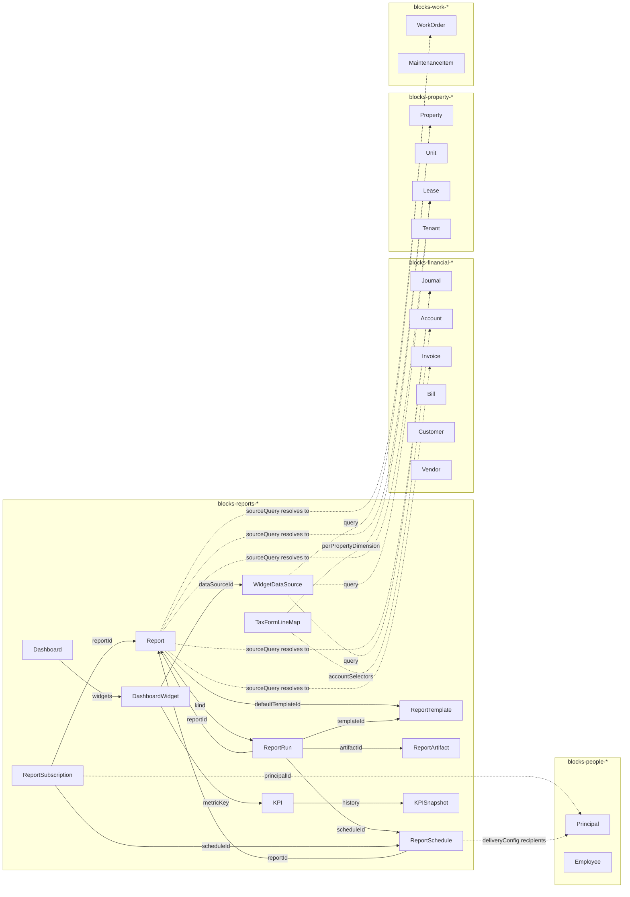

# `blocks-reports-*` — Clean-Room Stage 02 Schema Design

**Status:** Draft (Stage 02 architecture)
**Date:** 2026-05-16
**Author:** XO (research)
**ADR ancestor:** [`docs/adrs/0088-anchor-all-in-one-local-first-runtime.md`](../../docs/adrs/0088-anchor-all-in-one-local-first-runtime.md)
**ICM pipeline variant:** `sunfish-feature-change`
**Phase (per ADR 0088 §Appendix B):** Phase 1 (MVP) — basic PDF + receipts + invoices + statements + Schedule E

---

## 1. Header / Posture Summary

The `blocks-reports-*` cluster is the **reporting infrastructure** for Anchor's native domain. It does not own any business-domain entities (those live in `blocks-property-*`, `blocks-financial-*`, `blocks-work-*`, `blocks-people-*`). It owns:

1. The **rendering pipeline** — a deterministic function from `(ReportDefinition, parameters, domain-snapshot) → ReportArtifact`.
2. **Template definitions** — presentation-layer markup (React-PDF JSX, HTML/CSS for WeasyPrint headless, screen layouts).
3. **Report-run history** — auditable record of who-ran-what-when, with the produced artifact retained.
4. **Executive dashboards** — real-time KPI surfaces composed of widgets that pull from domain clusters.
5. **Tax-form mapping primitives** — the canonical mapping table from chart-of-accounts lines to e.g. IRS Schedule E lines.

Per ADR 0088 §1, this cluster is **Phase 1 (MVP)** — the immediate target is closing the Wave/Rentler/Mac-ERPNext replacement loop, which requires: rent roll, P&L, balance sheet, AR statements, invoice/receipt/quote/bill PDFs, and Schedule E.

**Per ADR 0088 §2 license posture:** Sunfish output is MIT. Every external FOSS source consulted is classified before code work begins (see §2 below). The `blocks-reports-*` cluster is unusual in that it has the **single largest direct-permissive-borrow opportunity in the entire Anchor stack** (`@react-pdf/renderer` is MIT and was effectively designed for our exact use case) and one of the **largest clean-room copyleft opportunities** (Beancount/GnuCash/ERPNext reports are the gold standard for tax-line mapping and statement queries, all GPL).

---

## 2. License Posture Table (this cluster)

Per ADR 0088 §3 discipline rules. Every entry has been classified before any code lands.

| Source | License | Class | Use in `blocks-reports-*` | Discipline applied |
|---|---|---|---|---|
| `@react-pdf/renderer` | MIT | Permissive | **Direct dep.** React JSX → PDF in-process; canonical Anchor-side renderer for invoices, receipts, statements, quotes, bills, rent rolls. | NOTICE entry; pin version; source-header attribution in components that adapt published examples. |
| WeasyPrint | BSD-3 | Permissive | **Direct dep (Bridge / Standard tier only).** HTML/CSS → PDF for server-side rendering when react-pdf isn't viable (e.g., large batch jobs, statements emailed from Bridge). Not bundled into Light tier (Python runtime + cairo deps would inflate footprint). | NOTICE entry; wrapped behind `IReportRenderer` so Light tier never loads it. |
| `wkhtmltopdf` | LGPLv3 | Copyleft (LGPL) | **Command-line invocation only.** Optional fallback for ad-hoc PDF generation when react-pdf can't reproduce a specific HTML layout. Never statically linked; never embedded; called as an external binary if installed by the user. | Treated as an optional system binary, not a code dependency. Detected at runtime via `which wkhtmltopdf`; absence is non-fatal. No code copied from the project. |
| Apache OFBiz `accounting/template/*` (invoice, statement, quote XSLT-FO) | Apache 2.0 | Permissive | **Borrow.** Real-world invoice/statement/quote layout structure (column order, totals placement, addressing block conventions, "remit to" placement, tax-line itemization). | Source-header attribution in templates; NOTICE entry; we are reading XSLT-FO and re-implementing as React-PDF JSX, which preserves attribution discipline even though the languages differ. |
| Apache Superset | Apache 2.0 | Permissive | **Borrow patterns.** Dashboard widget taxonomy (`big_number`, `time_series`, `table`, `pie`, `gauge`), widget-config JSON shape, drill-down query model. | We are not vendoring Superset code (it's Python + React); we are borrowing the **taxonomy of widget types** and the **shape of a widget definition** which are concepts, not copyrightable expression. NOTICE entry for "inspiration." |
| Metabase | AGPLv3 | Copyleft (AGPL) | **Study only.** Read public docs / blog posts / question-builder UI for inspiration on saved-question composition + parameter UI. Never open Metabase source while authoring Sunfish code. | Reading isolated to non-Sunfish git worktree per ADR 0088 §3.2. No code transferred. |
| Akaunting | GPLv3 | Copyleft | **Clean-room.** Modern small-business invoice/quote line-item composition; tax-application order; discount-before-vs-after-tax conventions. | Reading isolated worktree; design notes capture **rules** (e.g., "tax is applied after line discount, before invoice-level discount") not code. |
| Beancount + ledger-cli | GPLv2 | Copyleft | **Clean-room.** Period statement queries, balance-as-of-date queries, journal-aggregation grammar (`SELECT account, SUM(position) FROM ...`). The canonical OSS double-entry-as-query reference. | Reading isolated; we capture **the algorithmic shape** ("a P&L for [a, b] is sum of income+expense postings where date ∈ [a, b]") not code. |
| GnuCash | GPLv2 | Copyleft | **Clean-room.** Tax-line mapping (Schedule E line numbers ← account types); AR aging buckets (0/30/60/90+); reconciliation report structure. | Reading isolated; we capture the **mapping table** (an enumerated list of facts about IRS forms, which is uncopyrightable per *Feist v. Rural Telephone* — facts are not copyrightable) not the source code. |
| ERPNext (`rent_roll`, P&L by property, customer_statement, GST returns) | GPLv3 | Copyleft | **Clean-room.** Property-specific report shapes; per-property dimension on P&L; rent roll column set; statement aging columns. | Reading isolated; capture **column lists and groupings** (facts about how a rent roll is structured) not Frappe code. |
| IRS Publication 527 + Schedule E + Form 1040 + 1099-NEC + 1099-MISC instructions | Public domain (US federal works) | Public domain | **Direct reference.** Form line structure; line-number ↔ description; what counts as a deductible expense category. | Cited inline in design notes; no license concern (PD). |
| `rrule` (npm) | BSD-2 | Permissive | **Direct dep.** Recurrence rules for `ReportSchedule`. | NOTICE entry; pin version. |
| SQLite | Public domain | Public domain | **Direct dep.** Already the primary store per ADR 0088. ReportArtifact bytes can live as BLOB or as filesystem path; both supported. | Already attributed at the platform level. |
| Loro CRDT | MIT | Permissive | **Direct dep (via foundation).** Sync layer for shared Report/Dashboard definitions across Anchor nodes (so a CPA running Bridge sees the same dashboards the owner authored). | Already attributed at platform level. |

**No copyleft code enters this cluster.** Every clean-room source above contributes patterns, taxonomies, or factual mappings — none contributes copyrightable expression.

---

## 3. Entity Catalog (TypeScript field definitions)

All entities follow the Sunfish convention: ULID PKs, `createdAt` / `updatedAt` / `createdBy` / `tenantId` for tenant scoping. Loro state for definitions that sync between nodes; SQLite-local for run history + artifacts (which are heavy + node-specific).

```typescript
// ─────────────────────────────────────────────────────────────
// REPORTING PRIMITIVES
// ─────────────────────────────────────────────────────────────

/**
 * A report DEFINITION — what can be run, with what params.
 * Synced via Loro (every node has the same set of definitions).
 *
 * `kind` distinguishes built-in standard reports (RentRoll, P&L, etc.)
 * from user-authored ad-hoc reports.
 */
export interface Report {
  id: string;                          // ULID
  tenantId: string;
  name: string;                        // user-facing, e.g., "Quarterly P&L by Property"
  description: string | null;
  kind: ReportKind;                    // see enum below
  category: ReportCategory;            // 'financial' | 'property' | 'tax' | 'work' | 'people' | 'custom'
  parameterSchema: ReportParameterSchema;  // JSON-Schema-shaped; UI renders form from this
  sourceQuery: ReportSourceQuery;      // declarative query spec; see §6
  defaultTemplateId: string | null;    // ReportTemplate.id, or null for tabular-default
  outputFormats: OutputFormat[];       // ['pdf'] | ['pdf','csv','html'] etc.
  isSystem: boolean;                   // true for built-in standard reports; users can't delete
  createdAt: string;                   // ISO-8601
  updatedAt: string;
  createdBy: string;                   // PrincipalId
}

export type ReportKind =
  | 'rent-roll'
  | 'profit-and-loss'
  | 'balance-sheet'
  | 'cash-flow'
  | 'statement'              // customer/tenant statement
  | 'invoice-pdf'
  | 'receipt-pdf'
  | 'quote-pdf'
  | 'bill-pdf'
  | 'tax-schedule-e'
  | 'tax-1099-nec'
  | 'tax-1099-misc'
  | 'tax-w2-summary'
  | 'work-order-summary'
  | 'maintenance-backlog'
  | 'lease-expiration'
  | 'vacancy'
  | 'ar-aging'
  | 'ap-aging'
  | 'custom';                 // user-authored

export type ReportCategory =
  | 'financial' | 'property' | 'tax' | 'work' | 'people' | 'custom';

export type OutputFormat = 'pdf' | 'html' | 'csv' | 'xlsx' | 'json';

export interface ReportParameterSchema {
  // JSON-Schema subset; fields the UI renders into a form
  fields: ReportParameterField[];
}

export interface ReportParameterField {
  key: string;                         // e.g., 'periodStart', 'propertyId'
  label: string;
  type: 'date' | 'date-range' | 'string' | 'number' | 'enum'
      | 'entity-ref' | 'multi-entity-ref' | 'boolean';
  entityCluster?: string;              // if type=entity-ref, e.g., 'blocks-property-*'
  entityKind?: string;                 // e.g., 'Property', 'Tenant'
  required: boolean;
  defaultValue?: unknown;
  options?: Array<{ value: string; label: string }>;  // for type=enum
}

/**
 * Declarative query spec — NOT raw SQL. The runner resolves this
 * against the cluster's read-side query API (see §6 + §9).
 */
export interface ReportSourceQuery {
  // For built-in reports, this is a discriminated union of typed query specs.
  // For user-authored 'custom' reports, this is a saved-question shape
  // (à la Metabase / Superset, but Sunfish-defined).
  kind: 'builtin' | 'composed';
  spec: BuiltinQuerySpec | ComposedQuerySpec;
}

export interface BuiltinQuerySpec {
  reportKind: ReportKind;              // resolver picks the right service
  // ReportKind dictates which `IReportQueryHandler<TParams, TModel>` to call.
}

export interface ComposedQuerySpec {
  // For user-authored reports — composition of cluster queries.
  sources: Array<{
    cluster: string;                   // e.g., 'blocks-financial-*'
    queryName: string;                 // e.g., 'journal-by-period'
    parameterBindings: Record<string, string>;  // map outer param → inner param
  }>;
  joinKey?: string;                    // optional cross-source join
  groupBy?: string[];
  aggregations?: Array<{ field: string; op: 'sum'|'avg'|'count'|'min'|'max' }>;
}

// ─────────────────────────────────────────────────────────────

/**
 * A presentation-layer template. Bound to a Report by `Report.defaultTemplateId`
 * or selected per-run.
 *
 * Stored as Loro-synced text/binary; templates are versioned via Loro's
 * native version-vector — no separate version table.
 */
export interface ReportTemplate {
  id: string;                          // ULID
  tenantId: string;
  name: string;
  reportKind: ReportKind;              // 1..1 binding to a kind
  format: OutputFormat;                // pdf | html | csv | xlsx
  engine: TemplateEngine;
  source: string;                      // React-PDF JSX (string) OR HTML/CSS OR Handlebars
  isSystem: boolean;
  createdAt: string;
  updatedAt: string;
}

export type TemplateEngine =
  | 'react-pdf'        // Anchor in-process; @react-pdf/renderer
  | 'html-weasyprint'  // Bridge / Standard tier; HTML/CSS → PDF via WeasyPrint
  | 'html-browser'     // direct browser render; no PDF
  | 'csv'              // straight CSV emit; no template-engine logic
  | 'handlebars';      // for email body templates (subscriptions)

// ─────────────────────────────────────────────────────────────

/**
 * An EXECUTION of a Report. Local-only (NOT synced); each Anchor node
 * has its own run history. (Rationale: artifacts are heavy + node-specific;
 * sharing happens via explicit export, not CRDT sync.)
 */
export interface ReportRun {
  id: string;                          // ULID
  tenantId: string;
  reportId: string;                    // → Report.id
  templateId: string | null;           // → ReportTemplate.id (null = system default)
  parameters: Record<string, unknown>; // resolved param values used
  status: RunStatus;
  startedAt: string;
  completedAt: string | null;
  errorMessage: string | null;
  artifactId: string | null;           // → ReportArtifact.id (null until success)
  triggeredBy: 'manual' | 'schedule' | 'api';
  scheduleId: string | null;           // → ReportSchedule.id, if scheduled
  runByPrincipalId: string;            // who ran it
  domainSnapshotMarker: string | null; // see §6 "as-of" semantics
  durationMs: number | null;
}

export type RunStatus = 'pending' | 'running' | 'succeeded' | 'failed' | 'cancelled';

// ─────────────────────────────────────────────────────────────

/**
 * The rendered output of a successful ReportRun.
 * Local-only. Bytes stored either inline (BLOB) for small artifacts
 * (<256 KB) or filesystem (path) for larger ones.
 */
export interface ReportArtifact {
  id: string;                          // ULID
  tenantId: string;
  runId: string;                       // → ReportRun.id
  format: OutputFormat;
  storage: 'inline' | 'filesystem';
  inlineBytes: Uint8Array | null;      // if storage='inline'
  filePath: string | null;             // if storage='filesystem', relative to AppData/artifacts/
  sizeBytes: number;
  contentHash: string;                 // SHA-256, hex; for dedup + caching
  contentType: string;                 // 'application/pdf', 'text/csv', etc.
  createdAt: string;
}

// ─────────────────────────────────────────────────────────────

/**
 * A recurring-run definition. RRULE per RFC 5545.
 * Synced via Loro.
 */
export interface ReportSchedule {
  id: string;                          // ULID
  tenantId: string;
  reportId: string;                    // → Report.id
  templateId: string | null;
  name: string;
  rrule: string;                       // RFC 5545; parsed via `rrule` (BSD-2)
  parameters: Record<string, unknown>; // bound params; can include relative dates ("LAST_MONTH")
  isActive: boolean;
  lastRunAt: string | null;
  nextRunAt: string;                   // computed from rrule
  deliveryMode: 'store-only' | 'email' | 'shared-folder';
  deliveryConfig: DeliveryConfig | null;
  createdAt: string;
  updatedAt: string;
  createdBy: string;
}

export interface DeliveryConfig {
  // For deliveryMode='email':
  recipientPrincipalIds?: string[];    // → blocks-people-* lookup
  ccAddresses?: string[];              // free-form email
  emailSubjectTemplate?: string;       // Handlebars
  emailBodyTemplate?: string;
  // For deliveryMode='shared-folder':
  folderPath?: string;                 // local path
}

// ─────────────────────────────────────────────────────────────

/**
 * Per-user / per-principal delivery preferences for a Report.
 * Synced via Loro (so preferences travel with the principal).
 */
export interface ReportSubscription {
  id: string;
  tenantId: string;
  principalId: string;                 // → blocks-people-* Principal
  reportId: string;
  scheduleId: string | null;           // attach to a schedule, or null = on every manual run
  format: OutputFormat;
  deliveryMode: 'in-app-notification' | 'email';
  emailAddress: string | null;
  createdAt: string;
}

// ─────────────────────────────────────────────────────────────
// EXECUTIVE DASHBOARDS
// ─────────────────────────────────────────────────────────────

/**
 * A dashboard definition — a layout of widgets.
 * Synced via Loro.
 */
export interface Dashboard {
  id: string;                          // ULID
  tenantId: string;
  name: string;
  description: string | null;
  layout: DashboardLayout;             // grid spec
  refreshIntervalSeconds: number;      // 0 = manual refresh only
  defaultDateRange: 'today' | 'this-week' | 'this-month' | 'this-quarter' | 'this-year' | 'ytd';
  isSystem: boolean;
  createdAt: string;
  updatedAt: string;
  createdBy: string;
}

export interface DashboardLayout {
  // 12-column responsive grid, à la Tailwind / Bootstrap idiom
  rows: number;
  cols: 12;
  widgets: Array<{
    widgetId: string;                  // → DashboardWidget.id
    row: number;                       // 0-indexed
    col: number;
    rowSpan: number;
    colSpan: number;
  }>;
}

/**
 * A single widget on a dashboard.
 * Synced via Loro.
 *
 * Widget-type taxonomy borrows from Apache Superset (Apache 2.0).
 */
export interface DashboardWidget {
  id: string;                          // ULID
  tenantId: string;
  dashboardId: string;                 // → Dashboard.id
  type: WidgetType;
  title: string;
  dataSourceId: string;                // → WidgetDataSource.id
  config: WidgetConfig;                // type-specific
  createdAt: string;
  updatedAt: string;
}

export type WidgetType =
  | 'big-number'         // single KPI display
  | 'big-number-trend'   // KPI + sparkline + delta
  | 'time-series'        // line / area chart over time
  | 'bar-chart'
  | 'pie-chart'
  | 'gauge'              // for % targets
  | 'table'              // tabular data
  | 'heatmap'
  | 'drill-down-list'    // top-N list with click-through
  | 'recent-activity';   // event-feed style

export type WidgetConfig =
  | BigNumberConfig
  | TimeSeriesConfig
  | TableConfig
  | GaugeConfig
  | DrillDownConfig
  // …other type-specific shapes
  | Record<string, unknown>;

export interface BigNumberConfig {
  metricKey: string;                   // e.g., 'occupancy-rate'
  numberFormat: 'currency' | 'percent' | 'integer' | 'decimal';
  showTrend: boolean;
  comparisonPeriod?: 'prior-period' | 'prior-year' | 'none';
  thresholds?: Array<{                  // for color-coding
    op: '>=' | '<=' | '=='; value: number; color: 'green' | 'amber' | 'red'
  }>;
}

export interface TimeSeriesConfig {
  metricKeys: string[];                // one or more series
  granularity: 'day' | 'week' | 'month' | 'quarter' | 'year';
  showLegend: boolean;
  stacked: boolean;
}

export interface TableConfig {
  columns: Array<{ field: string; label: string; format?: string }>;
  pageSize: number;
  sortBy?: { field: string; dir: 'asc' | 'desc' };
}

export interface GaugeConfig {
  metricKey: string;
  targetValue: number;
  format: 'currency' | 'percent' | 'integer';
}

export interface DrillDownConfig {
  sourceQuery: string;                 // KPI / saved-question key
  drillTarget: { cluster: string; entityKind: string };  // where click goes
  maxRows: number;
}

// ─────────────────────────────────────────────────────────────

/**
 * A widget's data source — a saved query against domain clusters.
 * Synced via Loro.
 */
export interface WidgetDataSource {
  id: string;
  tenantId: string;
  name: string;                        // e.g., 'occupancy-by-property'
  query: ReportSourceQuery;            // same shape as Report.sourceQuery
  refreshable: boolean;                // true = supports live refresh; false = needs run
  cacheTtlSeconds: number;             // 0 = no cache
  createdAt: string;
  updatedAt: string;
}

// ─────────────────────────────────────────────────────────────

/**
 * A computed metric with optional history + threshold.
 * KPIs are first-class so they can appear in multiple widgets
 * without re-declaring the formula.
 */
export interface KPI {
  id: string;
  tenantId: string;
  key: string;                         // stable identifier, e.g., 'occupancy-rate'
  name: string;                        // 'Occupancy Rate'
  description: string | null;
  formula: KPIFormula;
  unit: 'currency' | 'percent' | 'count' | 'days' | 'ratio';
  target: number | null;               // optional goal
  thresholds: Array<{
    op: '>=' | '<=' | '=='; value: number; severity: 'good' | 'warning' | 'critical';
  }>;
  isSystem: boolean;
  createdAt: string;
  updatedAt: string;
}

export interface KPIFormula {
  // A KPI is a function of one or more aggregated cluster queries.
  numerator: BuiltinQuerySpec | ComposedQuerySpec;
  denominator?: BuiltinQuerySpec | ComposedQuerySpec;
  // e.g., occupancy-rate = numerator(occupied-units) / denominator(total-units)
}

/**
 * Historical KPI values, for sparklines + trends.
 * Local-only (each node computes from its own data; aggregated values
 * across nodes go through Bridge tier).
 */
export interface KPISnapshot {
  id: string;
  tenantId: string;
  kpiId: string;
  asOf: string;                        // ISO-8601
  value: number;
  computedAt: string;
}

// ─────────────────────────────────────────────────────────────
// TAX FORM MAPPING (Schedule E + 1099 etc.)
// ─────────────────────────────────────────────────────────────

/**
 * Mapping from chart-of-accounts entries (in blocks-financial-*) to
 * tax-form line items. The canonical mapping table referenced by
 * tax-form report generators.
 *
 * Synced via Loro (every node uses the same mapping).
 *
 * Source: IRS Pub 527 + Schedule E instructions (public domain) +
 * clean-room study of GnuCash tax-line mapping + ERPNext tax accounts.
 */
export interface TaxFormLineMap {
  id: string;
  tenantId: string;
  formKind: TaxFormKind;
  taxYear: number;                     // 2026, 2027, etc. — IRS form versions change
  line: string;                        // e.g., 'ScheduleE.Line5' (Advertising)
                                       //     or 'ScheduleE.Line14' (Repairs)
  description: string;                 // human label, e.g., 'Repairs and maintenance'
  // The accounts whose journal-postings roll up to this line:
  accountSelectors: TaxAccountSelector[];
  // Optional per-property dimension flag — Schedule E is per-property
  perPropertyDimension: boolean;
  createdAt: string;
  updatedAt: string;
}

export type TaxFormKind =
  | 'schedule-e'         // Form 1040 Schedule E (rental real estate)
  | '1099-nec'           // Nonemployee Compensation
  | '1099-misc'          // Misc income (rents paid to non-corporate landlords)
  | 'schedule-c'         // (future) self-employed
  | 'form-1065-k1'       // (future) partnership K-1
  | 'state-rental';      // (future) state-specific

export interface TaxAccountSelector {
  // A selector that matches journal lines from blocks-financial-*
  accountCode?: string;                // exact CoA code, e.g., '6100-Advertising'
  accountCodePrefix?: string;          // prefix match, e.g., '64' = all utilities
  accountTag?: string;                 // tag/category lookup
  invert?: boolean;                    // true = exclude from this line
}
```

---

## 4. Catalog of Standard Reports

Each entry follows: **Purpose · Source clusters/queries · Parameters · Output formats**.

### 4.1 RentRoll

- **Purpose:** Per-property snapshot of every unit, its lease, occupancy state, current rent, prepaid balance, delinquency aging, and tenant.
- **Source clusters/queries:** `blocks-property-*` (Property, Unit, Lease, Tenant); `blocks-financial-*` (AR aging per lease).
- **Parameters:** `propertyIds[]` (multi-entity-ref; omit = all), `asOfDate` (date; defaults to today).
- **Output formats:** `pdf`, `csv`, `xlsx`.
- **Inspiration source (clean-room):** ERPNext `rent_roll`, OFBiz `accounting/template/rental` (Apache).

### 4.2 ProfitAndLoss (P&L)

- **Purpose:** Income − Expenses over a period; optional per-property dimension. Income → revenue accounts; Expenses → expense accounts; Net Income at bottom.
- **Source clusters/queries:** `blocks-financial-*` (journal sum by account-type and period).
- **Parameters:** `periodStart`, `periodEnd` (date-range), `propertyIds[]` (optional dimension), `comparePriorPeriod` (boolean).
- **Output formats:** `pdf`, `csv`, `xlsx`.
- **Inspiration source (clean-room):** Beancount `bean-query`, GnuCash income-expense report, ERPNext P&L by cost-center.

### 4.3 BalanceSheet

- **Purpose:** Assets = Liabilities + Equity at a point in time.
- **Source clusters/queries:** `blocks-financial-*` (balance-as-of-date per account, grouped by account-type).
- **Parameters:** `asOfDate`, optional `propertyIds[]` dimension.
- **Output formats:** `pdf`, `csv`, `xlsx`.
- **Inspiration source (clean-room):** Beancount balance, GnuCash balance sheet.

### 4.4 CashFlow

- **Purpose:** Operating / Investing / Financing cash movements over a period.
- **Source clusters/queries:** `blocks-financial-*` (journal sum by cash-flow-category tag).
- **Parameters:** `periodStart`, `periodEnd`, method (`direct` | `indirect`).
- **Output formats:** `pdf`, `csv`.
- **Inspiration source (clean-room):** GnuCash cash-flow report.

### 4.5 Statement (Customer / Tenant)

- **Purpose:** Per-customer (or per-tenant) AR statement — opening balance, transactions in period, closing balance, aging bucket summary.
- **Source clusters/queries:** `blocks-financial-*` (AR ledger per customer/tenant).
- **Parameters:** `customerOrTenantId` (entity-ref), `periodStart`, `periodEnd`.
- **Output formats:** `pdf`, `html` (for email body), `csv`.
- **Inspiration source (clean-room):** OFBiz `accounting/template/CustomerStatement` (Apache, **borrowed directly**); ERPNext customer_statement (clean-room).

### 4.6 InvoicePDF / ReceiptPDF / QuotePDF / BillPDF

- **Purpose:** Transactional document rendering.
  - **InvoicePDF:** invoice issued to a customer/tenant (AR).
  - **ReceiptPDF:** payment receipt issued to a customer/tenant.
  - **QuotePDF:** quote issued to a customer/prospect (pre-invoice).
  - **BillPDF:** bill received from a vendor (AP).
- **Source clusters/queries:** `blocks-financial-*` (the source document: Invoice/Receipt/Quote/Bill entity).
- **Parameters:** `documentId` (entity-ref), `templateId` (optional override).
- **Output formats:** `pdf` (primary), `html` (for email body).
- **Inspiration source (borrow):** OFBiz `accounting/template/invoice.fo`, `accounting/template/quote.fo` (Apache 2.0).

### 4.7 ScheduleE (Form 1040 Schedule E — Rental Real Estate)

- **Purpose:** Annual US tax form for rental property income/expense. One Schedule E lines (per property, up to 3 per page in IRS layout; multiple pages if >3).
- **Source clusters/queries:** `blocks-financial-*` (journal aggregated per property per Schedule E line via `TaxFormLineMap`), `blocks-property-*` (property address + fair-rental-days metadata).
- **Parameters:** `taxYear` (integer), `propertyIds[]` (omit = all), `outputForm` (`pdf-only` | `pdf-plus-supporting-detail-csv`).
- **Output formats:** `pdf` (IRS Schedule E layout), `csv` (supporting detail per line).
- **Inspiration source (clean-room):** GnuCash tax-line export, ERPNext fiscal-year close reports. **Direct reference:** IRS Pub 527 + Schedule E instructions (PD).
- **See §8** for the detailed tax-form mapping design.

### 4.8 Form-1099 Variants (1099-NEC, 1099-MISC)

- **Purpose:** Year-end vendor / contractor / landlord-payer information reporting.
  - **1099-NEC:** Nonemployee compensation paid to a contractor ≥ $600 in the year.
  - **1099-MISC:** Misc payments — e.g., rents paid to a non-corporate landlord ≥ $600.
- **Source clusters/queries:** `blocks-financial-*` (vendor-payment ledger summed per vendor per year, gated by ≥ $600 threshold and vendor 1099-eligibility flag); `blocks-people-*` (vendor TIN + address).
- **Parameters:** `taxYear`, `vendorIds[]` (omit = all 1099-eligible), `includeBelowThreshold` (boolean; for review).
- **Output formats:** `pdf` (per-recipient), `csv` (bulk filing format).

### 4.9 W-2 Summary (employer-side)

- **Purpose:** Annual W-2 summary for any employees. Phase 3 (gated on `blocks-people-*` payroll being live; not in Phase 1 MVP).
- **Source clusters/queries:** `blocks-people-*` (payroll), `blocks-financial-*` (payroll journal).
- **Parameters:** `taxYear`, `employeeIds[]`.
- **Output formats:** `pdf`, `csv`.
- **Note:** W-2 filing has IRS-specific transmittal requirements (Form W-3, SSA BSO file format). Phase 3 deliverable.

### 4.10 WorkOrderSummary

- **Purpose:** All work orders for a property / time range / status, with cost, contractor, completion state.
- **Source clusters/queries:** `blocks-work-*` (WorkOrder), `blocks-property-*` (property name lookup), `blocks-financial-*` (cost actuals).
- **Parameters:** `propertyIds[]`, `periodStart`, `periodEnd`, `status[]` (open/in-progress/complete/cancelled).
- **Output formats:** `pdf`, `csv`.

### 4.11 MaintenanceBacklog

- **Purpose:** Outstanding maintenance items by property, prioritized by deferred-since age + severity.
- **Source clusters/queries:** `blocks-work-*` (maintenance items not done), `blocks-property-*` (inspection deficiencies open).
- **Parameters:** `propertyIds[]`, `severityMin` (enum: low/med/high).
- **Output formats:** `pdf`, `csv`.

### 4.12 LeaseExpirationReport

- **Purpose:** Leases expiring in a forward window — for renewal / re-lease planning.
- **Source clusters/queries:** `blocks-property-*` (Lease with end-date ∈ window).
- **Parameters:** `forwardWindowDays` (integer; default 90), `propertyIds[]`.
- **Output formats:** `pdf`, `csv`.

### 4.13 VacancyReport

- **Purpose:** Per-property occupancy + vacancy aging.
- **Source clusters/queries:** `blocks-property-*` (Unit + Lease + occupancy).
- **Parameters:** `asOfDate`, `propertyIds[]`.
- **Output formats:** `pdf`, `csv`.

### 4.14 AR Aging / AP Aging

- **Purpose:** 0 / 30 / 60 / 90+ buckets of outstanding receivables (or payables).
- **Source clusters/queries:** `blocks-financial-*` (open invoices / bills with age).
- **Parameters:** `asOfDate`, `customerOrVendorIds[]`.
- **Output formats:** `pdf`, `csv`.
- **Inspiration source (clean-room):** GnuCash AR/AP aging (bucket boundaries are conventional, not copyrightable).

---

## 5. Cross-Entity / Cross-Cluster Relationships



**Dotted arrows = cross-cluster read-only dependencies (declarative query resolution).** Solid arrows = within-cluster FK references.

---

## 6. Rendering Pipeline (pseudocode)

The pipeline is a deterministic function. Same inputs → same artifact (modulo timestamps). This determinism is what enables artifact caching (§6.3).

### 6.1 Core function — `Report.run(params)`

```typescript
// Conceptual; concrete TS implementation lives in packages/blocks-reports/.
async function runReport(
  reportId: string,
  templateId: string | null,
  params: Record<string, unknown>,
  triggeredBy: 'manual' | 'schedule' | 'api',
  principalId: string,
): Promise<ReportRun> {
  // 1. Load definitions
  const report = await reportStore.get(reportId);
  const template = templateId
    ? await templateStore.get(templateId)
    : await templateStore.get(report.defaultTemplateId);

  // 2. Validate params against report.parameterSchema
  validateParams(report.parameterSchema, params);

  // 3. Resolve "as-of" snapshot marker — captures the local SQLite WAL position
  //    + Loro version vector at run start, so the report is a coherent
  //    snapshot even if data churns during render.
  const snapshotMarker = await snapshotStore.takeMarker();

  // 4. Open a ReportRun row in 'running' state
  const run = await runStore.create({
    reportId, templateId, parameters: params,
    status: 'running', startedAt: now(),
    triggeredBy, runByPrincipalId: principalId,
    domainSnapshotMarker: snapshotMarker,
    /* …other fields */
  });

  try {
    // 5. Dispatch to the right query handler based on Report.kind
    //    Each handler returns a typed view-model (a "ReportModel"):
    //      RentRollModel, P&LModel, ScheduleEModel, etc.
    const handler = queryHandlerFor(report.kind);
    const model: ReportModel = await handler.resolve(params, snapshotMarker);

    // 6. Render via the template engine
    const artifactBytes = await renderTemplate(template, model);

    // 7. Persist artifact (inline if <256KB; filesystem otherwise)
    const artifact = await artifactStore.create({
      runId: run.id,
      format: template.format,
      bytes: artifactBytes,
      contentHash: sha256(artifactBytes),
      /* …other fields */
    });

    // 8. Update run to 'succeeded'
    await runStore.update(run.id, {
      status: 'succeeded',
      completedAt: now(),
      artifactId: artifact.id,
      durationMs: now() - run.startedAt,
    });

    // 9. Fire post-run hooks (subscriptions, delivery)
    await fireSubscriptions(report.id, run.id);

    return run;
  } catch (err) {
    await runStore.update(run.id, {
      status: 'failed',
      completedAt: now(),
      errorMessage: String(err),
    });
    throw err;
  }
}
```

### 6.2 Template engine dispatch

```typescript
async function renderTemplate(
  template: ReportTemplate,
  model: ReportModel,
): Promise<Uint8Array> {
  switch (template.engine) {
    case 'react-pdf':
      // In-process; canonical Anchor path.
      return await reactPdfRender(template.source, model);
    case 'html-weasyprint':
      // Bridge tier (or Standard tier with WeasyPrint available).
      // Anchor Light never enters this branch.
      return await weasyPrintRender(template.source, model);
    case 'html-browser':
      // Returns HTML bytes for in-app preview; no PDF.
      return await htmlRender(template.source, model);
    case 'csv':
      return await csvRender(model);
    case 'handlebars':
      // For email body composition.
      return await handlebarsRender(template.source, model);
  }
}
```

**Strategy summary:**

- **Anchor Light tier:** react-pdf for PDFs (in-process, MIT); CSV for tabular; HTML for in-app preview only.
- **Anchor Standard tier:** same as Light. Adds WeasyPrint as opt-in when the bundled Bridge runtime is enabled.
- **Bridge / Hosted tier:** react-pdf (server-side via the `@react-pdf/renderer` node API) for small artifacts; WeasyPrint for large batch jobs and email-friendly HTML→PDF.
- **wkhtmltopdf:** never default. Only invoked if the user explicitly configures it as a fallback for a specific report (e.g., a hand-crafted HTML template that doesn't reproduce in react-pdf). Detected via `which wkhtmltopdf`; absence is non-fatal.

### 6.3 Caching / memoization

A `ReportArtifact` may be safely reused — instead of regenerating — when **all** of the following hold:

1. Same `reportId` + `templateId` + `parameters` (cache key).
2. The `domainSnapshotMarker` of the prior run is **still current** — i.e., no journal-line writes have landed in any cluster the report sources from, since the prior run.
3. The `Report` definition + `ReportTemplate` source haven't been edited since.
4. The cached artifact is not older than the report's `cacheTtl` (default: 24 hours for non-financial reports; **0 for financial reports** — financial reports always re-run to avoid stale data tying to a closed period).

**Implementation:** each cluster publishes a `mutationVersion` token (incremented on any write). The cache key is `(reportId, templateId, hash(params), mutationVersions[clusters_sourced])`. A cache hit returns the prior artifact byte-for-byte; a miss runs the pipeline.

Financial reports default to `cacheTtl: 0` and `cacheStrategy: 'never'` to prevent accountants from seeing a stale P&L.

---

## 7. Dashboard Refresh Model

Dashboards are real-time surfaces, not periodic reports. Refresh semantics differ from reports.

**Pull vs. push hybrid.** Anchor uses a **client-driven pull** for the primary refresh (the UI polls or re-queries on a `refreshIntervalSeconds` tick), augmented with a **mutation-event push** that lets a widget invalidate immediately when its underlying cluster signals a write.

```typescript
// On dashboard mount:
//   for each widget:
//     fetch initial data
//     subscribe to cluster mutation events for the clusters this widget sources from
//
// On clusterMutated(cluster):
//   for each widget whose dataSource references `cluster`:
//     invalidate cache; re-fetch on next animation frame
//     (debounced to avoid thrash during bulk writes)
//
// On refreshIntervalSeconds tick:
//   for each widget:
//     if data is older than (now - cacheTtl):
//       re-fetch
```

**Loro sync interaction.** Dashboards are Loro-synced *definitions* (so two Anchor nodes show the same widget layout), but the **data** is computed locally on each node from each node's own SQLite. Two Anchor nodes that have diverged Loro state (e.g., partial sync) will show **different KPI values** until they reconcile. This is the same correctness-vs-eventual-consistency trade-off the rest of the Anchor stack lives with (per ADR 0088 §Concerns).

**KPISnapshot** is computed and persisted locally — never CRDT-merged — because numeric values are not naturally mergeable. Each node has its own KPI history. If a CPA on Bridge needs a "consolidated" KPI history across multiple Anchor nodes, that aggregation happens on the Bridge tier, not via Loro merge.

**Live indicators.** Each widget renders a "last refreshed at" timestamp. Big numbers with a trend show "vs. prior period" (period = the dashboard's selected `defaultDateRange`).

---

## 8. Tax-Form-Specific Design — Schedule E

US Schedule E (Form 1040, Supplemental Income and Loss — Part I: Rental Real Estate) is the canonical example of a tax-form-mapped report. The pattern generalizes to 1099 variants, Schedule C, K-1, etc.

### 8.1 Schedule E structure (per IRS 2026 form layout, line numbers may shift year-over-year)

- **Per-property column** — up to 3 properties (A, B, C) per page; multi-page if >3.
- **Address + fair-rental-days + personal-use-days header** per property.
- **Income lines:**
  - Line 3: Rents received
  - Line 4: Royalties received (rare for rental real estate)
- **Expense lines (5–19):**
  - Line 5: Advertising
  - Line 6: Auto and travel
  - Line 7: Cleaning and maintenance
  - Line 8: Commissions
  - Line 9: Insurance
  - Line 10: Legal and other professional fees
  - Line 11: Management fees
  - Line 12: Mortgage interest paid to banks
  - Line 13: Other interest
  - Line 14: Repairs
  - Line 15: Supplies
  - Line 16: Taxes
  - Line 17: Utilities
  - Line 18: Depreciation expense or depletion
  - Line 19: Other (with description)
- **Line 20:** Total expenses (sum 5–19)
- **Line 21:** Income or loss (Line 3 − Line 20, with adjustments)
- **Line 22:** Deductible rental real estate loss after limitation (passive-activity rules)

### 8.2 Mapping approach

`TaxFormLineMap` rows declare which chart-of-accounts entries roll up to each Schedule E line. **The mapping table is the source of truth; the report generator is a pure function over it.**

Example seeded rows (system-provisioned, tenant can override):

| formKind | taxYear | line | description | accountSelectors |
|---|---|---|---|---|
| schedule-e | 2026 | Line3 | Rents received | `[{accountTag:'income-rental'}]` |
| schedule-e | 2026 | Line5 | Advertising | `[{accountCodePrefix:'61'},{accountTag:'advertising'}]` |
| schedule-e | 2026 | Line7 | Cleaning and maintenance | `[{accountCodePrefix:'62'},{accountTag:'cleaning-maintenance'}]` |
| schedule-e | 2026 | Line11 | Management fees | `[{accountCodePrefix:'63'},{accountTag:'management-fees'}]` |
| schedule-e | 2026 | Line12 | Mortgage interest paid to banks | `[{accountCodePrefix:'7110'}]` |
| schedule-e | 2026 | Line16 | Taxes | `[{accountCodePrefix:'66'},{accountTag:'property-tax'}]` |
| schedule-e | 2026 | Line18 | Depreciation | `[{accountTag:'depreciation-expense'}]` |

The mapping is **per `taxYear`** to handle year-over-year IRS form changes. New tax year ⇒ seed a new set of rows (system migration); user-overrides carry forward by default with a "review changed lines" prompt.

### 8.3 Generator pseudocode

```typescript
async function generateScheduleE(
  taxYear: number,
  propertyIds: string[],
): Promise<ScheduleEModel> {
  const properties = propertyIds.length
    ? await propertyQuery.getMany(propertyIds)
    : await propertyQuery.getAllActiveInYear(taxYear);

  const linemap = await taxMapStore.getForForm('schedule-e', taxYear);

  const perPropertyResults: PerPropertyScheduleE[] = [];

  for (const property of properties) {
    const propertyResult: PerPropertyScheduleE = {
      address: property.address,
      fairRentalDays: property.fairRentalDaysInYear(taxYear),
      personalUseDays: property.personalUseDaysInYear(taxYear),
      lines: {},
    };

    for (const lineRow of linemap) {
      const total = await journalQuery.sumPostings({
        taxYear,
        propertyId: lineRow.perPropertyDimension ? property.id : undefined,
        accountSelectors: lineRow.accountSelectors,
      });
      propertyResult.lines[lineRow.line] = total;
    }

    propertyResult.lines['Line20'] = sumExpenseLines(propertyResult.lines);
    propertyResult.lines['Line21'] =
      propertyResult.lines['Line3'] - propertyResult.lines['Line20'];

    perPropertyResults.push(propertyResult);
  }

  return { taxYear, properties: perPropertyResults };
}
```

The template (`schedule-e-template.tsx` using react-pdf) renders the model into Schedule E's three-column-per-page layout, paginating across properties.

### 8.4 1099 mapping

1099 generation is structurally similar:

- `TaxFormLineMap` rows of `formKind: '1099-nec'` declare which vendor-payment account flows count toward Box 1 (Nonemployee Compensation).
- The generator iterates vendors, sums payments meeting the ≥ $600 threshold + vendor's `is1099Eligible` flag, emits one PDF per recipient + a CSV summary suitable for the IRS FIRE bulk-filing format.

### 8.5 Audit trail

Every tax-form `ReportRun` writes its `domainSnapshotMarker` plus a hash of the `TaxFormLineMap` rows used. This means: if a CPA returns a year later and re-runs the same Schedule E, the system can prove whether the result would have been different (the mapping changed, the source data changed, or both).

---

## 9. Cross-Cluster Contracts

`blocks-reports-*` is a read-heavy consumer of every other domain cluster. The dependencies are formalized as **typed read-only query interfaces** that each producing cluster exports.

| Source cluster | Interface name | Capabilities consumed |
|---|---|---|
| `blocks-financial-*` | `IFinancialReportQueries` | `sumJournalByAccount(params)`, `balanceAsOf(params)`, `arAgingBuckets(params)`, `apAgingBuckets(params)`, `invoiceById`, `billById`, `receiptById`, `quoteById`, `customerStatement(params)`, `vendorPaymentsByYear(params)` |
| `blocks-property-*` | `IPropertyReportQueries` | `getPropertyMany`, `unitsAndLeases(propertyIds, asOf)`, `leaseExpiringIn(window)`, `vacancyAsOf(propertyIds, asOf)`, `propertyDimensionByJournalLine(journalLineId)` (for per-property cost attribution) |
| `blocks-work-*` | `IWorkReportQueries` | `workOrdersInPeriod(params)`, `maintenanceBacklog(params)`, `workOrderCostActuals(workOrderId)` |
| `blocks-people-*` | `IPeopleReportQueries` | `getPrincipalsByIds(ids)`, `vendorTinAndAddress(vendorId)`, `recipientEmailByPrincipal(principalId)` (for delivery), `employeePayrollByYear(employeeId, year)` (Phase 3) |

**Contract discipline:**

- Reports never read directly from another cluster's tables; always via the interface.
- Interfaces are versioned with `[Obsolete]` deprecation discipline per Sunfish convention.
- A change to any interface follows the `sunfish-api-change` ICM pipeline variant.
- Cross-cluster queries are batched where possible to avoid N+1 SQLite hits (the report runner pre-fetches in bulk).

**Read-side isolation.** Reports run against a **snapshot marker** (§6.1 step 3) — a captured WAL position + Loro version vector at run start. The cluster query handlers respect the marker by reading-as-of that point. This gives us coherent snapshots even when the user is actively editing data during a long-running report.

---

## 10. FOSS Source Citations (consolidated)

| Source | License | Citation form |
|---|---|---|
| `@react-pdf/renderer` (npm package) | MIT | `LICENSES/react-pdf.LICENSE`; NOTICE entry; component source-header attribution where examples adapted. |
| WeasyPrint | BSD-3 | `LICENSES/weasyprint.LICENSE`; NOTICE entry (Bridge tier only). |
| wkhtmltopdf | LGPLv3 | NOT vendored; if invoked, NOTICE entry: "wkhtmltopdf optionally invoked as external binary; LGPLv3-licensed." |
| Apache OFBiz | Apache 2.0 | NOTICE entry: "Invoice / statement / quote template structure adapted from Apache OFBiz `accounting/template/*` (Apache 2.0)." Per-template source-header attribution. |
| Apache Superset | Apache 2.0 | NOTICE entry: "Dashboard widget type taxonomy and widget-definition shape inspired by Apache Superset (Apache 2.0)." |
| Metabase | AGPLv3 | No vendoring; design notes cite Metabase docs only, with date of consultation. |
| Akaunting | GPLv3 | No vendoring; clean-room notes capture invoicing rules with citation: "Akaunting GPLv3, studied 2026-05-16, isolated worktree, no code transferred." |
| Beancount + ledger-cli | GPLv2 | No vendoring; clean-room notes cite the query-algorithm shape. |
| GnuCash | GPLv2 | No vendoring; clean-room notes cite tax-line mapping table (facts, not code). |
| ERPNext | GPLv3 | No vendoring; clean-room notes cite rent-roll column lists + statement aging structure. |
| IRS Pub 527, Schedule E instructions, Form 1040 instructions, 1099-NEC / 1099-MISC instructions | Public domain (US federal works) | Cited inline in design + code comments; no license entry needed. |
| `rrule` (npm) | BSD-2 | `LICENSES/rrule.LICENSE`; NOTICE entry. |

**Per ADR 0088 §3 discipline rules, every copyleft source above was read in an isolated git worktree at `/tmp/sunfish-cleanroom-reads/` — never with Sunfish source open in the same editor session. No code was transferred. Notes captured are: column lists (factual), algorithm shapes (uncopyrightable per *Baker v. Selden*), and IRS-form mappings (factual).**

---

## 11. Open Questions for CO / cob

The following design choices warrant CO ruling or cob clarification before Stage 03 (package design) begins.

### Q1. Artifact storage policy — inline BLOB vs. filesystem

**Question:** Is the 256 KB inline/filesystem cutoff the right threshold, or should artifacts ALWAYS go to filesystem (`AppData/artifacts/`) for consistency? Filesystem-only simplifies backup (one place to look) but adds a syscall per artifact retrieval.

**Recommendation:** keep the hybrid (inline below 256 KB) — small receipts and statement PDFs are common and fit easily; large rent rolls and bulk-1099 batches need filesystem. But if CO prefers operational simplicity, an all-filesystem policy is defensible.

### Q2. Loro sync of `ReportTemplate` source

**Question:** `ReportTemplate.source` is potentially a large React-PDF JSX string (multiple KB). Should we sync it via Loro (so every node renders the same template) or treat templates as node-local definitions that propagate via a separate "template package" mechanism?

**Recommendation:** Loro-sync — the system reports are bundled in the install (no sync cost; same on every node), and user-authored templates are rare + small. Treating them like Reports + Dashboards keeps the mental model uniform.

### Q3. Tax-form-mapping mutability

**Question:** Should `TaxFormLineMap` rows be **editable by the user** (override the system defaults for their own chart of accounts) or **read-only** (system-managed; user must adjust their chart of accounts to match)?

**Recommendation:** **Editable, with audit trail.** Different chart-of-accounts numberings exist; forcing users to match Sunfish's defaults is hostile. But every edit emits an event capturing the prior + new selector for audit; tax-form generators record the mapping hash they used so a CPA can detect mid-year mapping drift.

### Q4. Schedule E year-over-year carry-forward

**Question:** When the IRS publishes the 2027 form (Phase 1 will likely ship around tax-year 2026 filing season early 2027), should we **auto-seed** 2027 mapping rows by copying 2026 + flagging changed lines for user review, or **block** Schedule E for 2027 until a Sunfish team member ratifies the new form structure?

**Recommendation:** Auto-seed with a "review changed lines" prompt — but gate behind a feature flag (`tax-year-auto-seed`) that defaults off until we have at least one year of operational experience with the carry-forward logic. For the first tax year transition, do it manually.

### Q5. Dashboards and Bridge-tier aggregation

**Question:** A property owner running Anchor on Mac + a CPA accessing via Bridge will both want to see the same dashboards. Do dashboard widgets compute on the Bridge tier (consolidating across all Anchor nodes the Bridge has visibility into) or do they compute locally and Bridge shows whichever node's view it's currently connected to?

**Recommendation:** Both, with a `dashboardScope: 'local-node' | 'consolidated-via-bridge'` field on `Dashboard`. Light-tier always uses local-node. Bridge tier defaults to consolidated. But this is a non-trivial cross-cluster decision that touches `foundation-localfirst` and Bridge identity — flagging for explicit CO ruling.

### Q6. Email delivery for `ReportSchedule.deliveryMode='email'`

**Question:** Light tier has no built-in SMTP. Schedule with email delivery requires either (a) a user-configured SMTP server, (b) handing off to the OS mail client, or (c) requiring Standard/Bridge tier for any email delivery. Which is the canonical Light-tier story?

**Recommendation:** (c) for Phase 1 — Light tier supports `deliveryMode: 'store-only'` and `'shared-folder'`; email requires Bridge. Defer (a) and (b) as Phase 2 polish.

### Q7. PDF rendering fallback hierarchy

**Question:** When react-pdf can't reproduce a complex layout (typically: precise IRS form layout with specific font metrics), what's the canonical fallback order?

**Recommendation:** react-pdf → embedded HTML preview (no PDF, user prints from browser) → WeasyPrint (Standard/Bridge tier only) → wkhtmltopdf (user-installed, opt-in). NEVER bundle wkhtmltopdf (LGPLv3 + binary distribution complexity).

### Q8. `blocks-tax-reporting` vs. `blocks-reports-tax-*`

**Question:** The repo already has `packages/blocks-tax-reporting/`. Does the tax-reporting work in this design land **in** that existing package, or does the `blocks-reports-*` cluster subsume it and `blocks-tax-reporting/` get re-homed under the new cluster naming?

**Recommendation:** Re-home under the new cluster — `blocks-tax-reporting/` becomes either `blocks-reports-tax/` or its surface gets folded into `blocks-reports/` directly. ADR 0088 §1 names `blocks-reports-*` as the canonical Phase 1 cluster; cluster naming consistency wins over package-rename cost. Flag to cob to confirm impact on any in-flight work in that existing package.

### Q9. `blocks-accounting` package — relationship to `blocks-financial-*`

**Question:** The repo already has `packages/blocks-accounting/`. ADR 0088 names the cluster `blocks-financial-*`. Is `blocks-accounting/` a prior name for what is now `blocks-financial-*`, or is it scoped narrower? This cluster's design assumes a `blocks-financial-*` interface; clarify the package mapping.

**Recommendation:** Treat `blocks-accounting/` as the seed of `blocks-financial-*` and flag the naming alignment as a follow-up in the `blocks-financial-*` design doc, not here. This cluster's contracts reference `blocks-financial-*` per ADR 0088 vocabulary.

### Q10. Performance budget — when does a report timeout?

**Question:** What's the SLA for a report run on the Light-tier minimum hardware (Surface Pro 7, 4 GB RAM)? A full-year P&L across 4 LLCs + 100 units + ~50k journal lines is a non-trivial query.

**Recommendation:** Soft target: P&L / Balance Sheet / Rent Roll complete in ≤ 5 seconds on the Surface Pro 7 reference device with the canonical $7.6M-Wave-history dataset. Hard timeout: 60 seconds (anything longer surfaces a "report is taking longer than expected" UI and the user can cancel). Schedule E (annual, all properties) hard timeout: 120 seconds. These belong in a separate performance ADR — flagged here, not specified.

---

## Appendix — Phase 1 MVP scope cut

Of the catalog in §4, Phase 1 (per ADR 0088 §Appendix B) must ship:

- RentRoll (§4.1)
- P&L (§4.2)
- BalanceSheet (§4.3)
- Statement (§4.5)
- InvoicePDF + ReceiptPDF + QuotePDF + BillPDF (§4.6)
- Schedule E (§4.7)
- AR Aging (§4.14)

Out of Phase 1, queued for Phase 1.5 / Phase 2:

- CashFlow (§4.4)
- 1099 variants (§4.8)
- WorkOrderSummary (§4.10) — gated on `blocks-work-*` Phase 2
- MaintenanceBacklog (§4.11) — gated on `blocks-work-*` Phase 2
- LeaseExpirationReport (§4.12)
- VacancyReport (§4.13)
- AP Aging (§4.14)
- Executive dashboards (§3 entities + §7 model) — full functionality; one or two seed dashboards may ship in Phase 1

Out of Phase 1, Phase 3:

- W-2 Summary (§4.9) — gated on `blocks-people-*` payroll
- Multi-tier dashboard consolidation (Q5)
- Bridge-tier WeasyPrint server-side rendering
