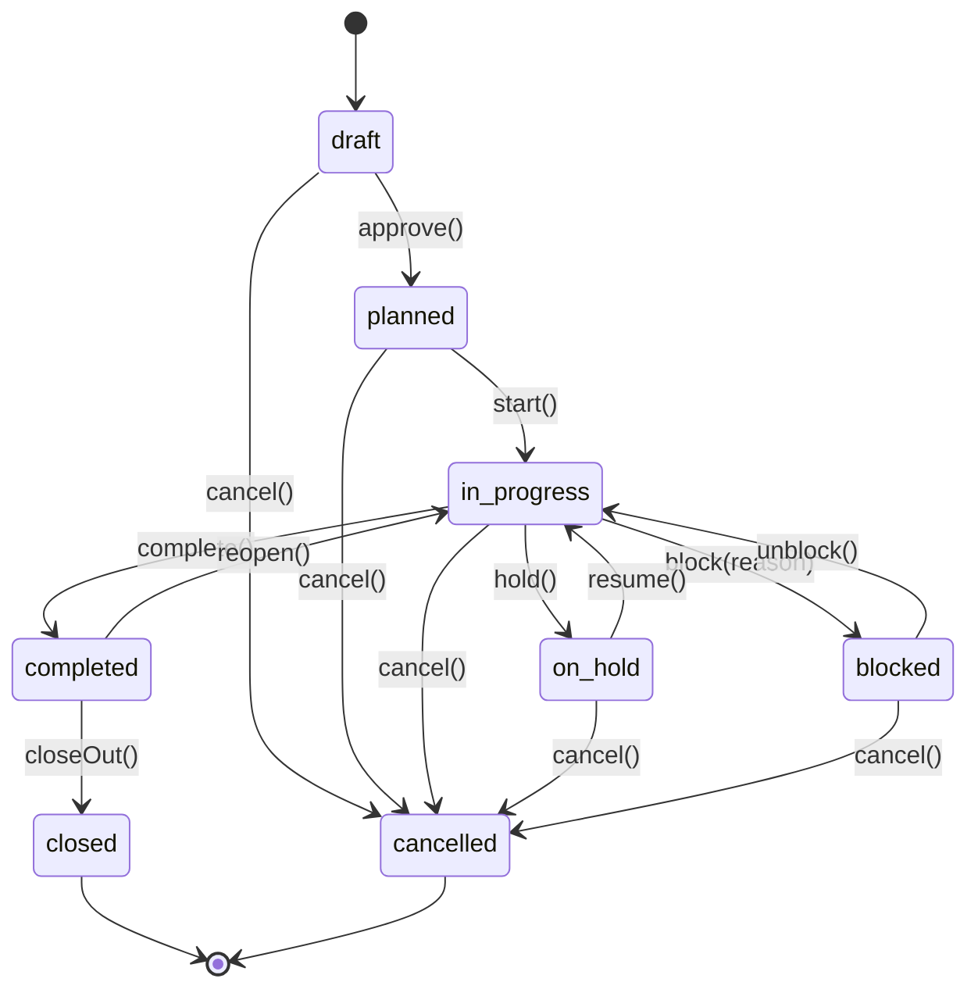
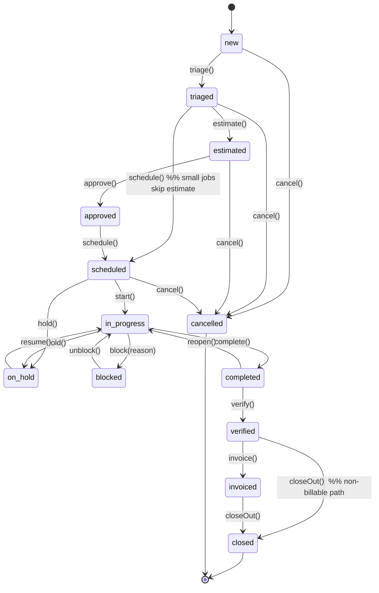
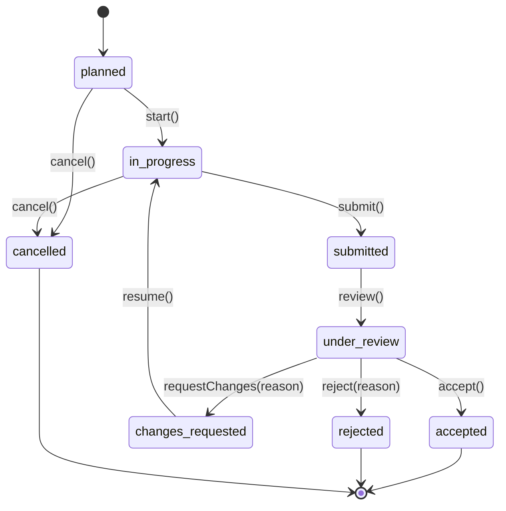
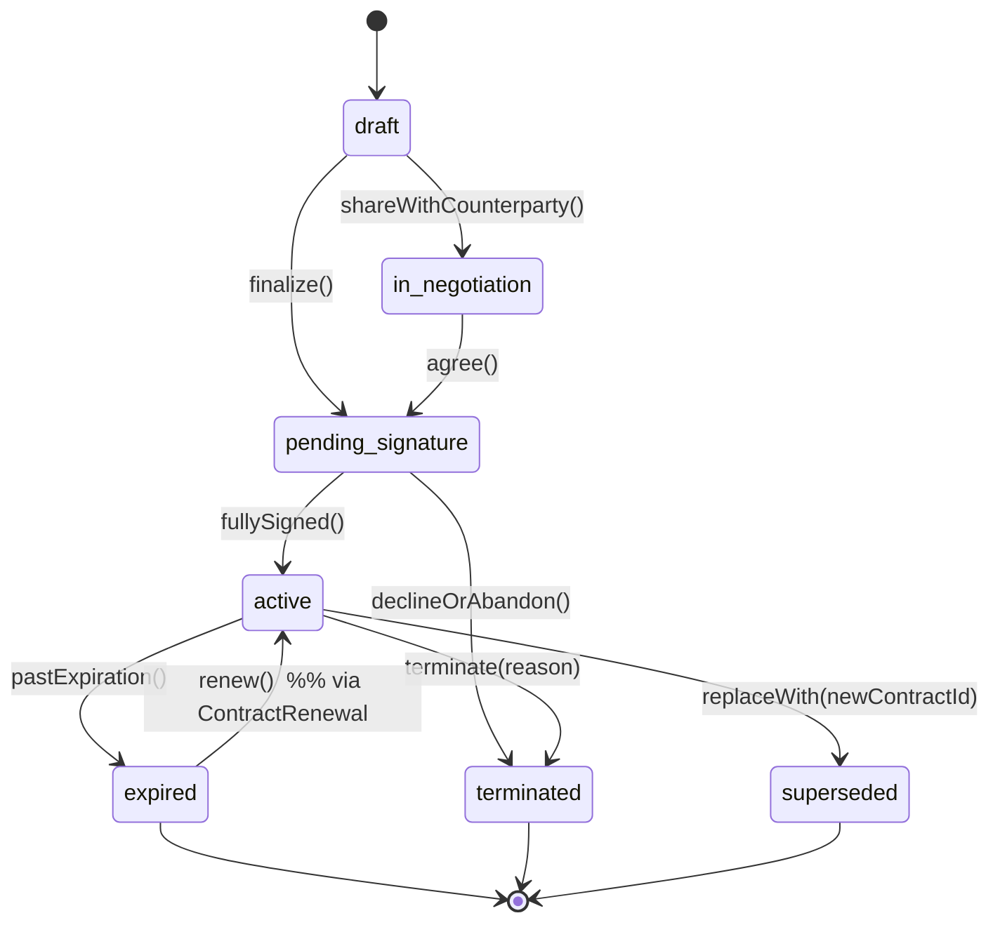
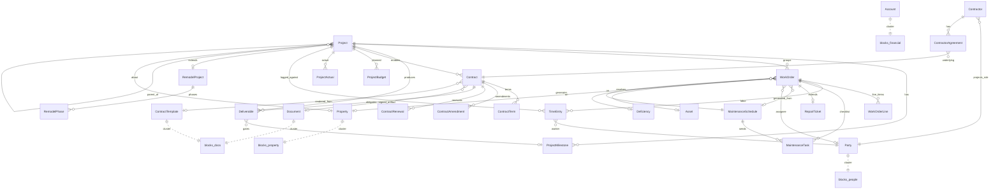

# `blocks-work-*` — Stage 02 Schema Design

**ADR reference:** [ADR 0088 — Anchor as All-In-One Local-First Runtime](../../docs/adrs/0088-anchor-all-in-one-local-first-runtime.md) (Path II, Phase 2).
**Cluster scope:** Project management, work execution, contractor management, contracts, deliverables, recurring maintenance, time/cost tracking.
**Status:** Draft (clean-room, framework-agnostic).
**Author:** XO (research subagent).
**Date:** 2026-05-16.

---

## 1. License posture summary (this cluster)

All Sunfish output is MIT-licensed per ADR 0088 §2. This document is a clean-room schema artifact: every entity below was derived from textbook fundamentals (project management, contract law, double-entry cost accounting) and from study of FOSS sources classified below. No copyleft code was opened in the same editor session as this file. Only permissive sources contributed structural patterns directly; copyleft sources informed concepts (state machines, lifecycle stages) only after the implementer-author re-expressed them in clean-room form.

### 1.1 License posture table

| Source | License | Posture | What it informed in this doc |
|---|---|---|---|
| **Apache OFBiz** `workeffort` + `agreement` + `content` modules | Apache 2.0 | **BORROW (permissive)** — attribution in source headers when implemented | Canonical `WorkEffort` ↔ `WorkEffortAssoc` graph; `Agreement` → `AgreementItem` → `AgreementTerm` decomposition; `WorkEffortFixedAsset` link pattern; party-role association on agreements |
| **Kanboard** | MIT | **BORROW (permissive)** | Lightweight task-state machine (`backlog → ready → in-progress → blocked → review → done → archived`); column-as-status pattern suitable for "repair-as-card" UI |
| **DocAssemble** | MIT | **BORROW (permissive)** — concepts only at schema level | Template-driven contract generation: `ContractTemplate` + `TemplateVariable` + `RenderedDocument` pattern; YAML-fronted template metadata shape |
| **rrule (RFC 5545)** | BSD-2 (and IETF RFC) | **BORROW (permissive)** | Recurrence-rule string format for `MaintenanceSchedule.recurrenceRule`; canonical iCal RRULE grammar |
| **OpenProject** (work-packages + budgets + types) | GPLv3 | **CLEAN-ROOM STUDY** — never paste; concepts only | Conceptual separation of *plan* vs *actual* on `ProjectBudget`/`ProjectActual`; multi-level WBS as parent/child on `Project`; "type" as discriminator across project shapes (here: `Project` vs `RemodelProject` via subtype + `kind` enum) |
| **Redmine** | GPLv2 | **CLEAN-ROOM STUDY** | Issue + project + time-entry triad; activity-type taxonomy for `TimeEntry.activityKind` |
| **ERPNext Projects** (`project`, `task`, `timesheet`, `activity_cost`) | GPLv3 | **CLEAN-ROOM STUDY** | Property-aware project linking; cost-rate-by-activity-kind approach |
| **GanttProject** | GPLv3 | **CLEAN-ROOM STUDY** | Schedule + cost build-up; predecessor/successor link as `MilestoneDependency` |
| **Documenso** | GPLv3 + Enterprise | **CLEAN-ROOM STUDY** (OSS parts only) | Signing-workflow state machine for `Contract.signingStatus`; signer + envelope + audit-trail decomposition |
| **OpenSign** | AGPLv3 | **STUDY ONLY** — public docs/blog only | DocuSign-alternative signing-workflow reference; confirmed canonical state shape |
| **OpenMAINT** | AGPLv3 | **STUDY ONLY** — public docs only | Inspection → deficiency → work-order flow (handoff contract from `blocks-property-*`); preventive vs corrective maintenance distinction |

**Discipline applied:** License-classification gate cleared before drafting. Reading isolation maintained — no copyleft source files opened in this editor session. Cleansing rule observed — no pasted text from any copyleft source. Attribution for borrowed permissive code will be applied at implementation time (Stage 06).

---

## 2. Entity catalog

All entities share Sunfish's `blocks-*` base shape (clean-room from `foundation-*` conventions): UUIDv7 primary key (`id`), `tenantId` (multi-tenant scope), `createdAt`/`updatedAt`/`createdBy`/`updatedBy` audit columns, optional `deletedAt` for soft delete, `version` for optimistic concurrency, and Loro CRDT replication metadata (`replicaId`, `lamportTs`) carried at the row level. These base fields are not re-listed per entity.

Field nullability uses TypeScript-style notation: `field: Type` (required), `field?: Type` (optional), `field: Type | null` (explicitly nullable on save). Validation rules are framework-agnostic; the implementer maps them onto FluentValidation / Zod / DataAnnotations at Stage 06.

### 2.1 `Project`

**Purpose:** A bounded body of work with a beginning, end, owner, and (typically) a property/asset focus.

```ts
interface Project {
  id: Uuid;
  tenantId: Uuid;
  code: string;                            // human-readable, unique-per-tenant (e.g., "PRJ-2026-014")
  name: string;
  description?: string;
  kind: ProjectKind;                       // 'generic' | 'remodel' | 'capex' | 'turnover' | 'capital-improvement'
  status: ProjectStatusCode;               // see ProjectStatus state machine
  priority: Priority;                      // 'low' | 'normal' | 'high' | 'urgent'

  // Cross-cluster anchors (all optional — a project may be property-agnostic)
  propertyId?: Uuid;                       // → blocks-property-*.Property
  assetId?: Uuid;                          // → blocks-property-*.Asset (when scoped to one asset)
  unitId?: Uuid;                           // → blocks-property-*.Unit (when scoped to one unit)
  customerPartyId?: Uuid;                  // → blocks-people-*.Party (when work is for an external customer)

  // Hierarchy (OpenProject-inspired WBS, clean-room)
  parentProjectId?: Uuid;                  // self-referential; supports sub-projects

  // Scheduling
  plannedStartDate?: IsoDate;
  plannedEndDate?: IsoDate;
  actualStartDate?: IsoDate;
  actualEndDate?: IsoDate;

  // Ownership
  ownerPartyId: Uuid;                      // → blocks-people-*.Party (internal staff in owner role)
  sponsorPartyId?: Uuid;                   // → blocks-people-*.Party (decision-maker / payer)

  // Roll-ups (denormalized; recomputed on aggregate events)
  budgetedAmount?: Money;                  // sum from ProjectBudget
  actualAmount?: Money;                    // sum from ProjectActual
  percentComplete?: Decimal;               // 0..100

  // Tags / labels (free-form; used for filtering)
  tags?: string[];

  // Soft archival flag distinct from soft delete
  archivedAt?: IsoDateTime;
}
```

**Relationships:**
- `propertyId` / `assetId` / `unitId` → `blocks-property-*` (loose join; project may exist without).
- `customerPartyId` / `ownerPartyId` / `sponsorPartyId` → `blocks-people-*.Party`.
- `parentProjectId` → `Project` (self).
- 1..N `ProjectMilestone`, `WorkOrder`, `Deliverable`, `Contract`, `ProjectBudget`, `ProjectActual`, `TimeEntry`.

**Validation:**
- `code`: required; unique per `tenantId`; matches `/^[A-Z]{1,4}-\d{4}-\d{3,6}$/` (recommended).
- `name`: 1–200 chars.
- `plannedEndDate` must be ≥ `plannedStartDate` when both set.
- `actualEndDate` requires `actualStartDate`.
- A project with `kind = 'remodel'` MUST have a `RemodelProject` sidecar row (see §2.5).
- `parentProjectId` must not create a cycle (closure-table check on save).
- `percentComplete` ∈ [0, 100].

### 2.2 `ProjectStatus` (state machine value)

Modeled as a fixed enumeration with a transition matrix; no separate table required (a small lookup is acceptable for UI labels/colors). Values:

```ts
type ProjectStatusCode =
  | 'draft'         // being scoped; no work has begun
  | 'planned'       // approved + scheduled; awaiting kickoff
  | 'in-progress'   // active execution
  | 'on-hold'       // paused intentionally
  | 'blocked'       // paused on external dependency
  | 'completed'     // work done; pending close-out
  | 'closed'        // accounting reconciled; immutable
  | 'cancelled';    // terminated without delivery
```

**State diagram (Mermaid):**



**Transition rules:**
- `complete` requires all child `WorkOrder.status ∈ {completed, cancelled}` AND all `Deliverable.status ∈ {accepted, rejected, cancelled}`.
- `closeOut` requires `ProjectBudget` vs `ProjectActual` reconciliation row written (see §2.18 workflow).
- `closed` is terminal except via explicit audit-correction operation.

### 2.3 `ProjectMilestone`

**Purpose:** A dated checkpoint inside a project — payment trigger, schedule landmark, or formal gate.

```ts
interface ProjectMilestone {
  id: Uuid;
  tenantId: Uuid;
  projectId: Uuid;                         // → Project
  code: string;                            // unique within projectId (e.g., "M1", "M2")
  name: string;
  description?: string;
  kind: MilestoneKind;                     // 'schedule' | 'payment' | 'gate' | 'deliverable-due'
  plannedDate: IsoDate;
  actualDate?: IsoDate;
  status: MilestoneStatusCode;             // 'pending' | 'at-risk' | 'achieved' | 'missed' | 'cancelled'
  weight?: Decimal;                        // optional; used in earned-value calc; 0..1
  paymentAmount?: Money;                   // for kind='payment'
  triggersInvoice?: boolean;               // if true, achieving milestone triggers a draft invoice via blocks-financial-*
  predecessorMilestoneId?: Uuid;           // → ProjectMilestone (GanttProject-inspired predecessor link)
}
```

**Validation:**
- `code` unique within `projectId`.
- `paymentAmount` required iff `kind = 'payment'`.
- `predecessorMilestoneId` must not cycle.

**State transitions:** `pending → at-risk` (rule-driven on date drift) `→ achieved | missed`; `cancelled` from any non-terminal.

### 2.4 `WorkOrder`

**Purpose:** A unit of executable work — a "job ticket." Lives independently or under a `Project`. Borrows OFBiz `WorkEffort` shape (clean-room expression).

```ts
interface WorkOrder {
  id: Uuid;
  tenantId: Uuid;
  number: string;                          // unique-per-tenant; e.g., "WO-2026-0014"
  title: string;
  description?: string;
  kind: WorkOrderKind;                     // 'task' | 'repair' | 'preventive-maintenance' | 'turnover' | 'inspection-followup'
  status: WorkOrderStatusCode;             // see §2.6
  priority: Priority;
  severity?: Severity;                     // 'cosmetic' | 'minor' | 'major' | 'safety' | 'habitability'

  // Cross-cluster anchors
  projectId?: Uuid;                        // → Project (optional; standalone work-orders allowed)
  propertyId?: Uuid;                       // → blocks-property-*.Property
  unitId?: Uuid;                           // → blocks-property-*.Unit
  assetId?: Uuid;                          // → blocks-property-*.Asset (the thing being worked on)
  deficiencyId?: Uuid;                     // → blocks-property-*.InspectionFinding/Deficiency (origin)

  // Parties
  requestedByPartyId?: Uuid;               // → blocks-people-*.Party (tenant, manager, staff)
  assignedToPartyId?: Uuid;                // → blocks-people-*.Party (internal or contractor)
  contractorId?: Uuid;                     // → Contractor (denormalized convenience; must match assignedToPartyId's contractor projection)

  // Scheduling
  reportedAt?: IsoDateTime;
  scheduledStart?: IsoDateTime;
  scheduledEnd?: IsoDateTime;
  startedAt?: IsoDateTime;
  completedAt?: IsoDateTime;
  dueBy?: IsoDateTime;                     // SLA-driven for safety/habitability kinds

  // Cost / billing
  estimatedAmount?: Money;
  approvedAmount?: Money;                  // post-estimate approval; gates contractor work-start in some kinds
  actualAmount?: Money;                    // recomputed from WorkOrderLine sum + TimeEntry costs

  // Recurrence link (for preventive-maintenance kind only)
  maintenanceScheduleId?: Uuid;            // → MaintenanceSchedule (origin schedule when auto-generated)

  // Tenant-billable flag (for property managers passing costs through)
  tenantBillable?: boolean;
  rebillPartyId?: Uuid;                    // → blocks-people-*.Party (e.g., tenant) when tenantBillable
}
```

**Relationships:**
- 1..N `WorkOrderLine` (line items).
- 1..N `TimeEntry` (labor).
- 0..1 `RepairTicket` sidecar (when `kind = 'repair'`).
- Optional `deficiencyId` is the inspection-finding handoff anchor.

**Validation:**
- `kind = 'repair'` SHOULD have a `RepairTicket` sidecar.
- `kind = 'preventive-maintenance'` MUST have `maintenanceScheduleId` set.
- `scheduledEnd` ≥ `scheduledStart` when both set.
- `severity = 'safety' | 'habitability'` MUST have `dueBy` set (SLA-required).
- `actualAmount` is computed; not user-editable.

### 2.5 `RepairTicket` (sidecar to `WorkOrder` when `kind = 'repair'`)

**Purpose:** Unplanned-repair-specific fields. Modeled as a sidecar table rather than nullable columns on `WorkOrder` to keep `WorkOrder` lean and to allow repair-specific indexes (e.g., on `reportedBy`, `triagedBy`).

```ts
interface RepairTicket {
  id: Uuid;
  tenantId: Uuid;
  workOrderId: Uuid;                       // → WorkOrder (1:1)
  reportedChannel: ReportChannel;          // 'phone' | 'sms' | 'email' | 'portal' | 'walk-in' | 'inspection'
  symptomText: string;                     // tenant/reporter's words
  triagedByPartyId?: Uuid;                 // → blocks-people-*.Party
  triagedAt?: IsoDateTime;
  rootCauseText?: string;
  fixDescription?: string;
  warrantyClaimed?: boolean;
  warrantyAgreementId?: Uuid;              // → ContractorAgreement (if a contractor warranty covers it)
}
```

### 2.6 `WorkOrderStatus` (state machine)

```ts
type WorkOrderStatusCode =
  | 'new'           // just created; not triaged
  | 'triaged'       // categorized and prioritized
  | 'estimated'     // estimate available; awaiting approval
  | 'approved'      // approved to proceed
  | 'scheduled'     // on the schedule
  | 'in-progress'
  | 'on-hold'
  | 'blocked'
  | 'completed'     // work physically done
  | 'verified'      // sign-off / QA pass
  | 'invoiced'      // invoiced via blocks-financial-* (one-way flag flip)
  | 'closed'        // accounting reconciled; immutable
  | 'cancelled';
```

**State diagram (Mermaid):**



**Transition rules:**
- `approve` requires `estimatedAmount` set.
- `complete` requires at least one `TimeEntry` OR one `WorkOrderLine` with `actualQuantity > 0`.
- `verify` is the QA / customer-acceptance gate; mandatory for `kind ∈ {'repair', 'turnover'}` when tenant-facing.
- `invoiced` is set by the `blocks-financial-*` invoice-generation handler, never manually.
- `closed` is terminal except via audit-correction.

### 2.7 `WorkOrderLine`

**Purpose:** A line item on a work order — labor, material, equipment, sub-contractor, or fee. Mirrors OFBiz `WorkEffortGoodStandard` semantics (clean-room).

```ts
interface WorkOrderLine {
  id: Uuid;
  tenantId: Uuid;
  workOrderId: Uuid;
  lineNumber: int;                         // unique-per-workOrderId; 1-based
  kind: WorkOrderLineKind;                 // 'labor' | 'material' | 'equipment' | 'subcontract' | 'fee' | 'reimbursable'
  description: string;
  sku?: string;                            // optional product/material code; later joins blocks-storefront-* catalog when present
  unitOfMeasure?: string;                  // 'hour' | 'each' | 'sqft' | 'gallon' | etc.
  estimatedQuantity?: Decimal;
  estimatedUnitPrice?: Money;
  estimatedAmount?: Money;                 // = qty × unitPrice (computed; validated)
  actualQuantity?: Decimal;
  actualUnitPrice?: Money;
  actualAmount?: Money;                    // computed
  taxCode?: string;                        // → blocks-financial-*.TaxCode (when taxable)
  glAccountId?: Uuid;                      // → blocks-financial-*.Account (cost account)
  notes?: string;
}
```

**Validation:**
- `lineNumber` unique within `workOrderId`.
- `estimatedAmount` ≈ `estimatedQuantity × estimatedUnitPrice` within rounding tolerance.
- `actualAmount` ≈ `actualQuantity × actualUnitPrice`.
- `kind = 'labor'` SHOULD be expressed via `TimeEntry` and a synthesized labor line, NOT as a hand-keyed line (enforced softly via convention).

### 2.8 `RemodelProject` (sidecar to `Project` when `kind = 'remodel'`)

**Purpose:** Capital-improvement / remodel projects carry budget phases and per-phase trade scheduling beyond the generic project shape.

```ts
interface RemodelProject {
  id: Uuid;
  tenantId: Uuid;
  projectId: Uuid;                         // → Project (1:1)

  // Scope
  scopeStatement: string;
  remodelKind: RemodelKind;                // 'kitchen' | 'bath' | 'whole-unit' | 'exterior' | 'roof' | 'system-replacement' | 'custom'

  // Permits
  permitRequired?: boolean;
  permitNumber?: string;
  permitIssuedAt?: IsoDate;
  inspectionsRequired?: string[];          // free-form labels: 'rough-electrical', 'final-plumbing', etc.

  // Budget phases — typical remodel breaks down by trade
  phases?: RemodelPhase[];

  // Capitalization handoff to financial cluster
  capitalizationAccountId?: Uuid;          // → blocks-financial-*.Account (the asset/CIP account)
  placedInServiceAt?: IsoDate;             // triggers depreciation start in blocks-financial-*
}

interface RemodelPhase {
  id: Uuid;
  remodelProjectId: Uuid;
  ordinal: int;
  name: string;                            // 'demolition', 'rough-in', 'finish', etc.
  budgetedAmount: Money;
  actualAmount?: Money;
  plannedStartDate?: IsoDate;
  plannedEndDate?: IsoDate;
  status: PhaseStatusCode;                 // 'planned' | 'active' | 'complete' | 'over-budget' | 'cancelled'
}
```

**Validation:**
- `projectId.kind` must equal `'remodel'`.
- `permitNumber` and `permitIssuedAt` required when `permitRequired = true`.
- Sum of `RemodelPhase.budgetedAmount` SHOULD reconcile to `Project.budgetedAmount` (warn on drift; don't block).
- `placedInServiceAt` requires `capitalizationAccountId` to be set.

### 2.9 `MaintenanceSchedule`

**Purpose:** Recurring rule that generates `WorkOrder`s of `kind = 'preventive-maintenance'`. RRULE-driven.

```ts
interface MaintenanceSchedule {
  id: Uuid;
  tenantId: Uuid;
  name: string;                            // e.g., "Quarterly HVAC filter — Unit 3B"
  description?: string;

  // Scope (one of these is typical)
  propertyId?: Uuid;                       // → blocks-property-*.Property
  unitId?: Uuid;                           // → blocks-property-*.Unit
  assetId?: Uuid;                          // → blocks-property-*.Asset

  // Recurrence
  recurrenceRule: string;                  // RFC 5545 RRULE string (e.g., "FREQ=MONTHLY;INTERVAL=3")
  startsOn: IsoDate;                       // anchor date
  endsOn?: IsoDate;                        // optional terminal date
  timezone: string;                        // IANA tz id; for local-first single-tz tenants this is typically the tenant's tz

  // Template for generated work orders
  taskTemplate: MaintenanceTaskTemplate;

  // Lead time + horizon
  generateLeadDays: int;                   // generate WO this many days before due (e.g., 14)
  lookaheadHorizonDays: int;               // generate up to N days in advance (e.g., 90)

  // Lifecycle
  status: ScheduleStatusCode;              // 'active' | 'paused' | 'archived'
  lastGeneratedAt?: IsoDateTime;
  nextDueAt?: IsoDateTime;                 // denormalized; recomputed on generator run
}

interface MaintenanceTaskTemplate {
  title: string;                           // becomes WorkOrder.title
  description?: string;                    // becomes WorkOrder.description
  priority: Priority;
  severity?: Severity;
  assignedToPartyId?: Uuid;                // default assignee
  contractorId?: Uuid;                     // default contractor (e.g., recurring landscaper)
  estimatedHours?: Decimal;
  estimatedAmount?: Money;
  defaultLines?: WorkOrderLineDraft[];     // pre-filled WorkOrderLine seeds
  checklistItems?: ChecklistItem[];        // → MaintenanceTask rows on the generated WO
}

interface ChecklistItem {
  ordinal: int;
  text: string;
  isMandatory: boolean;
}
```

**Validation:**
- Exactly one of `propertyId | unitId | assetId` SHOULD be set (warn if none; portfolio-wide schedules are allowed but rare).
- `recurrenceRule` parses as valid RFC 5545 RRULE.
- `generateLeadDays` ≤ `lookaheadHorizonDays`.
- `endsOn` ≥ `startsOn` when set.

### 2.10 `MaintenanceTask`

**Purpose:** A checklist line on a generated maintenance work order (the per-occurrence instances of `ChecklistItem`).

```ts
interface MaintenanceTask {
  id: Uuid;
  tenantId: Uuid;
  workOrderId: Uuid;                       // → WorkOrder (the generated PM work order)
  maintenanceScheduleId: Uuid;             // → MaintenanceSchedule (originating schedule)
  ordinal: int;
  text: string;
  isMandatory: boolean;
  status: TaskStatusCode;                  // 'pending' | 'completed' | 'na' | 'failed'
  completedAt?: IsoDateTime;
  completedByPartyId?: Uuid;
  notes?: string;
  photoMediaIds?: Uuid[];                  // → blocks-property-* MediaAsset / blocks-docs-* DAM (photographic evidence)
}
```

**Validation:**
- A WO with `isMandatory` tasks cannot transition to `completed` while any mandatory task is `pending`.

### 2.11 `Contractor`

**Purpose:** Projection of a `blocks-people-*.Party` in the supplier/contractor role. Contractor-specific fields (insurance, license, trade categories) live here, not on `Party`.

```ts
interface Contractor {
  id: Uuid;
  tenantId: Uuid;
  partyId: Uuid;                           // → blocks-people-*.Party (1:1 within tenant)
  displayName: string;                     // denormalized convenience
  trades: TradeCategory[];                 // 'general' | 'plumbing' | 'electrical' | 'hvac' | 'roofing' | 'landscaping' | 'cleaning' | 'pest' | 'paint' | 'flooring' | 'appliance' | 'other'

  // Compliance
  licenseNumber?: string;
  licenseExpiresOn?: IsoDate;
  insurancePolicyNumber?: string;
  insuranceExpiresOn?: IsoDate;
  bondedAmount?: Money;
  w9OnFile?: boolean;
  w9ReceivedOn?: IsoDate;

  // Operational
  preferredFlag?: boolean;                 // saved-favorite flag for quick assignment
  rating?: Decimal;                        // 1..5 average from project closeouts
  ratingCount?: int;
  hourlyRate?: Money;                      // default labor rate (overridable per WO)
  emergencyAvailable?: boolean;

  status: ContractorStatusCode;            // 'active' | 'paused' | 'blacklisted' | 'archived'
  notes?: string;
}
```

**Validation:**
- `partyId` must reference a `Party` with `role` including `'supplier'` (cross-cluster invariant; soft-enforced).
- `licenseExpiresOn` and `insuranceExpiresOn` generate `expired` warnings 30 days before lapse (rule, not constraint).
- `bondedAmount.currency` must match tenant base currency.

### 2.12 `ContractorAgreement`

**Purpose:** Master service agreement (MSA), rate sheet, or warranty agreement with a contractor. Distinct from `Contract` — `Contract` is the cluster's umbrella contract type (any counterparty), while `ContractorAgreement` is a thin specialization preset for the supplier relationship. Conceptually `ContractorAgreement` is a `Contract` with `partyRole = 'contractor'`; physically they MAY share the `Contract` table with a discriminator, or be a sidecar. **Decision deferred to Stage 03** (see Open Questions §8).

```ts
interface ContractorAgreement {
  id: Uuid;
  tenantId: Uuid;
  contractorId: Uuid;                      // → Contractor
  contractId: Uuid;                        // → Contract (the underlying contract object)
  agreementKind: AgreementKind;            // 'msa' | 'rate-sheet' | 'warranty' | 'preferred-vendor' | 'project-specific'

  // Rates (when agreementKind ∈ {'rate-sheet','msa'})
  laborRateBands?: LaborRateBand[];        // tiered hourly rates by skill class
  travelChargePolicy?: string;
  callOutFee?: Money;
  overtimeMultiplier?: Decimal;

  // Warranty (when agreementKind = 'warranty')
  warrantyScope?: string;                  // free-form description
  warrantyTermMonths?: int;
  warrantyStartDate?: IsoDate;
  warrantyEndDate?: IsoDate;

  status: AgreementStatusCode;             // 'draft' | 'active' | 'expired' | 'terminated'
}

interface LaborRateBand {
  skillClass: string;                      // 'journeyman' | 'apprentice' | 'master' | etc.
  hourlyRate: Money;
}
```

### 2.13 `Deliverable`

**Purpose:** A produced artifact or completed work-product subject to acceptance/sign-off. Sits between work output and contract fulfillment.

```ts
interface Deliverable {
  id: Uuid;
  tenantId: Uuid;
  projectId?: Uuid;                        // → Project (typical)
  workOrderId?: Uuid;                      // → WorkOrder (alternative anchor)
  contractId?: Uuid;                       // → Contract (when contractually required)
  milestoneId?: Uuid;                      // → ProjectMilestone (when milestone-gated)
  code: string;                            // unique per project; e.g., "D-1"
  name: string;
  description?: string;
  kind: DeliverableKind;                   // 'document' | 'physical' | 'service' | 'access-grant' | 'sign-off'

  status: DeliverableStatusCode;           // see §2.14
  plannedDate?: IsoDate;
  submittedAt?: IsoDateTime;
  acceptedAt?: IsoDateTime;
  rejectedAt?: IsoDateTime;
  rejectionReason?: string;

  // Producer / consumer
  producerPartyId?: Uuid;                  // → blocks-people-*.Party (who produced it)
  approverPartyId?: Uuid;                  // → blocks-people-*.Party (who signs off)

  // Artifact pointers
  documentIds?: Uuid[];                    // → blocks-docs-* Document (signed PDF, certificate of occupancy, photos-as-doc, etc.)
  mediaIds?: Uuid[];                       // → blocks-property-* / blocks-docs-* MediaAsset

  // Acceptance criteria (free-form text or structured checklist; structured form deferred)
  acceptanceCriteria?: string;
}
```

### 2.14 `DeliverableStatus` (state machine)

```ts
type DeliverableStatusCode =
  | 'planned'
  | 'in-progress'
  | 'submitted'
  | 'under-review'
  | 'changes-requested'
  | 'accepted'
  | 'rejected'
  | 'cancelled';
```

**State diagram (Mermaid):**



### 2.15 `Contract`

**Purpose:** The umbrella contract entity — any binding agreement (vendor MSA, contractor SOW, lease addendum-as-contract, customer SOW, NDA, etc.). Borrows OFBiz `Agreement` → `AgreementItem` → `AgreementTerm` decomposition (clean-room).

```ts
interface Contract {
  id: Uuid;
  tenantId: Uuid;
  number: string;                          // unique-per-tenant; e.g., "CTR-2026-0034"
  title: string;
  description?: string;
  kind: ContractKind;                      // 'msa' | 'sow' | 'nda' | 'service-agreement' | 'warranty' | 'lease-addendum' | 'purchase-order' | 'custom'

  // Counterparties (typically 2; OFBiz pattern allows N via ContractParty sidecar)
  counterpartyPartyId: Uuid;               // → blocks-people-*.Party (the other side)
  counterpartyRole: PartyRole;             // 'contractor' | 'vendor' | 'customer' | 'tenant' | 'service-provider'
  ownPartyId: Uuid;                        // → blocks-people-*.Party (our org as a Party)

  // Dates
  effectiveDate: IsoDate;
  expirationDate?: IsoDate;
  signedDate?: IsoDate;

  // Financial summary (denormalized from items where present)
  totalValue?: Money;
  paymentTermsText?: string;               // e.g., "NET 30"; structured terms live on ContractTerm

  // Status
  status: ContractStatusCode;              // see §2.16
  signingStatus: SigningStatusCode;        // see §2.16
  renewalPolicy?: RenewalPolicy;           // 'manual' | 'auto-renew' | 'evergreen' | 'none'

  // Anchors to other clusters
  projectId?: Uuid;                        // → Project (when contract is project-scoped)
  propertyId?: Uuid;                       // → blocks-property-*.Property
  templateId?: Uuid;                       // → blocks-docs-*.ContractTemplate (origin template)
  primaryDocumentId?: Uuid;                // → blocks-docs-*.Document (the rendered + signed PDF)
}
```

**Validation:**
- `expirationDate` ≥ `effectiveDate` when both set.
- `signedDate` ≥ `effectiveDate` is NOT required (back-dated signatures are valid).
- A `Contract` with `renewalPolicy = 'auto-renew'` MUST have `expirationDate` set.
- `counterpartyPartyId ≠ ownPartyId`.

### 2.16 `ContractStatus` + `SigningStatus` (state machines)

```ts
type ContractStatusCode =
  | 'draft'
  | 'in-negotiation'
  | 'pending-signature'
  | 'active'
  | 'expired'
  | 'terminated'
  | 'superseded';                          // replaced by another contract (e.g., amended via new doc)

type SigningStatusCode =
  | 'not-sent'
  | 'sent'
  | 'partially-signed'
  | 'fully-signed'
  | 'declined'
  | 'voided';
```

**Contract state diagram:**



**Signing state diagram (sub-state of Contract during draft → pending-signature → active):**

```mermaid
stateDiagram-v2
  [*] --> not_sent
  not_sent --> sent: sendForSignature()
  sent --> partially_signed: signerSigns()
  partially_signed --> partially_signed: nextSignerSigns()
  partially_signed --> fully_signed: lastSignerSigns()
  sent --> declined: signerDeclines()
  partially_signed --> declined: signerDeclines()
  fully_signed --> voided: voidPostSign(reason)  %% rare; audit-only
```

### 2.17 `ContractTerm`

**Purpose:** Structured term within a contract — payment schedule, SLA, liability cap, indemnification, exclusivity, etc. OFBiz `AgreementTerm` shape, clean-room.

```ts
interface ContractTerm {
  id: Uuid;
  tenantId: Uuid;
  contractId: Uuid;
  ordinal: int;                            // display order
  termKind: ContractTermKind;              // 'payment' | 'sla' | 'liability-cap' | 'indemnification' | 'exclusivity' | 'termination' | 'renewal' | 'governing-law' | 'confidentiality' | 'penalty' | 'incentive' | 'custom'
  title: string;
  bodyText: string;                        // human-readable clause text

  // Optional structured fields per termKind
  paymentAmount?: Money;
  paymentDueRule?: string;                 // 'NET 30' | 'on-milestone' | 'on-receipt' | etc.
  slaTargetText?: string;                  // e.g., "respond within 4 business hours"
  liabilityCapAmount?: Money;
  effectiveFrom?: IsoDate;
  effectiveUntil?: IsoDate;
}
```

**Validation:**
- `paymentAmount` and `paymentDueRule` SHOULD be set when `termKind = 'payment'`.
- `liabilityCapAmount` SHOULD be set when `termKind = 'liability-cap'`.

### 2.18 `ContractAmendment`

**Purpose:** A formal change to an active contract. Captured as a row rather than mutating `Contract` so the audit trail of "what changed when" is queryable.

```ts
interface ContractAmendment {
  id: Uuid;
  tenantId: Uuid;
  contractId: Uuid;
  amendmentNumber: int;                    // 1-based per contractId
  effectiveDate: IsoDate;
  summary: string;                         // human description of what changed
  changesJson: JsonValue;                  // structured diff: [{path, op, oldValue, newValue}, ...]
  signedDate?: IsoDate;
  signingStatus: SigningStatusCode;
  primaryDocumentId?: Uuid;                // → blocks-docs-*.Document (the signed amendment PDF)
}
```

**Validation:**
- `amendmentNumber` unique per `contractId`; auto-increments.
- Parent contract status must be `active` when amendment is created.
- Applying an amendment is a deliberate transaction that updates `Contract` fields AND writes the amendment row; never one without the other.

### 2.19 `ContractRenewal`

**Purpose:** Renewal event tied to expiry. Carries renewal-term changes (new expiration, new pricing) as well as the linkage to the prior contract instance.

```ts
interface ContractRenewal {
  id: Uuid;
  tenantId: Uuid;
  contractId: Uuid;                        // the contract being renewed
  renewedFromContractId?: Uuid;            // when renewal creates a new contract row (preserve-history mode)
  renewalDate: IsoDate;
  newExpirationDate: IsoDate;
  newTotalValue?: Money;
  renewalKind: RenewalKind;                // 'auto' | 'manual' | 'renegotiated'
  notes?: string;
  triggeredByPartyId?: Uuid;
}
```

**Validation:**
- `newExpirationDate` > `renewalDate`.
- For `renewalKind = 'auto'`, parent contract must have `renewalPolicy = 'auto-renew'`.

### 2.20 `TimeEntry` / `TimeLog`

**Purpose:** A unit of logged time against a `Project` or `WorkOrder`. Drives both labor cost and (optionally) payroll inputs. Redmine-inspired activity-type taxonomy (clean-room).

```ts
interface TimeEntry {
  id: Uuid;
  tenantId: Uuid;
  workerPartyId: Uuid;                     // → blocks-people-*.Party (the person doing the work)

  // Target — exactly one is required
  projectId?: Uuid;
  workOrderId?: Uuid;
  maintenanceTaskId?: Uuid;                // → MaintenanceTask (when logging against a checklist line)

  activityKind: ActivityKind;              // 'labor' | 'travel' | 'consultation' | 'inspection' | 'admin' | 'callout' | 'overtime'
  startedAt: IsoDateTime;
  endedAt?: IsoDateTime;                   // null while running; required to finalize
  durationMinutes: int;                    // derived; recomputed from start/end; stored for query speed

  billable: boolean;
  hourlyRate?: Money;                      // captured at entry time; defaults from Contractor.hourlyRate or staff rate
  amount?: Money;                          // = (durationMinutes/60) × hourlyRate
  glAccountId?: Uuid;                      // → blocks-financial-*.Account
  description?: string;
  approvedByPartyId?: Uuid;                // approval gate for billable hours
  approvedAt?: IsoDateTime;
  invoicedFlag?: boolean;                  // true once rolled into an invoice (one-way)
}
```

**Validation:**
- Exactly one of `projectId | workOrderId | maintenanceTaskId` is set.
- `endedAt` ≥ `startedAt`.
- `durationMinutes` = floor((endedAt − startedAt) / 60 000); recomputed by the persistence layer; not user-editable.
- Overlapping `TimeEntry` rows for the same `workerPartyId` produce a warning (not blocked — split-attention work happens).

### 2.21 `ProjectBudget`

**Purpose:** Planned (budgeted) cost rolled up by category for a project. One row per budget category per project — multiple rows compose the budget.

```ts
interface ProjectBudget {
  id: Uuid;
  tenantId: Uuid;
  projectId: Uuid;
  category: BudgetCategory;                // 'labor' | 'materials' | 'equipment' | 'subcontract' | 'permits' | 'contingency' | 'other'
  glAccountId?: Uuid;                      // → blocks-financial-*.Account
  budgetedAmount: Money;
  notes?: string;
  revisionNumber: int;                     // increments on revised budget (history kept in BudgetRevision audit table — Stage 03 detail)
}
```

### 2.22 `ProjectActual`

**Purpose:** Actual cost incurred against a project — typically generated from `WorkOrderLine`, `TimeEntry`, and direct journal allocations. May be denormalized (event-sourced from `blocks-financial-*` journal lines) or stored as a roll-up table; Stage 03 will decide.

```ts
interface ProjectActual {
  id: Uuid;
  tenantId: Uuid;
  projectId: Uuid;
  category: BudgetCategory;
  glAccountId?: Uuid;
  postedAmount: Money;
  postedDate: IsoDate;
  sourceKind: ActualSourceKind;            // 'work-order-line' | 'time-entry' | 'journal-entry' | 'invoice' | 'manual'
  sourceRefId?: Uuid;                      // → WorkOrderLine | TimeEntry | blocks-financial-*.JournalEntry | etc.
  notes?: string;
}
```

**Validation:**
- `postedAmount.currency` matches tenant base currency unless explicit FX handling.
- `sourceRefId` SHOULD be set for traceability; manual entries allowed but flagged.

---

## 3. Cross-entity relationship diagram



---

## 4. Key workflows

### 4.1 Inspection finding → deficiency → work-order generation (handoff from `blocks-property-*`)

`blocks-property-*` owns `InspectionFinding` / `Deficiency`. When a deficiency reaches a "needs-remediation" state (severity ≥ minor, or marked actionable), `blocks-work-*` listens for a `DeficiencyRaised` domain event and generates a `WorkOrder`.

```text
# Event consumer pseudocode (idempotent on (deficiencyId, kind='inspection-followup'))
on DeficiencyRaised(deficiencyId, propertyId, unitId, assetId, severity, description, photos):
  existing = WorkOrder.find_by(deficiencyId, kind='inspection-followup')
  if existing: return existing      # idempotent — re-firing is safe

  wo = WorkOrder.create(
    tenantId,
    number = next_workorder_number(),
    title = f"Remediate: {description[:120]}",
    description = description,
    kind = severity >= 'safety' ? 'repair' : 'inspection-followup',
    status = 'new',
    priority = derivePriority(severity),
    severity = severity,
    propertyId, unitId, assetId,
    deficiencyId = deficiencyId,
    reportedAt = now(),
    dueBy = severity in {'safety','habitability'} ? now() + sla(severity) : null,
  )
  if wo.kind == 'repair':
    RepairTicket.create(workOrderId=wo.id, reportedChannel='inspection', symptomText=description)
  emit WorkOrderCreated(wo.id, originDeficiencyId=deficiencyId)
```

The `blocks-property-*` cluster never writes to `blocks-work-*` tables directly. The event is the contract.

### 4.2 Project budget vs actual reconciliation (handoff to `blocks-financial-*`)

```text
# Triggered nightly + on demand at project close-out
def reconcile(projectId):
  budgets = ProjectBudget.where(projectId, latest revisionNumber per category)

  # Pull actuals from three sources
  from_lines = sum(WorkOrderLine.actualAmount where workOrder.projectId == projectId)
  from_time  = sum(TimeEntry.amount where projectId == projectId and approvedAt is not null)
  from_journal = blocks_financial.query(
    "actuals posted to project cost accounts where dimension.projectId == :projectId"
  )

  # Upsert ProjectActual rows per source (idempotent on (projectId, sourceKind, sourceRefId))
  upsert_actuals(projectId, from_lines, from_time, from_journal)

  # Compute variance per category
  for category in BudgetCategory:
    b = budgets[category].budgetedAmount or 0
    a = sum(ProjectActual where category == category)
    variance = a - b
    variance_pct = b == 0 ? null : variance / b * 100
    if variance_pct and variance_pct > THRESHOLD:
      emit BudgetVarianceExceeded(projectId, category, variance, variance_pct)
```

Reconciliation never writes to `blocks-financial-*` journal directly — it reads only. Cost allocation to journal happens via the time-entry → journal-entry workflow (§4.6).

### 4.3 Maintenance schedule auto-creates recurring work orders

```text
# Generator job runs daily (or on schedule change)
def generate_pm_workorders():
  for schedule in MaintenanceSchedule.where(status='active'):
    occurrences = rrule_expand(
      schedule.recurrenceRule,
      from = max(schedule.lastGeneratedAt or schedule.startsOn, today() - 1d),
      to   = today() + schedule.lookaheadHorizonDays,
      tz   = schedule.timezone,
    )
    for occ_date in occurrences:
      due_at = occ_date
      generate_at = occ_date - schedule.generateLeadDays
      if today() < generate_at: continue
      if WorkOrder.exists(maintenanceScheduleId=schedule.id, scheduledStart=occ_date):
        continue   # idempotent

      wo = WorkOrder.create(
        kind='preventive-maintenance',
        status='scheduled',
        title = schedule.taskTemplate.title,
        description = schedule.taskTemplate.description,
        priority = schedule.taskTemplate.priority,
        propertyId / unitId / assetId from schedule,
        assignedToPartyId = schedule.taskTemplate.assignedToPartyId,
        contractorId = schedule.taskTemplate.contractorId,
        scheduledStart = occ_date, scheduledEnd = occ_date + estimatedDuration,
        dueBy = occ_date,
        estimatedAmount = schedule.taskTemplate.estimatedAmount,
        maintenanceScheduleId = schedule.id,
      )
      for line_seed in schedule.taskTemplate.defaultLines or []:
        WorkOrderLine.create(workOrderId=wo.id, ...line_seed)
      for ci in schedule.taskTemplate.checklistItems or []:
        MaintenanceTask.create(workOrderId=wo.id, maintenanceScheduleId=schedule.id,
                               ordinal=ci.ordinal, text=ci.text, isMandatory=ci.isMandatory,
                               status='pending')
    schedule.lastGeneratedAt = now()
    schedule.nextDueAt = next(occurrences, after=today())
```

### 4.4 Contract renewal workflow

```text
# Two policies: 'auto-renew' fires automatically; 'manual' just emits reminders.
# Daily job:
def process_renewals():
  for contract in Contract.where(status='active', expirationDate is not null):
    days_to_expiry = (contract.expirationDate - today()).days

    if contract.renewalPolicy == 'auto-renew':
      if days_to_expiry == 0:
        renewal = ContractRenewal.create(
          contractId = contract.id,
          renewalDate = today(),
          newExpirationDate = contract.expirationDate + default_renewal_term(contract),
          renewalKind = 'auto',
          newTotalValue = compute_renewal_value(contract),
        )
        contract.expirationDate = renewal.newExpirationDate
        contract.totalValue = renewal.newTotalValue or contract.totalValue
        # Status stays 'active'
        emit ContractRenewed(contract.id, renewalId=renewal.id)

    elif contract.renewalPolicy == 'manual':
      if days_to_expiry in {90, 60, 30, 7, 1}:
        emit ContractRenewalReminder(contract.id, daysToExpiry=days_to_expiry)

    if days_to_expiry < 0 and contract.status == 'active':
      contract.status = 'expired'
      emit ContractExpired(contract.id)
```

### 4.5 Deliverable acceptance + sign-off

```text
# 1. Producer submits deliverable
on submit(deliverable):
  require deliverable.status == 'in-progress'
  deliverable.status = 'submitted'
  deliverable.submittedAt = now()
  emit DeliverableSubmitted(deliverable.id, projectId, milestoneId, approverPartyId)

# 2. Approver reviews
on approve(deliverable):
  require deliverable.status in {'submitted', 'under-review'}
  deliverable.status = 'accepted'
  deliverable.acceptedAt = now()

  if deliverable.milestoneId:
    milestone = ProjectMilestone.get(deliverable.milestoneId)
    if all_deliverables_accepted(milestone):
      milestone.status = 'achieved'
      milestone.actualDate = today()
      if milestone.triggersInvoice:
        emit InvoiceTriggered(projectId, milestoneId, amount=milestone.paymentAmount)
        # blocks-financial-* listens and drafts an invoice

  emit DeliverableAccepted(deliverable.id, projectId)

on requestChanges(deliverable, reason):
  deliverable.status = 'changes-requested'
  emit ChangesRequested(deliverable.id, reason)
```

### 4.6 Time-entry → cost allocation → journal entry

```text
# At time-entry approval, cost is allocated to the right cost dimension
# in blocks-financial-* via an event. blocks-work-* never inserts into journals directly.

on approve(timeEntry):
  require timeEntry.endedAt is not null
  if timeEntry.hourlyRate is null:
    timeEntry.hourlyRate = lookup_rate(timeEntry.workerPartyId, timeEntry.activityKind)
  timeEntry.amount = round(timeEntry.durationMinutes / 60 * timeEntry.hourlyRate)
  timeEntry.approvedAt = now()
  timeEntry.approvedByPartyId = currentUser

  emit TimeEntryApproved(
    timeEntryId, projectId, workOrderId,
    amount = timeEntry.amount,
    glAccountId = timeEntry.glAccountId or default_labor_account(),
    workerPartyId = timeEntry.workerPartyId,
    occurredOn = startDate,
  )

# blocks-financial-* handler:
on TimeEntryApproved(evt):
  je = JournalEntry.create(
    date = evt.occurredOn,
    description = f"Labor: TimeEntry {evt.timeEntryId}",
    dimensions = {projectId: evt.projectId, workOrderId: evt.workOrderId, partyId: evt.workerPartyId},
    lines = [
      {accountId: evt.glAccountId, debit: evt.amount},
      {accountId: accrued_payroll_account(), credit: evt.amount},
    ],
    sourceKind = 'time-entry',
    sourceRefId = evt.timeEntryId,
  )

# blocks-work-* listens to the resulting JournalEntryPosted event and upserts a ProjectActual row:
on JournalEntryPosted(je):
  if je.sourceKind == 'time-entry':
    ProjectActual.upsert(
      projectId = je.dimensions.projectId,
      category = 'labor',
      glAccountId = je.lines[0].accountId,
      postedAmount = je.lines[0].debit,
      postedDate = je.date,
      sourceKind = 'time-entry',
      sourceRefId = je.sourceRefId,
    )
```

This bidirectional event flow avoids any direct cross-cluster DB writes; each cluster owns its tables; events are the only contract.

---

## 5. Cross-cluster contracts (explicit dependencies)

### 5.1 On `blocks-property-*`

- Reads: `Property`, `Unit`, `Asset` (by id; for display/denorm only).
- Reads: `InspectionFinding` / `Deficiency` (resolves via `WorkOrder.deficiencyId`).
- Consumes events: `DeficiencyRaised`, `DeficiencyResolved`, `AssetRetired` (cascade `MaintenanceSchedule.archive`).
- Emits events: `WorkOrderCompleted{ propertyId, unitId, assetId }` (property cluster updates last-serviced timestamps).

### 5.2 On `blocks-people-*`

- Reads: `Party` (by id) for displayName + role check.
- Projects `Party` into `Contractor` when the party has `role='supplier'`.
- Emits no writes; the `Contractor` projection lives in `blocks-work-*`.

### 5.3 On `blocks-financial-*`

- Reads: `Account` ids (`glAccountId` on lines/budgets/time-entries), `TaxCode`.
- Emits events: `TimeEntryApproved`, `WorkOrderInvoiceRequested`, `MilestoneInvoiceTriggered`, `RemodelCapitalized` (placed-in-service → start depreciation).
- Consumes events: `JournalEntryPosted` (with `dimensions.projectId` or `dimensions.workOrderId`) → upsert `ProjectActual`.
- Convention: `blocks-financial-*` accepts free-form `dimensions` JSON on journal entries; the `projectId`/`workOrderId` dimensions are part of the canonical dimension key set defined in `blocks-financial-*` schema.

### 5.4 On `blocks-docs-*`

- Reads: `ContractTemplate` (for new contract creation), `Document` (for signed PDF, deliverable artifacts).
- Emits events: `ContractRendered{ contractId, templateId, documentId }` (docs cluster owns the document; work cluster references it).
- Consumes events: `DocumentSigned{ documentId, contractId, signerPartyId, signedAt }` → updates `Contract.signingStatus`, `Contract.signedDate`, and the relevant `ContractTermSignature` if structured signatures are tracked.

### 5.5 On `blocks-reports-*` (downstream consumer only)

- `blocks-reports-*` reads `Project`, `WorkOrder`, `Contract`, `ProjectBudget`, `ProjectActual` for: project P&L, contractor spend summary, maintenance compliance, contract-renewal dashboard, deferred-maintenance report.
- No bidirectional contract.

---

## 6. FOSS-source citations (cluster-wide)

This catalog credits sources studied for this cluster. Citation does not imply derivative-work status; per ADR 0088 §3, all copyleft sources were studied for understanding only, and the schema above was authored in clean-room form.

| Source | License | Domain area informed | Citation purpose |
|---|---|---|---|
| Apache OFBiz `workeffort` module ([ofbiz.apache.org](https://ofbiz.apache.org/)) | Apache 2.0 | WorkEffort graph; WorkEffortAssoc; WorkEffortFixedAsset | Permissive — borrowable patterns; will attribute in source headers at Stage 06 |
| Apache OFBiz `agreement` module | Apache 2.0 | Agreement / AgreementItem / AgreementTerm decomposition | Same |
| Kanboard ([kanboard.org](https://kanboard.org/)) | MIT | Task state machine + column model | Permissive; will attribute |
| DocAssemble ([docassemble.org](https://docassemble.org/)) | MIT | Template-driven contract render pattern | Permissive; will attribute |
| RFC 5545 (iCalendar) RRULE grammar | IETF (open standard) | `MaintenanceSchedule.recurrenceRule` | Open spec; no license entanglement |
| OpenProject ([openproject.org](https://www.openproject.org/)) | GPLv3 | Budget-vs-actual conceptual separation; WBS hierarchy | Clean-room study; no code referenced |
| Redmine ([redmine.org](https://www.redmine.org/)) | GPLv2 | Issue/project/time-entry triad; activity-type taxonomy | Clean-room study |
| ERPNext Projects ([github.com/frappe/erpnext](https://github.com/frappe/erpnext)) | GPLv3 | Property-aware project linking; cost-rate-by-activity-kind | Clean-room study |
| GanttProject ([ganttproject.biz](https://www.ganttproject.biz/)) | GPLv3 | Predecessor/successor link; schedule + cost build-up | Clean-room study |
| Documenso ([documenso.com](https://documenso.com/)) | GPLv3 + Enterprise | Signing workflow state machine | Clean-room study (OSS parts only) |
| OpenSign ([opensignlabs.com](https://www.opensignlabs.com/)) | AGPLv3 | Signing workflow reference (public docs) | Public-docs study only — no source consulted |
| OpenMAINT ([openmaint.org](https://www.openmaint.org/)) | AGPLv3 | Inspection→deficiency→work-order pattern | Public-docs study only — no source consulted |

---

## 7. Open questions for CO/cob ratification

1. **`ContractorAgreement` vs `Contract` — sidecar or row-discriminator?** §2.12 leaves this open. Stage 03 (package design) must choose between a separate `ContractorAgreement` table linked 1:1 to `Contract`, vs a single `Contract` table with a `contractKind` discriminator and contractor-specific fields as nullable columns. Trade-off: separate table = cleaner indexes + smaller `Contract` row + more joins; single table = fewer joins + more nullable columns + denser indexes. Recommend separate table for clean indexing on contractor-specific queries.

2. **`ProjectActual` storage — materialized table or event-sourced read model?** §2.22 implies a row-per-actual table. An alternative is to derive actuals entirely from `blocks-financial-*` journal queries at read time (a read-model view, not a stored table). Stage 03 decision: depends on read-pattern frequency and Loro CRDT sync footprint. Materialized table is simpler for offline Anchor reads.

3. **`Deliverable.acceptanceCriteria` — free text or structured?** §2.13 ships as free text. Structured (checklist) form would require a `DeliverableAcceptanceCriterion` child table. Recommend free text for MVP; structured in Phase 3 if real-world data shows pattern.

4. **Time-entry approval policy — staff-by-staff opt-in or tenant-default?** §4.6 assumes approval gates billable hours. Some tenants will want auto-approve for trusted staff. Stage 03: add `Tenant.timeEntryApprovalPolicy` setting OR per-`Party` opt-out flag.

5. **Photo storage — `blocks-property-*.MediaAsset` or `blocks-docs-*.Document`?** `MaintenanceTask.photoMediaIds` and `Deliverable.mediaIds` reference both clusters. Per-cluster owner not yet agreed. Likely answer: property-scoped photos live in `blocks-property-*`; contract-scoped or marketing-collateral lives in `blocks-docs-*`. Document the rule in cross-cluster ADR.

6. **Currency handling — single-tenant base or multi-currency?** All `Money` fields throughout assume a single tenant base currency. Multi-currency support (FX rates, base-currency conversion) is out of scope here; if introduced, it lives in `blocks-financial-*` and `Money` becomes a structured `{ amount, currency }` value that this cluster passes through opaquely.

7. **CRDT semantics — entity-level or field-level merges?** Loro supports both. For `WorkOrder.status` transitions, last-write-wins on status conflicts could break the state machine invariants. Recommendation: state-machine-aware merge function for status fields; field-level LWW for everything else. Stage 03 decision.

8. **`Contract.counterpartyPartyId` — single counterparty or N?** Current shape assumes 2-party contracts. Real-world contracts can have 3+ parties (joint-venture agreements, multi-tenant leases). OFBiz uses `AgreementRole` for N parties. Recommend: ship single-counterparty MVP; add `ContractParty` sidecar table when first 3-party use case lands.

9. **Soft delete on `Contract` and `ContractAmendment`?** Contracts are legal records; soft delete is risky. Recommend: deny `deletedAt` writes via constraint; only `superseded` or `terminated` lifecycle transitions allowed. Same for amendments.

10. **`WorkOrder.number` and `Contract.number` — collision-free generation under Loro replication?** Auto-increment doesn't work across replicas. Two replicas creating WOs offline will collide on `WO-2026-0014`. Stage 03 decision: time-prefixed numbers + replica suffix (`WO-2026-05-16T1432-A4`)? Or UUIDv7-derived shortcodes? Or per-tenant claim-ranges per replica?

11. **`MaintenanceSchedule` portfolio scope.** §2.9 validates that one of property/unit/asset SHOULD be set. Some maintenance is truly portfolio-wide (e.g., "review all insurance policies annually"). Decide: allow null + `scopeKind = 'portfolio'`? Or require the user to enumerate target assets?

12. **Cross-cluster eventing transport.** All §4 workflows assume a domain-event bus. ADR 0088 specifies Loro CRDT for sync but not eventing. Stage 03: pick an in-process event bus (likely `foundation-events` or equivalent) and document idempotency keys per event type. Each handler above has implicit idempotency requirements that must be made explicit.

---

*End of clean-room Stage 02 schema design for `blocks-work-*`. Next stage: 03 package design (per-block API surface, persistence shape, DI registration patterns). The 12 open questions above are the gating items for Stage 03.*
